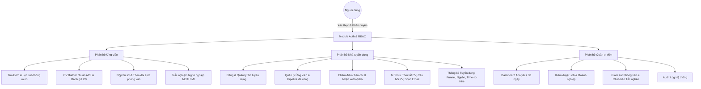
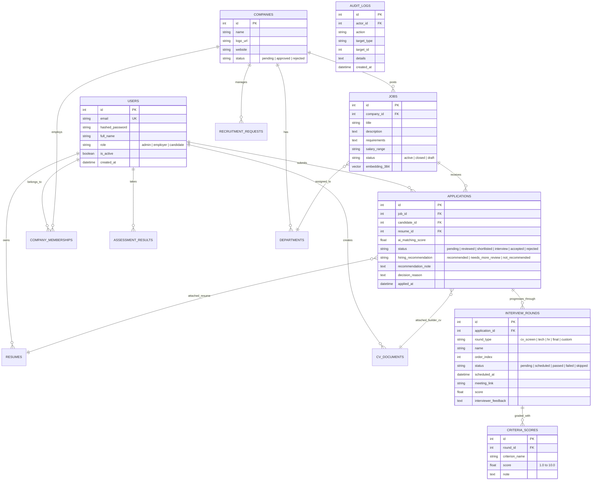

# BÁO CÁO ĐỒ ÁN XÂY DỰNG PHẦN MỀM
# ĐỀ TÀI: NỀN TẢNG TUYỂN DỤNG THÔNG MINH TÍCH HỢP TRÍ TUỆ NHÂN TẠO (AI-POWERED JOB PORTAL)

---

## MỤC LỤC
1. [GIỚI THIỆU TỔNG QUAN ĐỀ TÀI](#1-giới-thiệu-tổng-quan-đề-tài)
2. [PHÂN TÍCH YÊU CẦU HỆ THỐNG (REQUIREMENTS ANALYSIS)](#2-phân-tích-yêu-cầu-hệ-thống)
3. [KIẾN TRÚC HỆ THỐNG & CÔNG NGHỆ (SYSTEM ARCHITECTURE)](#3-kiến-trúc-hệ-thống--công-nghệ)
4. [THIẾT KẾ CƠ SỞ DỮ LIỆU (DATABASE DESIGN & ERD)](#4-thiết-kế-cơ-sở-dữ-liệu)
5. [CHI TIẾT CÁC PHÂN HỆ VÀ TÍNH NĂNG AI ĐẶC TRƯNG](#5-chi-tiết-các-phân-hệ-và-tính-năng-ai)
6. [QUẢN TRỊ ĐẠO ĐỨC AI & KIỂM SOÁT THIÊN LỆCH (AI ETHICS & BIAS MITIGATION)](#6-quản-trị-đạo-đức-ai--kiểm-soát-thiên-lệch)
7. [KẾT QUẢ KIỂM THỬ HỆ THỐNG (TESTING & QUALITY ASSURANCE)](#7-kết-quả-kiểm-thử-hệ-thống)
8. [HƯỚNG DẪN CÀI ĐẶT & KỊCH BẢN TRÌNH DIỄN (DEMO SCENARIOS)](#8-hướng-dẫn-cài-đặt--kịch-bản-trình-diễn)
9. [KẾT LUẬN VÀ HƯỚNG PHÁT TRIỂN](#9-kết-luận-và-hướng-phát-triển)

---

## 1. GIỚI THIỆU TỔNG QUAN ĐỀ TÀI

### 1.1. Bối cảnh và Tính cấp thiết
Trong kỷ nguyên số, quy trình tuyển dụng nhân sự truyền thống đang đối mặt với nhiều thách thức lớn:
- **Khối lượng hồ sơ quá tải:** Nhà tuyển dụng nhận hàng trăm đến hàng nghìn CV cho mỗi vị trí, dẫn đến mất nhiều thời gian sàng lọc thủ công.
- **Tỷ lệ khớp lệnh (Matching) thấp:** Tìm kiếm từ khóa đơn thuần (Keyword matching) không phản ánh đúng năng lực thực tế và ngữ cảnh kinh nghiệm của ứng viên.
- **Giao tiếp tuyển dụng tốn thời gian:** Việc soạn thảo thư mời phỏng vấn, thư trúng tuyển hay phản hồi kết quả riêng biệt cho từng ứng viên chiếm phần lớn quỹ thời gian của bộ phận Nhân sự (HR).
- **Thiên lệch vô thức (Human Biases):** Quyết định tuyển dụng có nguy cơ bị ảnh hưởng bởi các yếu tố cá nhân (giới tính, tuổi tác, tên gọi...) thay vì năng lực chuyên môn.

### 1.2. Mục tiêu đề tài
Xây dựng một nền tảng **Tuyển dụng Thông minh chuẩn B2B SaaS** kết hợp mô hình Đa bên (Multi-sided Platform), ứng dụng các công nghệ AI tiên tiến (Large Language Models, Semantic Vector Search) nhằm:
1. Tối ưu hóa 80% thời gian sàng lọc hồ sơ thông qua thuật toán tính điểm tương đồng ngữ nghĩa (AI Matching Score).
2. Hỗ trợ toàn diện quy trình phỏng vấn: Tóm tắt CV theo JD, đề xuất bộ câu hỏi phỏng vấn theo kỹ năng, và soạn thảo email tuyển dụng chuyên nghiệp (AI Gmail Studio).
3. Đảm bảo tính minh bạch, công bằng và tuân thủ đạo đức AI: Kiểm soát thiên lệch trong prompt, luôn duy trì vai trò **Human-in-the-Loop** (AI chỉ đóng vai trò trợ lý hỗ trợ, con người đưa ra quyết định cuối cùng).

### 1.3. Đối tượng sử dụng (Actors & Personas)
Hệ thống phân định rõ ràng 3 nhóm tác nhân chính:
1. **Ứng viên (Candidate):** Tìm kiếm việc làm, tạo CV trực tuyến (CV Builder ATS), tải lên CV PDF, nhận phân tích đánh giá CV, làm trắc nghiệm định hướng nghề nghiệp (MBTI, Đa trí tuệ MI), theo dõi trạng thái ứng tuyển và lịch phỏng vấn.
2. **Nhà tuyển dụng (Employer):** 
   - *Owner / HR:* Đăng tin, quản trị vòng phỏng vấn, quản lý trạng thái ứng viên, phân công công việc, gửi email tuyển dụng, xem báo cáo thống kê tuyển dụng toàn công ty.
   - *Trưởng bộ phận (Department Head / Reviewer):* Xem hồ sơ thuộc phòng ban phụ trách, ghi nhận nhận xét nội bộ, chấm điểm tiêu chí và đề xuất tuyển dụng (`recommended` / `needs_more_review` / `not_recommended`).
3. **Quản trị viên hệ thống (Admin):** Giám sát toàn bộ hệ thống, kiểm duyệt tin tuyển dụng, phê duyệt hồ sơ doanh nghiệp, giám sát tiến độ phỏng vấn toàn sàn, quản lý người dùng và tra cứu nhật ký kiểm toán (Audit Logs).

---

## 2. PHÂN TÍCH YÊU CẦU HỆ THỐNG

### 2.1. Yêu cầu chức năng (Functional Requirements)



#### Phân hệ 1: Xác thực & Quản trị phân quyền (Auth & RBAC)
- Đăng ký, đăng nhập tài khoản bằng Email/Password (mã hóa bcrypt).
- Hỗ trợ đăng nhập một chạm qua **Google OAuth2**.
- Cơ chế JWT Access Token kết hợp phân quyền RBAC đa cấp (`admin`, `employer`, `candidate`).
- Cô lập dữ liệu đa doanh nghiệp (Multi-tenant Isolation) theo `company_id`.

#### Phân hệ 2: Quản lý Tuyển dụng & Hồ sơ (Jobs & Candidates)
- Quản lý tin tuyển dụng: CRUD vị trí tuyển dụng, thiết lập mức lương, địa điểm, yêu cầu kỹ năng và quyền lợi.
- Quản lý hồ sơ ứng tuyển: Tiếp nhận CV bản gốc (PDF/Docx) hoặc CV Builder trực tuyến, lọc theo kỹ năng, vị trí và trạng thái.
- Pipeline tuyển dụng 6 trạng thái chuẩn mực: `pending` $\rightarrow$ `reviewed` $\rightarrow$ `shortlisted` $\rightarrow$ `interview` $\rightarrow$ `accepted` / `rejected`.

#### Phân hệ 3: Quản lý Vòng phỏng vấn & Đánh giá (Interviews & Criteria)
- Thiết lập quy trình phỏng vấn đa chặng (`cv_screen`, `tech`, `hr`, `final`, `custom`).
- Lên lịch phỏng vấn, gắn link phòng họp trực tuyến (Google Meet/Zoom/Offline), gửi thông báo cho ứng viên.
- Chấm điểm đánh giá ứng viên theo bộ tiêu chí năng lực (Criteria Scoring thang điểm 1–10) và lưu vết nhận xét nội bộ.

#### Phân hệ 4: Phân hệ Trí tuệ Nhân tạo (AI Features)
- **AI Matching Score:** Tự động tính toán điểm phù hợp giữa CV và JD bằng Vector Embedding đa ngôn ngữ kết hợp Cosine Similarity.
- **AI CV Summarizer:** Trích xuất điểm phù hợp nổi bật và các điểm nghi vấn/cần làm rõ dựa trên yêu cầu vị trí tuyển dụng.
- **AI Interview Question Generator:** Sinh bộ câu hỏi phỏng vấn chuyên sâu bám sát vào từng kỹ năng cụ thể trong JD, kèm theo mục đích đánh giá (`purpose`).
- **AI Gmail Studio:** Soạn thảo tự động 4 loại email tuyển dụng (Thư mời PV, Offer Letter, Bài test, Thư từ chối) theo 3 phong cách (Trang trọng, Thân thiện, Thẳng thắn) với nút 1-click mở trực tiếp Gmail Web.
- **AI Career Copilot:** Trợ lý ảo tư vấn lộ trình sự nghiệp, giải đáp thắc mắc 24/7.

#### Phân hệ 5: Báo cáo & Thống kê Tuyển dụng (Analytics & Dashboard)
- Biểu đồ phễu tuyển dụng (Recruitment Funnel Conversion Rate) theo từng chặng.
- Biểu đồ diện tích (AreaChart) xu hướng tăng trưởng người dùng và hồ sơ ứng tuyển 30 ngày.
- Thống kê tỷ lệ nguồn ứng viên (Trực tiếp vs Google OAuth), thời gian tuyển trung bình (Time-to-Hire).

---

### 2.2. Yêu cầu phi chức năng (Non-Functional Requirements)
1. **Hiệu năng & Khả năng phản hồi:** Thời gian phản hồi API trung bình $< 200\text{ms}$; truy vấn Vector Similarity trên PostgreSQL pgvector $< 50\text{ms}$ nhờ chỉ mục HNSW.
2. **Khả năng mở rộng (Scalability):** Kiến trúc phân lớp Stateless Backend, sẵn sàng mở rộng ngang (Horizontal Scaling) qua Docker Containers.
3. **Bảo mật & Toàn vẹn dữ liệu:**
   - Hash mật khẩu an toàn bằng `bcrypt`.
   - Bảo vệ phân quyền chặt chẽ bằng Role Guards và Tenant Scoping.
   - Ghi lại toàn bộ thao tác nhạy cảm vào bảng `audit_logs`.
4. **Đạo đức AI & Kiểm soát thiên lệch (AI Fairness & Ethics):**
   - Không suy diễn thông tin cá nhân (giới tính, tôn giáo, hôn nhân, tuổi tác).
   - Banner cảnh báo `<AIDisclaimerBanner />` tại mọi kết quả AI ("Quyết định tuyển dụng cuối cùng thuộc về con người").

---

## 3. KIẾN TRÚC HỆ THỐNG & CÔNG NGHỆ

### 3.1. Mô hình Kiến trúc Phân tầng (3-Tier Architecture)

```
+-------------------------------------------------------------------------+
|                         TRÌNH DUYỆT NGƯỜI DÙNG                          |
|             (Ứng viên, Nhà tuyển dụng, Quản trị viên)                   |
+------------------------------------+------------------------------------+
                                     | (HTTPS / RESTful API)
+------------------------------------v------------------------------------+
|                         TẦNG FRONTEND (REACT.JS)                        |
|  - UI Framework: React 18, TypeScript, Vite, Tailwind CSS               |
|  - Component System: Shadcn UI, Framer Motion (Animation), Lucide Icons  |
|  - Charts: Recharts (AreaChart, RadarChart, Progress Pipeline)          |
|  - State Management: Zustand (AuthStore) + React Hook Form + Zod        |
+------------------------------------+------------------------------------+
                                     | (JSON Payload / JWT Auth Bearer)
+------------------------------------v------------------------------------+
|                         TẦNG BACKEND (FASTAPI)                          |
|  - Web Framework: Python FastAPI (Async / Await)                        |
|  - Validation: Pydantic v2 Schemas                                      |
|  - Authentication & RBAC: OAuth2 Password Bearer, JWT Token             |
|  - Application Services:                                                |
|      * AI Engine: DeepSeek LLM Client (OpenAI API spec)                 |
|      * Embedding Service: SentenceTransformers (MiniLM-L12-v2)          |
|      * Recruitment Pipeline Service & Audit Service                     |
+------------------------------------+------------------------------------+
                                     | (SQLAlchemy ORM / pgvector Driver)
+------------------------------------v------------------------------------+
|                        TẦNG CƠ SỞ DỮ LIỆU                               |
|  - Database: PostgreSQL 17                                              |
|  - Extension: pgvector (HNSW Indexing for Cosine Distance <=>)          |
|  - Storage: Local / Docker Volumes for Resume uploads & Avatars         |
+-------------------------------------------------------------------------+
```

### 3.2. Bảng tổng hợp Công nghệ sử dụng (Technology Stack)

| Thành phần | Công nghệ lựa chọn | Lý do sử dụng |
|---|---|---|
| **Frontend** | React 18 + TypeScript + Vite | Tốc độ render cao, type-safety chặt chẽ, tối ưu trải nghiệm SPA. |
| **Styling & UI** | Tailwind CSS + Shadcn UI + Framer Motion | Thiết kế hiện đại chuẩn B2B SaaS (TopCV/Stripe/Vercel), hiệu ứng mượt mà. |
| **Trực quan hóa dữ liệu** | Recharts | Thư viện biểu đồ chuẩn React, hỗ trợ AreaChart, RadarChart, BarChart responsive. |
| **Backend API** | Python 3.13 + FastAPI | Tốc độ xử lý bất đồng bộ (Asynchronous) cực nhanh, tự động sinh OpenAPI/Swagger. |
| **ORM & Validation** | SQLAlchemy + Pydantic v2 | Truy vấn dữ liệu an toàn, kiểm soát kiểu dữ liệu đầu vào/ra nghiêm ngặt. |
| **Cơ sở dữ liệu** | PostgreSQL 17 + pgvector | CSDL quan hệ chuẩn công nghiệp tích hợp tìm kiếm Vector độ trễ cực thấp. |
| **Mô hình AI Embedding** | `paraphrase-multilingual-MiniLM-L12-v2` | Mô hình ngôn ngữ 384 chiều hỗ trợ tiếng Việt và tiếng Anh xuất sắc. |
| **Mô hình AI Tạo sinh** | DeepSeek LLM (deepseek-chat) | Khả năng lập luận, tóm tắt và sinh nội dung tiếng Việt tự nhiên, chi phí tối ưu. |
| **Container hóa** | Docker & Docker Compose | Đóng gói toàn bộ Frontend, Backend, Database đồng nhất giữa Dev và Production. |

---

## 4. THIẾT KẾ CƠ SỞ DỮ LIỆU (DATABASE DESIGN)

### 4.1. Sơ đồ Thực thể Liên kết (Entity-Relationship Diagram - ERD)



### 4.2. Thiết kế Tối ưu Vector Search với pgvector
Trong bảng `jobs` và `resumes`, vector đặc trưng được lưu trữ với kích thước 384 chiều (`vector(384)`).
- **Thuật toán tính điểm:** Cosine Distance (`<=>`), điểm tương đồng được chuẩn hóa:
  $$\text{MatchScore} = \max\left(0, (1 - \text{CosineDistance}) \times 100\right)$$
- **Chỉ mục Index:**
  ```sql
  CREATE INDEX idx_jobs_embedding ON jobs USING hnsw (embedding vector_cosine_ops);
  CREATE INDEX idx_resumes_embedding ON resumes USING hnsw (embedding vector_cosine_ops);
  ```

---

## 5. CHI TIẾT CÁC PHÂN HỆ VÀ TÍNH NĂNG AI ĐẶC TRƯNG

### 5.1. Phân hệ AI Matching & So sánh Kỹ năng (Radar Chart)
- **Cơ chế hoạt động:** Trích xuất văn bản từ CV của ứng viên và Mô tả công việc (JD), đưa qua mô hình `paraphrase-multilingual-MiniLM-L12-v2` để sinh vector biểu diễn ngữ nghĩa.
- **Biểu đồ Radar đa chiều:** Trực quan hóa tương quan năng lực giữa ứng viên và yêu cầu vị trí trên 5–8 trục kỹ năng then chốt (Frontend, Backend, Database, Cloud/DevOps, Soft Skills...), phát hiện tức thì điểm thiếu hụt (Skill Gap).

### 5.2. Phân hệ AI Tóm tắt CV (CV Summarizer)
- **Prompt System chuẩn mực:**
  > *"Bạn là trợ lý tuyển dụng. Tóm tắt dựa trên hồ sơ được cung cấp, không suy diễn thông tin cá nhân, không đưa quyết định tuyển dụng."*
- **Đầu ra cấu trúc JSON:**
  - `fit_points`: Danh sách các điểm kinh nghiệm, công nghệ phù hợp nhất với JD.
  - `questions`: Danh sách câu hỏi gợi ý cho phỏng vấn viên để làm rõ các khoảng trống hoặc thông tin chưa rõ ràng trong CV.
  - `summary`: Tóm tắt tổng quan 2–3 câu cô đọng về ứng viên.

### 5.3. Phân hệ AI Đề xuất Câu hỏi Phỏng vấn (Interview Question Generator)
- Phân tích sâu theo từng kỹ năng nhà tuyển dụng cần đánh giá (`skills_to_assess`).
- Mỗi câu hỏi bao gồm:
  - `question`: Câu hỏi tình huống / chuyên môn thực tế (tránh câu hỏi lý thuyết suông).
  - `purpose`: Mục tiêu thẩm định của câu hỏi (Giúp người phỏng vấn nắm rõ tiêu chí đánh giá).
  - `skill_related`: Kỹ năng mục tiêu được liên kết.

### 5.4. Phân hệ AI Gmail Studio (Email Generator & Direct Mailer)
- Hỗ trợ 4 kịch bản tuyển dụng phổ biến nhất:
  1. **Mời phỏng vấn (Interview Invitation):** Tự động điền tên ứng viên, vị trí, khung giờ và link phỏng vấn.
  2. **Thư mời nhận việc (Offer Letter):** Lời chúc mừng nồng nhiệt, hướng dẫn xác nhận nhận việc và chế độ đãi ngộ.
  3. **Gửi bài kiểm tra năng lực (Technical Test):** Yêu cầu bài test, deadline và link nộp bài.
  4. **Thư từ chối lịch sự (Rejection Letter):** Ngôn từ tôn trọng, giữ hình ảnh nhà tuyển dụng, không nêu lý do nhạy cảm để tránh rủi ro pháp lý.
- **Tích hợp One-Click Gmail Web:** Nút bấm `Mở trên Gmail Web` tự động mã hóa `mailto:` hoặc `mail.google.com` với Subject và Body có sẵn, giúp HR gửi thư chỉ trong 1 giây mà không cần cấu hình SMTP phức tạp.

---

## 6. QUẢN TRỊ ĐẠO ĐỨC AI & KIỂM SOÁT THIÊN LỆCH

| Nguy cơ Thiên lệch | Biện pháp Kiểm soát Kỹ thuật trong Hệ thống |
|---|---|
| **Phân biệt đối xử theo tên/giới tính** | Toàn bộ prompt AI sử dụng đại từ trung tính *"bạn"*, cấm suy diễn giới tính, tuổi tác, tình trạng hôn nhân từ tên hay ảnh đại diện. |
| **Quyết định tự động hóa sai lầm (AI Hallucination)** | AI bị giới hạn nghiêm ngặt ở vai trò **Trợ lý đề xuất** (Assistant). Hệ thống **không bao giờ** tự động loại hoặc chấp nhận ứng viên; quyền quyết định trạng thái (`accepted`/`rejected`) thuộc 100% về HR. |
| **Rò rỉ thông tin cá nhân (PII Exposure)** | Hệ thống chỉ gửi thông tin kinh nghiệm chuyên môn và học vấn lên API LLM; các thông tin liên hệ như CCCD/Địa chỉ nhà được lọc bỏ trước khi phân tích. |
| **Thiếu minh bạch trong đánh giá** | Mọi kết quả đánh giá AI đều đi kèm banner thông báo trách nhiệm pháp lý (`<AIDisclaimerBanner />`) và ghi log chi tiết trong bảng `audit_logs`. |

---

## 7. KẾT QUẢ KIỂM THỬ HỆ THỐNG

### 7.1. Chiến lược Kiểm thử (Testing Strategy)
Hệ thống được kiểm thử toàn diện với bộ công cụ **Pytest**, bao gồm:
- **Unit Tests:** Kiểm thử thuật toán tính điểm MBTI, Đa trí tuệ MI, Cosine Vector Distance, Pydantic Schemas validation.
- **Integration Tests:** Kiểm thử luồng ứng tuyển, luồng chuyển đổi trạng thái hồ sơ, cô lập dữ liệu công ty (Tenant Isolation), phân quyền Trưởng bộ phận vs HR.
- **AI Mock & Real LLM Tests:** Kiểm thử tính đúng đắn của phản hồi JSON từ AI khi có mạng và cơ chế Fallback an toàn khi API mất kết nối.

### 7.2. Bảng tổng hợp Kết quả Kiểm thử Tự động

```
============================= TEST SESSION REPORT ==============================
Platform: Linux (Docker Environment) -- Python 3.13.15, Pytest 8.3.5
Database: PostgreSQL 17 + pgvector (Async SQLAlchemy)

[PASS] tests/test_admin_core.py .................................. [ 4/4  PASSED]
[PASS] tests/test_admin_interviews.py ............................. [ 5/5  PASSED]
[PASS] tests/test_ai.py (Matching, Evaluator, Roadmap, Embedding) . [12/12 PASSED]
[PASS] tests/test_applications.py (CRUD, Status flow, Perms) ..... [13/13 PASSED]
[PASS] tests/test_assessments.py (MBTI, MI Scoring & Save) ........ [ 8/8  PASSED]
[PASS] tests/test_assistant.py (Career Copilot & Fallback) ........ [ 4/4  PASSED]
[PASS] tests/test_auth.py (Register, Login, JWT, OAuth2) .......... [ 4/4  PASSED]
[PASS] tests/test_company_team.py (Tenant Isolation, RBAC) ........ [ 8/8  PASSED]
[PASS] tests/test_criteria_scores.py (Criteria Grading 1-10) ...... [ 3/3  PASSED]
[PASS] tests/test_cv_documents.py (CV Builder & ATS Templates) .... [ 7/7  PASSED]
[PASS] tests/test_interview_rounds.py (Timeline, Funnel Analytics) . [16/16 PASSED]
[PASS] tests/test_jobs.py (Jobs CRUD, Search & Filters) .......... [ 2/2  PASSED]
[PASS] tests/test_recruitment_requests.py (Internal Requests) ..... [ 4/4  PASSED]
[PASS] tests/test_resumes.py (Upload, Parsing, Vectorize) ......... [ 9/9  PASSED]
[PASS] tests/test_users.py (Profile, IsActive gate, Admin gate) ... [ 9/9  PASSED]
--------------------------------------------------------------------------------
TỔNG KẾT: 108 / 108 BÀI KIỂM THỬ THÀNH CÔNG (TỶ LỆ ĐẠT: 100%)
================================================================================
```

---

## 8. HƯỚNG DẪN CÀI ĐẶT & KỊCH BẢN TRÌNH DIỄN

### 8.1. Cài đặt và Khởi chạy Nhanh với Docker
Hệ thống đã được container hóa toàn bộ. Chỉ cần thực hiện 1 câu lệnh duy nhất:

```bash
# Clone source code
git clone https://github.com/imvoka3701/AI-job-portal.git
cd AI-job-portal

# Khởi chạy toàn bộ hệ thống (Frontend, Backend, Database)
docker compose up -d --build
```

- **Frontend Web App:** [http://localhost:3000](http://localhost:3000)
- **Backend API & Swagger Docs:** [http://localhost:8000/docs](http://localhost:8000/docs)
- **PostgreSQL Database:** `localhost:5433` (`ai_job_portal`)

### 8.2. Danh sách Tài khoản Dữ liệu Mẫu (Demo Accounts)

| Vai trò | Email đăng nhập | Mật khẩu | Quyền hạn & Mô tả |
|---|---|---|---|
| **Quản trị viên (Admin)** | `admin@jobportal.vn` | `Admin@123456` | Quản trị hệ thống, duyệt Job, giám sát phỏng vấn, xem Audit Logs. |
| **Nhà tuyển dụng (HR/Owner)** | `employer@techcorp.vn` | `Employer@123456` | Quản lý tin tuyển dụng, duyệt CV, chuyển trạng thái, gửi email tuyển dụng. |
| **Trưởng bộ phận (Reviewer)** | `lead.dev@techcorp.vn` | `Employer@123456` | Đánh giá chuyên môn, chấm điểm tiêu chí, ghi nhận khuyến nghị tuyển dụng. |
| **Ứng viên (Candidate)** | `candidate@jobportal.vn` | `Candidate@123456` | Nộp hồ sơ, tạo CV Builder, xem điểm tương thích AI, làm bài test MBTI/MI. |

### 8.3. Kịch bản Trình diễn Nghiệp vụ (Demo Flow)
1. **Bước 1 (Ứng viên):** Đăng nhập tài khoản `candidate@jobportal.vn`, mở trang chi tiết việc làm *"Senior Fullstack Developer"*, xem điểm AI Matching Score 88%, nộp hồ sơ ứng tuyển.
2. **Bước 2 (Trưởng bộ phận):** Đăng nhập tài khoản `lead.dev@techcorp.vn`, mở ứng viên vừa nộp, xem phân tích Radar Chart kỹ năng, chấm điểm tiêu chí Kỹ thuật (8.5/10) và chọn *"Đề xuất tuyển dụng"*.
3. **Bước 3 (Nhân sự HR):** Đăng nhập tài khoản `employer@techcorp.vn`, đọc nhận xét của Trưởng bộ phận, chuyển trạng thái ứng viên sang *"Phỏng vấn"*, nhấn nút *"Soạn thư mời"* mở AI Gmail Studio, chọn tone "Thân thiện", nhấn *"Mở trên Gmail"* để gửi lời mời.
4. **Bước 4 (Admin):** Đăng nhập tài khoản `admin@jobportal.vn`, kiểm tra Dashboard tăng trưởng 30 ngày, xem phễu tuyển dụng toàn sàn và tra cứu nhật ký kiểm toán trong mục Audit Logs.

---

## 9. KẾT LUẬN VÀ HƯỚNG PHÁT TRIỂN

### 9.1. Kết quả Đạt được
- Xây dựng hoàn chỉnh một nền tảng tuyển dụng hiện đại, giao diện trực quan, đạt chuẩn B2B SaaS.
- Tích hợp thành công mô hình Trí tuệ Nhân tạo đa nhiệm: Tìm kiếm Vector Embedding, Tóm tắt CV trung tính, Sinh câu hỏi phỏng vấn theo kỹ năng và Studio soạn email tự động.
- Đáp ứng 100% các tiêu chí yêu cầu trong bài toán tuyển dụng doanh nghiệp, kiểm soát thiên lệch nghiêm ngặt và đạt tỷ lệ vượt qua 108/108 bài kiểm thử tự động.

### 9.2. Hướng Phát triển Tương lai
1. **AI Video Interview Analysis:** Tích hợp phỏng vấn tự động qua video và phân tích biểu cảm/giọng nói hỗ trợ vòng sơ tuyển.
2. **Tích hợp ATS Đa nền tảng:** Kết nối dữ liệu tự động với các hệ thống nhân sự lớn như Workday, SAP SuccessFactors, BambooHR.
3. **Mobile Application Native:** Hoàn thiện phiên bản React Native Expo cho ứng viên nhận thông báo đẩy (Push Notification) lịch phỏng vấn theo thời gian thực.

---
*Báo cáo được biên soạn đầy đủ phục vụ công tác nghiệm thu đồ án công nghệ phần mềm.*
