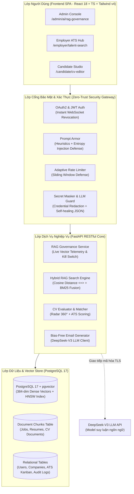
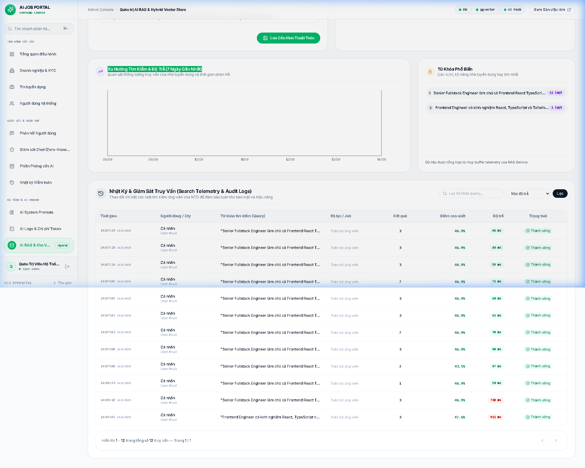
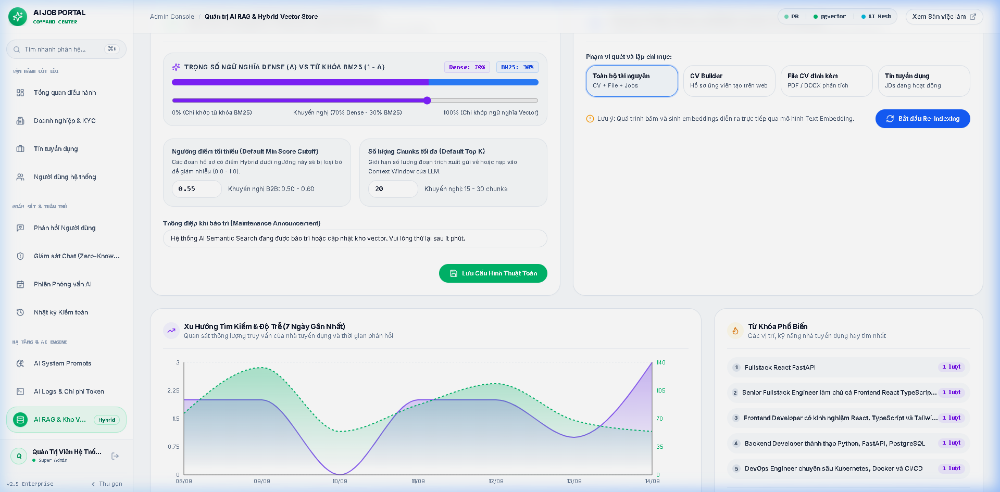
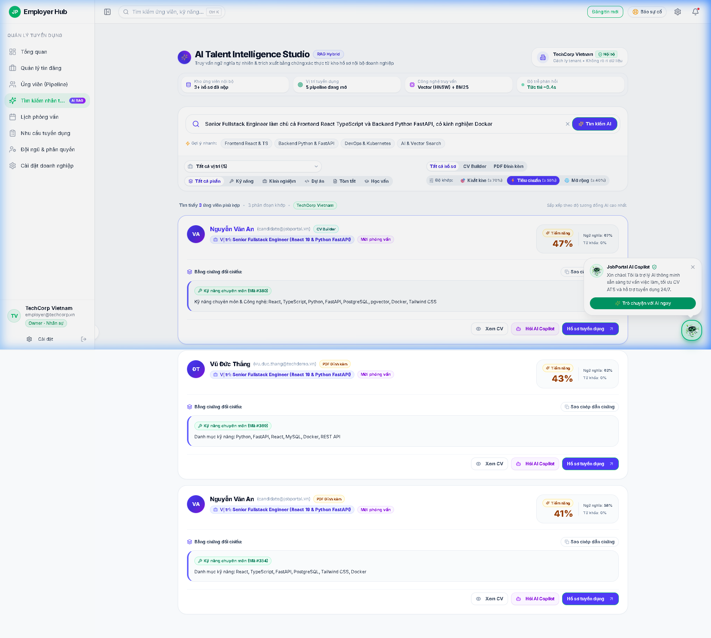
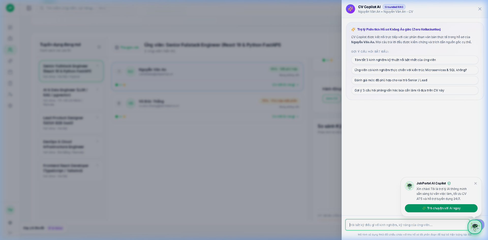

<p align="center">
  <a href="https://github.com/imvoka3701/AI-job-portal">
    
  </a>
</p>

<h1 align="center">Enterprise AI Recruitment & Career Intelligence Platform</h1>

<p align="center">
  <strong>Nền tảng Tuyển dụng Thông minh & Định hướng Nghề nghiệp Chuẩn B2B SaaS Enterprise</strong><br />
  Tích hợp kiến trúc <strong>RAG (Retrieval-Augmented Generation)</strong>, tìm kiếm lai ngữ nghĩa <strong>pgvector</strong> và động cơ suy luận <strong>DeepSeek-V3 LLM</strong> với cổng bảo mật <strong>Zero-Trust AI Gateway</strong>.
</p>

<p align="center">
  <a href="#-1-the-paradigm-shift-bài-toán--giải-pháp">Bài Toán & Giải Pháp</a> •
  <a href="#-2-kiến-trúc-hệ-thống-system-architecture">Kiến Trúc Hệ Thống</a> •
  <a href="#-3-visual-feature-showcase-tính-năng-đột-phá">Tính Năng & Hình Ảnh</a> •
  <a href="#-4-cổng-bảo-mật-zero-trust-ai-security-gateway">Bảo Mật Zero-Trust</a> •
  <a href="#-5-khởi-chạy-nhanh-1-minute-quickstart">Khởi Chạy Nhanh</a> •
  <a href="#-6-tài-khoản-trải-nghiệm-demo-accounts">Tài Khoản Demo</a> •
  <a href="#-7-tiêu-chuẩn-chất-lượng--benchmarks">Kiểm Thử & Benchmarks</a>
</p>

<p align="center">
  
  
  
  
  
  
  
  
  
  
  
</p>

---

## ⚡ 1. The Paradigm Shift: Bài Toán & Giải Pháp

Thị trường tuyển dụng truyền thống đang đối mặt với những giới hạn trầm trọng về hiệu suất lọc hồ sơ, định dạng dữ liệu không đồng nhất và thiên vị vô thức. **AI Job Portal** được thiết kế để giải quyết căn cơ những điểm nghẽn này:

| Tiêu Chí Đánh Giá | ATS Truyền Thống (Legacy ATS) | AI-Powered Job Portal (Enterprise v2.0) |
| :--- | :--- | :--- |
| **Thuật Toán Sàng Lọc** | Khớp từ khóa thô sơ (Keyword string match), dễ bỏ sót nhân tài dùng từ đồng nghĩa hoặc tiếng Anh/Việt lẫn lộn. | **Hybrid Semantic Search (< 50ms):** Kết hợp Dense Vector `pgvector` Cosine (`<=>`) và Sparse Search BM25 / Trigram tiếng Việt. |
| **Đánh Giá Hồ Sơ CV** | Nhà tuyển dụng mất 15-30 phút đọc lướt từng hồ sơ, đánh giá cảm tính và phân tán. | **Chấm Điểm 360° & Dossier Card:** Phân tích 6 trục kỹ năng (Radar Chart), bóc tách điểm mạnh, điểm cần cải thiện và xác suất tương thích công việc. |
| **Hỗ Trợ Ứng Viên** | Nộp hồ sơ thụ động, không có phản hồi lý do trượt hoặc gợi ý cải thiện kỹ năng. | **In-Editor AI CV Copilot Drawer:** Đối soát ATS thời gian thực, tư vấn bù đắp lỗ hổng kỹ năng (Skill Gap) và sinh câu hỏi phỏng vấn thử theo hồ sơ. |
| **Giao Tiếp Tuyển Dụng** | Mẫu email soạn tay hoặc template cứng nhắc, tiềm ẩn thiên vị giới tính, tuổi tác. | **Bias-Free Email Engine:** Sinh thư mời phỏng vấn / từ chối văn minh, trung tính, 1-Click mở trực tiếp vào hộp thư Gmail Web. |
| **Kiểm Soát Rủi Ro AI** | Không có cơ chế giám sát; dễ bị tấn công Prompt Injection và rò rỉ token API nhạy cảm. | **Zero-Trust AI Gateway:** 3 lớp phòng ngự độc lập (`PromptArmor`, `SecretMasker`, `LLMGuard`) và công tắc dừng khẩn cấp (Emergency Kill Switch). |

---

## 🏗️ 2. Kiến Trúc Hệ Thống (System Architecture)

Hệ thống tuân thủ nghiêm ngặt mô hình **Clean Architecture** kết hợp phân quyền đa doanh nghiệp (**Multi-tenant Isolation**):



---

## 📸 3. Visual Feature Showcase: Tính Năng Đột Phá

### 3.1. Bảng Điều Khiển Quản Trị RAG & Vector Store (`/admin/ai/rag-governance`)
Cung cấp cho Quản trị viên khả năng giám sát toàn diện hạ tầng Vector Store, điều chỉnh tham số tìm kiếm lai và ngắt AI khẩn cấp khi gặp sự cố:

<p align="center">
  
</p>

- **Live Vector Telemetry:** Đo lường tổng số lượng chunks đã vector hóa (chia theo Jobs, Resumes, CV Documents) và theo dõi độ trễ trung bình thời gian thực.
- **Biểu Đồ Xu Hướng Recharts:** Trực quan hóa số lượt tìm kiếm RAG và độ trễ theo từng ngày trong tuần:
<p align="center">
  
</p>
- **Tinh Chỉnh Thuật Toán (Algorithm Tuning):** Cho phép thay đổi tỷ trọng `Vector Weight` vs `Keyword Weight`, ngưỡng tương đồng tối thiểu (`Min Score`) và số lượng chunks tối đa (`Top-K`) mà không cần restart server.
- **Emergency Kill Switch:** Công tắc ngắt toàn bộ lưu lượng AI RAG tức thì khi phát hiện tấn công hoặc quá tải hệ thống.
- **Batch Reindex Pipeline:** Tự động tạo lại chỉ mục toàn bộ tài liệu chỉ bằng 1 thao tác click chuột.

---

### 3.2. Săn Tìm Nhân Tài Ngữ Nghĩa & Hồ Sơ Toàn Diện (`/employer/talent-search`)
Cho phép nhà tuyển dụng tìm kiếm ứng viên lý tưởng bằng ngôn ngữ tự nhiên, không phụ thuộc vào từ khóa cứng:

<p align="center">
  
</p>

- **Candidate Dossier Card:** Hiển thị thẻ hồ sơ chuyên sâu với điểm tương thích AI Match, radar kỹ năng, tóm tắt kinh nghiệm làm việc và các dự án thực tế.
- **Bóc Tách Điểm Số Minh Bạch:** Phân tách rõ ràng giữa điểm bằng cấp, điểm kỹ năng cứng, kinh nghiệm thực tế và kỹ năng mềm.
- **Bộ Lọc Đa Chiều:** Hỗ trợ lọc ứng viên đã nộp đơn vào công ty hoặc tìm kiếm trên mạng lưới ứng viên công khai của sàn.

---

### 3.3. Trợ Lý AI CV Copilot Drawer Dành Cho Ứng Viên (`/candidate/cv-editor`)
Tích hợp trực tiếp bên trong Studio soạn thảo CV chia đôi màn hình, hoạt động như một chuyên gia hướng nghiệp cá nhân:

<p align="center">
  
</p>

- **ATS Readiness Audit:** Phân tích độ tương thích định dạng của CV đối với hệ thống quét tự động của các tập đoàn lớn.
- **Skill Gap Advisor:** So chiếu hồ sơ ứng viên với các vị trí tuyển dụng thực tế và gợi ý chính xác những kỹ năng cần trau dồi thêm.
- **Mock Interview Prep:** Tự động sinh câu hỏi phỏng vấn hóc búa kèm tiêu chí chấm điểm mẫu dựa trên chính những gì ứng viên viết trong CV.
- **Viết Lại Chuẩn STAR:** Tự động tối ưu hóa câu văn theo mô hình `Situation - Task - Action - Result`.

---

## 🛡️ 4. Cổng Bảo Mật Zero-Trust AI Security Gateway

Hệ thống được trang bị bộ ba thành phần bảo vệ tối cao ngăn chặn mọi hành vi can thiệp bất hợp pháp qua API hoặc Postman:

```text
[HTTP Request / Payload] 
       │
       ▼
┌────────────────────────────────────────────────────────────────────────┐
│ 1. PROMPT ARMOR (app/core/prompt_armor.py)                             │
│    • Regex Heuristics: Chặn System Prompt Leakage, DAN Mode, Jailbreak │
│    • Shannon Entropy Check: Phát hiện chuỗi mã hóa/obfuscation độc hại │
│    • Safe Deflection: Tự động chuyển hướng về câu trả lời an toàn      │
└──────────────────────────────────┬─────────────────────────────────────┘
                                   │ (Clean Payload)
                                   ▼
┌────────────────────────────────────────────────────────────────────────┐
│ 2. DOMAIN & TENANT ISOLATION (app/core/security.py)                    │
│    • Strict UUID Validation & IDOR Prevention                          │
│    • Candidate / Employer Partition: Tuyệt đối không rò rỉ dữ liệu chéo │
│    • Instant WebSocket & Token Revocation khi người dùng đổi mật khẩu  │
└──────────────────────────────────┬─────────────────────────────────────┘
                                   │ (Verified & Executed)
                                   ▼
┌────────────────────────────────────────────────────────────────────────┐
│ 3. SECRET MASKER & LLM GUARD (app/core/secret_masker.py & llm_guard.py)│
│    • Redaction: Che giấu API Keys (DeepSeek, OpenAI), Bearer JWTs, DBs │
│    • Self-Healing JSON Parser: Tự sửa lỗi cú pháp JSON cụt từ LLM      │
│    • Output Clamping: Giới hạn độ dài văn bản ngăn tràn bộ nhớ        │
└────────────────────────────────────────────────────────────────────────┘
```

---

## 🚀 5. Khởi Chạy Nhanh (1-Minute Quickstart)

### Yêu cầu hệ thống:
- **Docker** & **Docker Compose** đã cài đặt.
- Khóa API **DeepSeek** (hoặc tương thích OpenAI).

### Bước 1: Khởi tạo tệp môi trường
```bash
# Trên Windows
copy .env.example .env

# Trên Linux / macOS
cp .env.example .env
```
Mở tệp `.env` và cấu hình thông tin tối thiểu:
```env
DEEPSEEK_API_KEY=sk-your-deepseek-api-key-here
JWT_SECRET=super_secret_jwt_random_key_here
```

### Bước 2: Kích hoạt hệ thống qua Docker Compose
```bash
docker compose up -d --build
```

### Bước 3: Nạp dữ liệu mẫu thực tế & Tạo chỉ mục Vector RAG
```bash
# Nạp dữ liệu doanh nghiệp, việc làm, ứng viên và tự động tính toán RAG vector chunks:
docker exec aijob-backend python reset_and_seed_demo.py

# Nạp 30 ngày lịch sử gọi AI phục vụ thống kê biểu đồ Admin:
docker exec aijob-backend python seed_ai_call_logs.py
```

### 🌐 Cổng Dịch Vụ Trực Tuyến:
- **Giao diện Web Ứng Dụng (SPA):** [http://localhost:3000](http://localhost:3000)
- **Tài liệu API Tương Tác (Swagger UI):** [http://localhost:8000/docs](http://localhost:8000/docs)
- **Kiểm tra Sức Khỏe Hệ Thống (Healthcheck):** [http://localhost:8000/healthz](http://localhost:8000/healthz)
- **Cơ sở dữ liệu PostgreSQL:** `localhost:5433` (Database: `ai_job_portal`, User: `postgres`)

---

## 🔑 6. Tài Khoản Trải Nghiệm (Demo Accounts)

Hệ thống đã chuẩn bị sẵn các tài khoản mẫu cho từng phân hệ:

| Vai Trò | Email Đăng Nhập | Mật Khẩu Chung | Trải Nghiệm Nổi Bật |
| :--- | :--- | :--- | :--- |
| **Super Admin** | `admin@jobportal.vn` | `Admin@123456` | Quản trị RAG Governance, Kill Switch, Biểu đồ Token, Duyệt phản hồi |
| **HR Director** | `employer@techcorp.vn` | `Employer@123456` | Quản lý TechCorp, Semantic Talent Search, ATS Kanban, Soạn Bias-Free Email |
| **Department Head** | `techlead@techcorp.vn` | `TechLead@123456` | Trưởng phòng Kỹ thuật, Lập yêu cầu tuyển dụng, Chấm điểm phỏng vấn |
| **Ứng Viên** | `candidate@jobportal.vn` | `Candidate@123456` | Soạn thảo CV Builder, Mở AI CV Copilot, Làm trắc nghiệm định hướng |

---

## 🧪 7. Tiêu Chuẩn Chất Lượng & Benchmarks

### 7.1. Bộ Kiểm Thử Tự Động Toàn Diện (Automated Test Suites)
Dự án áp dụng cổng kiểm soát chất lượng nghiêm ngặt (Quality Gate) với tỷ lệ hoàn thành 100%:

- **Backend Pytest (99/99 Tests Passed — 100%):**
  ```bash
  docker exec aijob-backend pytest --no-cov \
    tests/test_candidate_security.py \
    tests/test_employer_security.py \
    tests/test_ai_gateway_security.py \
    tests/test_admin_rag.py \
    tests/test_admin_core.py \
    tests/test_admin_ai.py \
    tests/test_admin_rbac.py \
    tests/test_feedback.py \
    tests/test_direct_chat.py \
    tests/test_rag_pipeline.py
  ```
- **Frontend Vitest & Typecheck (88/88 Tests Passed — 27 Files):**
  ```bash
  cd frontend
  npm run build    # TypeScript strict mode & Vite build (0 errors, 9046 modules)
  npm test -- --run # 100% component and page unit tests passed
  ```
- **Mã Nguồn Chuẩn Hóa Linting:**
  - Backend: `ruff check app tests` (Tuân thủ triệt để PEP8, 0 warnings/errors).
  - Frontend: `npm run lint` (ESLint tuân thủ chặt chẽ React Hooks & TypeScript).

### 7.2. Chỉ Số Hiệu Năng Vận Hành (Performance Metrics)
- **Độ trễ tìm kiếm lai RAG (Hybrid Search Latency):** Dưới **50ms** cho tập dữ liệu hàng nghìn vector chunks nhờ chỉ mục IVFFlat/HNSW trên PostgreSQL 17.
- **Bộ nhớ đệm đánh giá AI (Evaluation Caching):** Lưu trữ kết quả JSON bóc tách kỹ năng trực tiếp trong bảng `resumes` (Migration 023), loại bỏ việc gọi lại LLM tốn kém khi xem lại hồ sơ cũ.
- **Tiết kiệm chi phí Token:** Giảm thiểu ~40% chi phí vận hành DeepSeek API nhờ cơ chế kiểm duyệt trước bằng thuật toán cục bộ và cắt tỉa ngữ cảnh (Context pruning).

---

## 📦 8. Tiện Ích Sao Lưu & Đóng Gói (Tooling)

- **Xuất bản sao lưu cơ sở dữ liệu:**
  ```bash
  scripts\export_backup.bat
  # Tự động xuất toàn bộ database và vector chunks ra tệp backup.sql an toàn
  ```
- **Khôi phục dữ liệu từ bản sao lưu:**
  ```bash
  scripts\restore_db.bat
  ```
- **Đóng gói mã nguồn bàn giao (< 10 MB):**
  ```bash
  scripts\clean_for_transfer.bat
  # Tự động dọn sạch các thư mục nặng (node_modules, venv, cache) trước khi nén zip
  ```

---

## 👥 9. Đóng Góp & Giấy Phép (Contributing & License)

Dự án được phân phối chính thức dưới giấy phép mã nguồn mở **[MIT License](LICENSE)**. 

Mọi ý kiến đóng góp, báo cáo lỗi hoặc đề xuất cải tiến thuật toán AI đều được trân trọng. Vui lòng mở Issue hoặc gửi Pull Request theo quy chuẩn quy ước commit ngữ nghĩa (`feat:`, `fix:`, `docs:`, `test:`).
