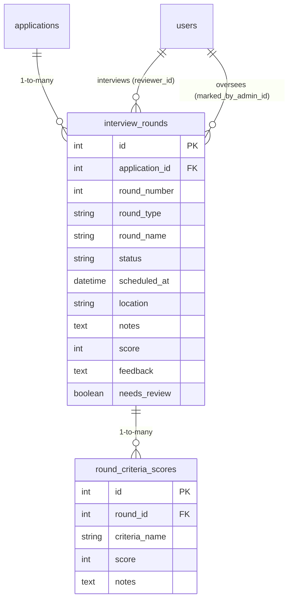
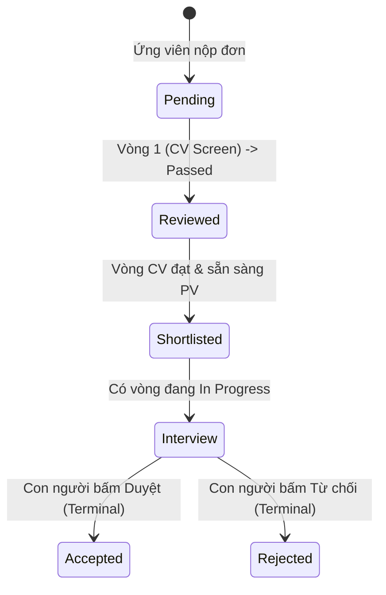

# 🎯 4.5.5 — ĐẶC TẢ KIẾN TRÚC VÒNG TUYỂN DỤNG NHIỀU BƯỚC (MULTI-ROUND PIPELINE)

> **Trạng thái:** **ĐÃ TRIỂN KHAI HOÀN THIỆN & VẬN HÀNH THỰC TẾ (AS-BUILT SPECIFICATION 2.0)**  
> **Phạm vi:** Backend FastAPI + PostgreSQL CSDL + Frontend React 19 B2B SaaS  
> **Mục tiêu:** Mở rộng quy trình tuyển dụng thành nhiều vòng phỏng vấn chuyên sâu (`Duyệt CV` $\rightarrow$ `PV Kỹ thuật` $\rightarrow$ `PV HR` $\rightarrow$ `Vòng cuối`), tích hợp bảng chấm điểm tiêu chí (Criteria Scoring thang 1-10) và cơ chế đồng bộ 2 chiều tương thích tuyệt đối với `Application.status`.

---

## 1. TỔNG QUAN KIẾN TRÚC & QUYẾT ĐỊNH THIẾT KẾ

### 1.1. Bối cảnh Nghiệp vụ
Trong tuyển dụng doanh nghiệp (B2B SaaS), việc đánh giá một ứng viên không bao giờ diễn ra trong một bước duy nhất. Quy trình tuyển dụng thực tế gồm nhiều vòng thẩm định với sự tham gia của nhiều nhân sự: HR duyệt hồ sơ sơ loại, Trưởng bộ phận (TechLead) phỏng vấn kỹ năng chuyên môn, Ban giám đốc phỏng vấn văn hóa và thương lượng mức lương.

### 1.2. Quyết định Schema: Mô hình 2 Bảng Thực Thể
Hệ thống sử dụng **bảng riêng biệt** thay vì mở rộng trực tiếp bảng `applications`:
- **Bảng 1:** `interview_rounds` (Quan hệ $1-N$ với `applications`): Quản lý từng vòng phỏng vấn độc lập (thời gian, địa điểm, trạng thái, người phỏng vấn).
- **Bảng 2:** `round_criteria_scores` (Quan hệ $1-N$ với `interview_rounds`): Chấm điểm chi tiết từng tiêu chí chuyên môn (thang điểm 1-10) cho mỗi vòng.



---

## 2. CHI TIẾT CƠ SỞ DỮ LIỆU THỰC TẾ

### 2.1. Định nghĩa Enums & Model `InterviewRound`
Tọa độ: [`backend/app/models/interview_round.py`](file:///d:/ai-job-portal/backend/app/models/interview_round.py)

```python
class RoundType(str, enum.Enum):
    CV_SCREEN = "cv_screen"        # Vòng 1: Duyệt CV sơ loại
    TECH_INTERVIEW = "tech"        # Vòng 2: Phỏng vấn chuyên môn kỹ thuật
    HR_INTERVIEW = "hr"            # Vòng 3: Phỏng vấn văn hóa & nhân sự
    FINAL = "final"                # Vòng 4: Phỏng vấn lãnh đạo & Offer
    CUSTOM = "custom"              # Vòng tùy chỉnh đặc thù doanh nghiệp

class RoundStatus(str, enum.Enum):
    PENDING = "pending"            # Chưa bắt đầu / Đang chờ
    IN_PROGRESS = "in_progress"    # Đang diễn ra / Đã lên lịch hẹn
    PASSED = "passed"              # Ứng viên vượt qua vòng này
    FAILED = "failed"              # Ứng viên không đạt vòng này
    SKIPPED = "skipped"            # Bỏ qua vòng (ưu tiên hồ sơ đặc biệt)
```

**Các trường dữ liệu cốt lõi:**
| Tên Trường | Kiểu Dữ Liệu | Ràng Buộc | Ý Nghĩa Nghiệp Vụ |
| :--- | :--- | :--- | :--- |
| `id` | `Integer` | PK, Index | Khóa chính vòng phỏng vấn |
| `application_id` | `Integer` | FK -> `applications.id` | Liên kết với đơn ứng tuyển (Cascade Delete) |
| `round_number` | `Integer` | Not Null | Thứ tự vòng (1, 2, 3...) |
| `round_type` | `String(50)` | Not Null | Loại vòng (`cv_screen`, `tech`, `hr`, `final`) |
| `round_name` | `String(255)` | Nullable | Tên hiển thị (*"Phỏng vấn Kỹ thuật Backend"*) |
| `status` | `String(50)` | Default 'pending' | Trạng thái vòng |
| `scheduled_at` | `DateTime(tz)` | Nullable | Thời điểm hẹn phỏng vấn |
| `location` | `String(500)` | Nullable | Địa điểm phòng họp hoặc link Google Meet |
| `notes` | `Text` | Nullable | Ghi chú nội bộ dành cho người phỏng vấn |
| `reviewer_id` | `Integer` | FK -> `users.id` | ID chuyên viên chấm thi chính |
| `score` | `Integer` | Nullable | Điểm tổng hợp vòng (0-100) |
| `feedback` | `Text` | Nullable | Nhận xét đánh giá chi tiết |
| `needs_review` | `Boolean` | Default False | Cờ cảnh báo bất thường dành cho Admin |
| `review_reason` | `Text` | Nullable | Lý do Admin đánh dấu cần kiểm tra lại |
| `marked_by_admin_id`| `Integer` | FK -> `users.id` | Admin thực hiện gắn cờ giám sát |

---

### 2.2. Model Chấm Điểm Tiêu Chí `CriteriaScore`
Tọa độ: [`backend/app/models/criteria_score.py`](file:///d:/ai-job-portal/backend/app/models/criteria_score.py)

Bảng `round_criteria_scores` lưu trữ chi tiết điểm thành phần cho từng kỹ năng của ứng viên:
```python
class CriteriaScore(Base):
    __tablename__ = "round_criteria_scores"

    id: Mapped[int] = mapped_column(primary_key=True, index=True)
    round_id: Mapped[int] = mapped_column(ForeignKey("interview_rounds.id", ondelete="CASCADE"), nullable=False)
    criteria_name: Mapped[str] = mapped_column(String(255), nullable=False)
    score: Mapped[int] = mapped_column(Integer, nullable=False) # Ràng buộc CHECK: score >= 0 AND score <= 10
    notes: Mapped[str | None] = mapped_column(Text, nullable=True)
```
- **Bộ tiêu chí mặc định:** *Kỹ năng chuyên môn, Giao tiếp & Trình bày, Kinh nghiệm thực tế, Thái độ làm việc, Phù hợp văn hóa công ty*.
- **Tự động tính điểm trung bình:** Khi lưu điểm các tiêu chí, hệ thống tự động tính điểm trung bình và cập nhật ngược vào cột `InterviewRound.score`.

---

## 3. CƠ CHẾ ĐỒNG BỘ 2 CHIỀU THỰC TẾ (TWO-WAY SYNC & HUMAN-IN-THE-LOOP)

Hệ thống thiết lập nguyên tắc đồng bộ 2 chiều chặt chẽ giữa tiến trình các vòng con (`interview_rounds`) và trạng thái tổng quan của đơn nộp (`applications.status`):



### 3.1. Nguyên tắc Bảo Vệ Quyết Định Con Người (Human-in-the-loop Guard)
Trong tuyển dụng B2B thực tế, việc một ứng viên "Trúng tuyển" (`accepted`) hay "Bị từ chối" (`rejected`) là **quyết định pháp lý của con người** (HR Manager / Ban Giám đốc).  
Do đó, trong [`CRUDInterviewRound._sync_application_status`](file:///d:/ai-job-portal/backend/app/crud/interview_round.py#L87), hệ thống đặt rào chắn:
```python
# Trạng thái terminal do con người quyết định tuyệt đối không bị ghi đè tự động
terminal_statuses = {ApplicationStatus.ACCEPTED, ApplicationStatus.REJECTED}
if app.status in terminal_statuses:
    return
```

### 3.2. Dọn Dẹp Vòng Mồ Côi Khi Đơn Chuyển Trạng Thái Terminal (`cleanup_orphan_rounds`)
Khi HR đưa ra quyết định kết thúc đơn tuyển dụng trên giao diện:
- Nếu chuyển sang `accepted`: Tất cả các vòng còn đang ở trạng thái `pending` hoặc `in_progress` sẽ tự động chuyển thành **`skipped`** (bỏ qua hợp lệ).
- Nếu chuyển sang `rejected`: Tất cả các vòng còn dở dang sẽ tự động chuyển thành **`failed`** (dừng quy trình).
- Đảm bảo cơ sở dữ liệu luôn sạch sẽ, không còn các bản ghi vòng phỏng vấn "mồ côi" treo vô tận.

---

## 4. ĐẶC TẢ CHI TIẾT 5 RESTFUL API ENDPOINTS

Toàn bộ các endpoint đều được bảo vệ bằng JWT và cơ chế phân quyền 2 lớp: `require_company_permission(CompanyPermission.INTERVIEW_MANAGE)` và `require_application_scope(context, application)`.

| Phương thức | Đường Dẫn API | Vai Trò Cho Phép | Mục Đích Nghiệp Vụ |
| :--- | :--- | :--- | :--- |
| `GET` | `/api/applications/{app_id}/rounds` | Candidate, Employer | Lấy toàn bộ danh sách các vòng phỏng vấn của đơn nộp. |
| `POST` | `/api/applications/{app_id}/rounds` | Employer (HR/Owner) | Tạo một vòng phỏng vấn mới (tự động tăng `round_number`). |
| `PATCH` | `/api/applications/rounds/{round_id}` | Employer (HR/Owner) | Cập nhật trạng thái vòng (pass/fail), lịch hẹn, phòng họp. |
| `GET` | `/api/rounds/{round_id}/criteria` | Employer, Reviewer | Lấy danh sách điểm các tiêu chí thành phần của vòng phỏng vấn. |
| `PUT` | `/api/rounds/{round_id}/criteria` | Employer, Reviewer | Cập nhật bảng điểm các tiêu chí (chấm điểm từ 0 đến 10). |

---

## 5. HIỆN THỰC HÓA GIAO DIỆN NGƯỜI DÙNG (FRONTEND IMPLEMENTATION)

### 5.1. Phân hệ Doanh nghiệp: Component `RoundTimeline.tsx`
Tọa độ: [`frontend/src/components/ui/RoundTimeline.tsx`](file:///d:/ai-job-portal/frontend/src/components/ui/RoundTimeline.tsx)
- **Timeline dọc:** Trực quan hóa tiến trình từng vòng bằng icon màu sắc (`✓ Xanh`, `✗ Đỏ`, `◉ Tím đang PV`, `○ Xám chờ`).
- **Bộ chọn lịch siêu tốc (Quick-Picks):** 3 nút chọn nhanh *Ngày mai 9h*, *Ngày mai 14h*, *Tuần sau*.
- **Hỗ trợ Họp Trực tuyến & Trực tiếp:** Tùy chọn Online (nhập link Google Meet / Teams) hoặc Trực tiếp (nhập địa chỉ văn phòng).
- **Bảng chấm điểm tiêu chí tích hợp:** Chấm điểm trượt trực quan thang 1-10 kèm ô nhận xét chuyên môn.
- **Tính năng Xuất Lịch (.ics):** Cho phép xuất và tải tệp lịch iCalendar để nhập vào Google Calendar/Outlook chỉ bằng 1-click.

### 5.2. Tích hợp trên Bảng Kanban Tuyển dụng (`EmployerKanbanBoard.tsx`)
- Thẻ ứng viên trên Kanban hiển thị trực quan huy hiệu vòng hiện tại (ví dụ: `Vòng 2: Phỏng vấn Kỹ thuật`) thay vì chỉ hiển thị số lượng vòng thô sơ.
- Click trực tiếp vào huy hiệu để mở Modal quản lý lịch phỏng vấn tức thì.

### 5.3. Phân hệ Ứng viên: Theo dõi Tiến độ Thời gian thực
- **Banner Lịch Hẹn Sắp Tới:** Hiển thị nổi bật trên Dashboard với ngày giờ, người phỏng vấn và nút bấm 1-click `Vào phòng họp Google Meet`.
- **Dòng thời gian Pipeline Stepper:** Hiển thị chi tiết từng vòng phỏng vấn giúp ứng viên luôn nắm bắt được trạng thái xét duyệt hồ sơ của mình.
