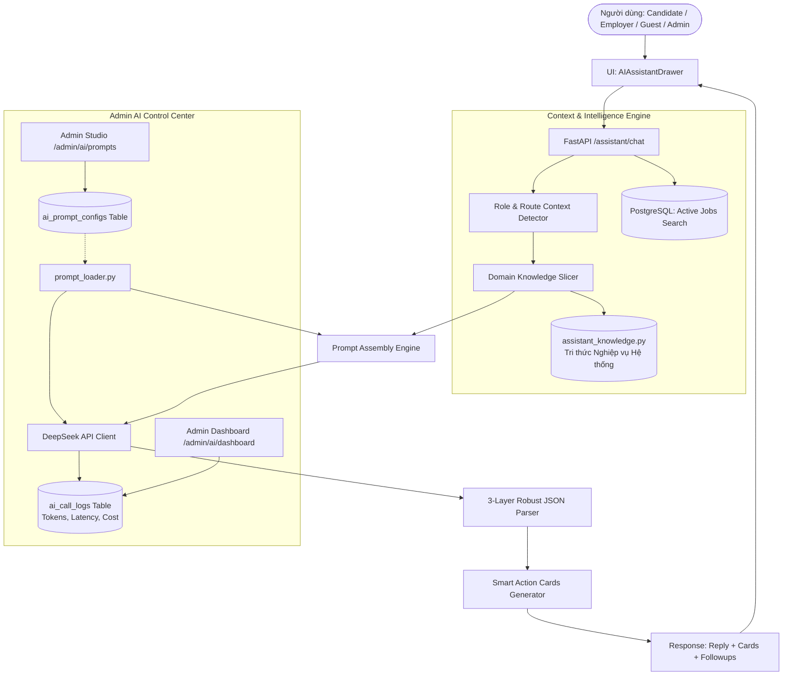

# 🚀 KẾ HOẠCH NÂNG CẤP TOÀN DIỆN: AI ASSISTANT THÀNH "HỆ THỐNG AI COPILOT & KỸ SƯ GIẢI PHÁP" (SYSTEM COPILOT & SOLUTIONS ENGINEER)

Tài liệu này định hình lại toàn bộ kiến trúc và nghiệp vụ của **AI Assistant** trên nền tảng **AI Job Portal**. Chatbot không đơn thuần chỉ là một công cụ hỏi-đáp xã giao, mà trở thành một **Kỹ sư Giải pháp Kỹ thuật & Cố vấn Chuyên sâu (Autonomous Solutions Engineer & System Copilot)** am tường 100% chức năng, giao diện, thuật toán và phân quyền trong toàn bộ hệ sinh thái.

---

## 📌 PHÂN TÍCH YÊU CẦU & BÀI TOÁN CỦA HỆ THỐNG

### 1. Vấn đề cốt lõi
- AI Assistant hiện tại có kiến thức tổng quan nhưng chưa có tri thức sâu (grounding) về từng nút bấm, luồng nghiệp vụ cụ thể của website (ví dụ: làm sao để kéo thả ATS Kanban, thuật toán pgvector tính điểm match thế nào, phân quyền 5 role Employer ra sao, xuất file Excel tiếng Việt không lỗi font thế nào...).
- Thiếu sự phân hóa tầng bậc rõ rệt giữa:
  - **Ứng viên (Candidate):** Cần một người Cố vấn sự nghiệp (Career Mentor) & Hướng dẫn sử dụng các công cụ đắc lực (CV Builder 5 mẫu ATS, Lộ trình học tập, MBTI/MI 80 câu, chat với HR).
  - **Nhà tuyển dụng (Employer):** Cần một **Kỹ sư Giải pháp (Customer Solutions Engineer)** hỗ trợ kỹ thuật và quy trình tuyển dụng B2B (tạo JD bằng AI, phân quyền Team 5 cấp độ, điều phối phỏng vấn & iCalendar .ics, xuất CSV UTF-8 BOM, AI Email).
  - **Khách vãng lai (Guest):** Cần đại sứ truyền thông & cỗ máy tăng trưởng (Growth Engine) bẻ lái thông minh, dẫn dắt đăng ký tài khoản miễn phí.
  - **Quản trị viên (Admin):** Cần bảng điều khiển kiểm soát toàn diện (Admin AI Studio) để theo dõi token, chi phí, và tinh chỉnh prompt/knowledge base theo thời gian thực mà không cần chạm vào source code.

---

## 🏗️ KIẾN TRÚC GIẢI PHÁP KỸ THUẬT (ENTERPRISE ARCHITECTURE)

---

## 💎 CHI TIẾT 3 TẦNG PERSONA & TRI THỨC NGHIỆP VỤ CHUYÊN SÂU

### 1. Ứng viên (Candidate Persona: "Career Mentor & Platform Navigator")
* **Tri thức hệ thống am tường:**
  - **CV Builder (`/cv-builder`):** 5 mẫu chuẩn ATS quốc tế (Modern, Minimalist, Executive, Tech, Creative), tự động chấm điểm độ khớp từ khóa, AI gợi ý kỹ năng và phần tóm tắt, xuất PDF chất lượng in ấn.
  - **Lộ trình Sự nghiệp (`/career-roadmap`):** Phân tích khoảng cách kỹ năng (Skill Gaps), đề xuất các mốc học tập theo thời gian thực (Estimated Months), tài liệu tham khảo.
  - **Trắc nghiệm Tính cách & Trí tuệ (`/tools/mbti`, `/tools/mi`):** 40 câu hỏi MBTI (16 nhóm tính cách & văn hóa doanh nghiệp) và 40 câu hỏi Đa trí tuệ MI (8 loại hình thông minh & ngành nghề tương thích).
  - **Theo dõi Ứng tuyển & Lịch phỏng vấn:** Vòng phỏng vấn, liên kết Google Calendar, tải file `.ics` đồng bộ vào Outlook/điện thoại, nhắn tin trực tiếp với HR qua In-app Chat.
* **Các kịch bản thực tế AI xử lý:**
  - *"Làm sao để CV của tôi vượt qua bộ lọc ATS của nhà tuyển dụng?"*
  - *"Sau khi làm bài trắc nghiệm MBTI ra kết quả INTJ, tôi nên tìm những công việc nào trên sàn?"*
  - *"Làm sao để liên hệ trực tiếp với HR sau khi nộp hồ sơ?"*
  - *"Làm thế nào để đồng bộ lịch phỏng vấn vào Google Calendar?"*

---

### 2. Nhà tuyển dụng (Employer Persona: "Dedicated B2B Solutions Engineer")
* **Tri thức hệ thống am tường (Đóng vai Kỹ sư Hỗ trợ Kỹ thuật):**
  - **Tạo JD thông minh (`/employer/jobs/new`):** AI tự động sinh JD chuẩn SEO & ATS theo tên vị trí, ngành nghề, cấp bậc và mức lương đề xuất.
  - **Hệ thống ATS Kanban (`/employer/candidates`):** 5 giai đoạn tuyển dụng (Ứng tuyển, Sàng lọc, Phỏng vấn, Đề nghị nhận việc, Từ chối). Hướng dẫn thao tác kéo-thả, lọc theo điểm AI Matching.
  - **Cơ chế AI CV Matching (Vector pgvector):** Giải thích cặn kẽ thuật toán tính điểm 3 trụ cột: Kỹ năng chuyên môn (40%), Kinh nghiệm & Cấp bậc (30%), Độ phù hợp lĩnh vực/Domain (30%), phát hiện điều kiện tiên quyết (Deal-breakers), gợi ý câu hỏi phỏng vấn theo lỗ hổng kỹ thuật của ứng viên.
  - **Phân quyền Thành viên Team (RBAC 5 Roles tại `/employer/team`):**
    - `Owner`: Toàn quyền công ty, thanh toán, xoá công ty, quản lý thành viên.
    - `HR Manager`: Đăng tin tuyển dụng, quản lý mọi ứng viên, phân công interviewer, gửi email.
    - `Department Lead`: Xem và đánh giá ứng viên của phòng ban mình, tham gia phỏng vấn.
    - `Interviewer`: Chỉ xem ứng viên được giao phỏng vấn, điền bảng điểm/đánh giá kỹ thuật.
    - `Viewer`: Quyền chỉ đọc báo cáo và danh sách.
  - **Lịch phỏng vấn & iCalendar (`.ics`):** Thiết lập lịch, tự sinh file `.ics` chuẩn RFC 5545, link Google Calendar tự động.
  - **AI Soạn thảo Thư tín (`EmailDraftModal`):** 3 mẫu thư chuyên nghiệp (Mời phỏng vấn, Thư mời nhận việc Offer Letter, Thư cảm ơn/từ chối tế nhị), tự điền tên ứng viên và vị trí.
  - **Xuất dữ liệu Excel/CSV:** Hướng dẫn xuất dữ liệu đã được xử lý UTF-8 BOM để Excel không bao giờ bị lỗi font Tiếng Việt.
  - **Xác minh Doanh nghiệp (`/employer/company`):** Hướng dẫn nộp Giấy phép kinh doanh (GPKD) để nhận Huy hiệu Đã xác minh (Verified Badge).
* **Các kịch bản thực tế AI xử lý:**
  - *"Tôi muốn phân quyền cho một lập trình viên Tech Lead vào chấm điểm ứng viên mà không được quyền sửa tin tuyển dụng thì làm thế nào?"* -> AI hướng dẫn gán role `Interviewer` hoặc `Department Lead` tại `/employer/team`.
  - *"Tại sao điểm AI Matching của ứng viên này lại bị trừ và có cảnh báo Deal-breaker?"* -> AI giải thích cơ chế so sánh vector ngữ nghĩa và đối chiếu kinh nghiệm/công nghệ cốt lõi.
  - *"Làm sao để xuất toàn bộ danh sách 200 ứng viên ra Excel mở bằng máy tính Windows không bị lỗi font?"* -> AI hướng dẫn bấm nút 'Xuất CSV' trên thanh công cụ và giải thích định dạng UTF-8 BOM tích hợp sẵn.
  - *"Công ty tôi muốn có huy hiệu Xác minh uy tín (Verified Badge) thì làm theo các bước nào?"* -> Hướng dẫn vào Cài đặt công ty tải lên GPKD.

---

### 3. Khách vãng lai (Guest Persona: "Growth Engine & Sales Diplomat")
* Chào đón nồng hậu, giải đáp thắc mắc về thị trường lao động và hướng nghiệp.
* **Nghệ thuật Bẻ lái Ngoại giao (Diplomatic Pivot):** Xử lý câu hỏi đùa cợt/linh tinh một cách duyên dáng và dẫn dắt về giá trị tuyển dụng/việc làm.
* **Chuyển đổi Khách hàng (Lead Generation):** Luôn khéo léo đính kèm thẻ hành động và lời nhắc: *Dành 30 giây [Đăng ký tài khoản miễn phí](/register) để lưu vĩnh viễn CV chuẩn ATS và kết quả trắc nghiệm*.

---

### 4. Quản trị viên (Admin Persona & AI Control Studio)
* **Toàn quyền kiểm soát và theo dõi:**
  - Truy cập `/admin/ai/prompts`: Xem, thử nghiệm (Playground) và cập nhật System Prompt của Chatbot trực tiếp trên giao diện mà không cần deploy lại backend.
  - Truy cập `/admin/ai/dashboard`: Giám sát thời gian thực số lượng token, chi phí ước tính (USD), độ trễ phản hồi (latency), tỷ lệ thành công của DeepSeek API.
  - Quản lý quy trình kiểm duyệt Doanh nghiệp, duyệt tin tuyển dụng và quản trị người dùng.

---

## 📋 CÁC BƯỚC TRIỂN KHAI CHI TIẾT (STEP-BY-STEP IMPLEMENTATION)

### Giai đoạn 1: Xây dựng Cơ sở Tri thức Nghiệp vụ Chuẩn hóa (`assistant_knowledge.py`)
- Tạo file [backend/app/services/assistant_knowledge.py](file:///d:/ai-job-portal/backend/app/services/assistant_knowledge.py) chứa:
  - Danh mục chi tiết các trang web, URL, mục đích sử dụng.
  - Ma trận tính năng ứng viên (CV Builder, Roadmap, MBTI/MI, Search, Chat).
  - Ma trận tính năng Nhà tuyển dụng (AI JD, ATS Kanban, AI Match Vector 40/30/30, RBAC 5 roles, Interviews .ics, AI Email, CSV UTF-8 BOM, Verification).
  - Ma trận tính năng Admin (Duyệt GPKD, User Moderation, AI Prompt Studio, AI Logs).
  - Hướng dẫn giải quyết các thắc mắc thường gặp (Troubleshooting FAQs).

### Giai đoạn 2: Nâng cấp AI Assistant Service (`assistant_service.py`)
- Cập nhật [backend/app/services/assistant_service.py](file:///d:/ai-job-portal/backend/app/services/assistant_service.py):
  - **Dynamic Knowledge Slicing:** Dựa vào `role` (`candidate`, `employer`, `guest`, `admin`) và từ khóa trong câu hỏi của người dùng để trích xuất lát cắt tri thức phù hợp nhất, giúp câu trả lời chuẩn xác 100% nghiệp vụ mà không làm phình token.
  - **Kỹ sư Hỗ trợ Kỹ thuật (Solutions Engineer) Prompting:** Khi role là `employer`, AI tự động xưng hô và giải thích như một Kỹ sư Hỗ trợ Sản phẩm Doanh nghiệp (từng bước 1-2-3, nút bấm, URL).
  - **Smart Action Cards:** Tự động tạo thẻ hành động sâu (Deep-link cards) đưa người dùng đến đúng trang tính năng (ví dụ: thẻ "Quản lý Đội ngũ & Phân quyền", "Soạn tin tuyển dụng mới", "Bộ lọc ATS Kanban", "Tạo CV mới").
  - **Few-Shot Examples:** Bổ sung các mẫu đối thoại kinh điển cho cả Candidate và Employer vào prompt để định hình câu trả lời mẫu mực.

### Giai đoạn 3: Tích hợp Admin Prompt Studio & CSDL
- Đảm bảo trong CSDL có bản ghi `assistant_chat` của bảng `ai_prompt_configs` để Admin có thể xem và sửa đổi trực tiếp từ giao diện Admin.
- Cập nhật `prompt_loader.py` đồng bộ với fallback prompt chuyên sâu mới.

### Giai đoạn 4: Tối ưu UI Frontend (`AIAssistantDrawer.tsx` & Suggestions)
- Bổ sung bộ câu hỏi gợi ý nhanh (Quick Suggestions) cực kỳ sát với nghiệp vụ thực tế cho từng trang và từng vai trò:
  - *Candidate:* "Làm sao để CV đạt trên 85 điểm ATS?", "Xem lộ trình phát triển kỹ năng ở đâu?", "Làm sao để liên hệ trực tiếp với HR?".
  - *Employer:* "Cách phân quyền thành viên trong Team tuyển dụng?", "Giải thích cơ chế tính điểm AI CV Matching?", "Cách xuất danh sách ứng viên ra Excel không bị lỗi font?".
- Tối ưu hiển thị Action Cards có icon rõ ràng, phân biệt thẻ Job, thẻ Công cụ (Tool), thẻ Hành động (Action) và thẻ Quản trị (Admin/Employer).

### Giai đoạn 5: Bung Hết Sức Model — Autonomous AI Copilot & Agentic Tool Calling
- Tạo [backend/app/services/assistant_tools.py](file:///d:/ai-job-portal/backend/app/services/assistant_tools.py):
  - Khai báo 5 Agentic Tools chuẩn OpenAI Schema:
    1. `search_live_jobs`: Tìm kiếm việc làm đang mở theo từ khóa, mức lương, địa điểm, hình thức làm việc.
    2. `get_candidate_profile_and_cv`: Trích xuất hồ sơ cá nhân, kỹ năng, điểm đánh giá AI của CV ứng viên.
    3. `get_candidate_applications`: Lấy lịch sử và tiến độ ứng tuyển thực tế từ bảng `applications`.
    4. `get_employer_ats_stats`: Tổng hợp số liệu ATS thực tế (số tin tuyển dụng, tổng hồ sơ, breakdown theo 5 stage Kanban, lịch phỏng vấn sắp tới).
    5. `get_job_detail_by_id`: Tra cứu chi tiết một công việc cụ thể.
  - Xây dựng `dispatch_tool_call` điều phối an toàn với SQLAlchemy Session.
- Cập nhật [backend/app/services/deepseek_client.py](file:///d:/ai-job-portal/backend/app/services/deepseek_client.py):
  - Bổ sung tham số `tools` và `tool_choice` trong `create_chat_completion`.
- Cập nhật [backend/app/services/assistant_service.py](file:///d:/ai-job-portal/backend/app/services/assistant_service.py):
  - Tích hợp 2-turn Tool Calling Execution Loop:
    - Turn 1: Gửi messages kèm `tools`.
    - Khi có `tool_calls`: Thực thi tool lấy dữ liệu thực từ PostgreSQL, append message `tool`.
    - Turn 2: Gọi DeepSeek tổng hợp câu trả lời chuẩn xác 100% kèm `suggested_cards` và `suggested_followups`.
- Cập nhật UI [frontend/src/components/ai-assistant/AIAssistantDrawer.tsx](file:///d:/ai-job-portal/frontend/src/components/ai-assistant/AIAssistantDrawer.tsx):
  - Nâng cấp hiển thị thẻ Job và thẻ Application trực quan với Badge lương, địa điểm, công ty và trạng thái hồ sơ.
- Kiểm thử tự động [backend/tests/test_assistant.py](file:///d:/ai-job-portal/backend/tests/test_assistant.py) và chạy script thực chiến.

---

## 🛡️ KẾ HOẠCH XÁC THỰC (VERIFICATION PLAN)

### 1. Kiểm thử Tự Động (Automated Tests)
- Chạy pytest: `pytest backend/tests/test_assistant.py -v`
- Chạy script mô phỏng trực tiếp với DeepSeek API: `python scratch/test_ai_assistant_live.py` kiểm tra cả 3 role (Candidate, Employer, Guest) trả về đúng nghiệp vụ, không lỗi JSON, có đầy đủ cards và followups.

### 2. Kiểm thử Thủ công trên Giao diện (Manual E2E Testing)
- Mở website ở vai trò Guest -> Chat câu hỏi ngẫu nhiên và câu hỏi việc làm -> Kiểm tra thẻ Đăng ký và khả năng bẻ lái.
- Đăng nhập tài khoản Employer -> Mở Drawer -> Hỏi: "Làm sao để phân quyền cho người phỏng vấn xem CV mà không được đổi trạng thái?" -> Kiểm tra AI có đóng vai Kỹ sư Giải pháp hướng dẫn chính xác role `Interviewer` tại `/employer/team` hay không.
- Đăng nhập tài khoản Candidate -> Mở Drawer -> Hỏi: "Cách tạo CV chuẩn ATS và làm trắc nghiệm tính cách?" -> Kiểm tra thẻ điều hướng tới `/cv-builder` và `/tools/mbti`.
- Vào `/admin/ai/dashboard` kiểm tra token log của `assistant_chat`.
