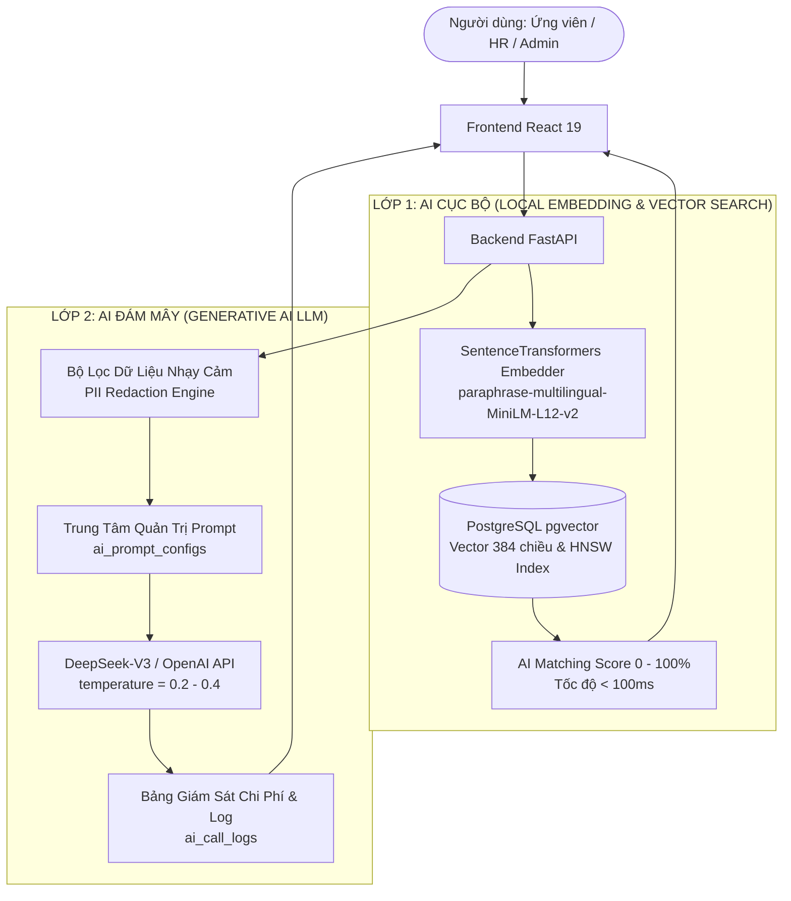

# 🤖 NHẬT KÝ VẬN HÀNH AI, QUẢN TRỊ PROMPT & KIỂM SOÁT THIÊN LỆCH (AI LOG)

**Dự án:** Nền tảng Tuyển dụng Thông minh Tích hợp Trí tuệ Nhân tạo (**AI-Powered Job Portal**)  
**Học phần:** Ứng dụng Trí tuệ Nhân tạo  
**Kiến trúc AI:** Mô hình 2 lớp (SentenceTransformers Cục bộ + DeepSeek-V3 LLM API)  
**Tiêu chuẩn:** Human-in-the-Loop & Bias-Free AI (Giảm thiểu thiên lệch tối đa)  
**Phiên bản:** 2.0 (Cập nhật hoàn chỉnh)

---

## 1. TỔNG QUAN CHIẾN LƯỢC TÍCH HỢP AI TRONG DỰ ÁN

Hệ thống áp dụng kiến trúc Trí tuệ Nhân tạo phân cấp nhằm tối ưu hóa đồng thời 3 yếu tố: **Tốc độ phản hồi (Latency)**, **Bảo mật dữ liệu cá nhân (Data Privacy)**, và **Chi phí vận hành (Token Cost)**:



---

## 2. DANH MỤC 5 SYSTEM PROMPTS CHUẨN MỰC CỦA HỆ THỐNG

Toàn bộ các Prompt được quản lý động trong bảng `ai_prompt_configs`, cho phép Quản trị viên tùy chỉnh mà không cần khởi động lại dịch vụ:

### 2.1. Prompt 1: Đánh Giá & Xếp Loại CV Chuẩn ATS (`cv_evaluate`)
- **Mục tiêu:** Phân tích cấu trúc CV của ứng viên, đối chiếu với chuẩn định dạng ATS quốc tế và chỉ ra các điểm yếu cần khắc phục.
- **Nhiệt độ (Temperature):** `0.3` | **Max Tokens:** `1500`
- **Khuôn mẫu Prompt (System Template):**
```text
Bạn là chuyên gia tư vấn tuyển dụng quốc tế và kiểm định hệ thống ATS (Applicant Tracking System).
Nhiệm vụ của bạn là phân tích nội dung CV dưới đây và trả về kết quả dưới định dạng JSON duy nhất.

CÁC TIÊU CHÍ ĐÁNH GIÁ:
1. Điểm tổng quát (Thang 100).
2. Phân loại mức độ hoàn thiện: "Xuất sắc", "Tốt", "Cần cải thiện".
3. Danh sách 3 điểm mạnh nổi bật.
4. Danh sách 3 điểm yếu hoặc lỗi định dạng (ví dụ: thiếu số liệu định lượng, từ khóa mơ hồ).
5. Đề xuất cải thiện cụ thể theo từng mục (Học vấn, Kinh nghiệm, Kỹ năng).

QUY TẮC BẮT BUỘC:
- Trả về đúng cú pháp JSON hợp lệ, không bọc trong ```json hay văn bản giải thích thừa.
- Đánh giá hoàn toàn khách quan, không phân biệt tuổi tác, giới tính, trường đào tạo.
```

---

### 2.2. Prompt 2: Lộ Trình Sự Nghiệp Cá Nhân Hóa (`roadmap`)
- **Mục tiêu:** Dựa trên kỹ năng hiện tại của ứng viên và vị trí mục tiêu, xây dựng lộ trình học tập và kỹ năng cần bổ sung theo từng giai đoạn (1-3 tháng, 3-6 tháng, 6-12 tháng).
- **Nhiệt độ (Temperature):** `0.4` | **Max Tokens:** `2000`
- **Khuôn mẫu Prompt (System Template):**
```text
Bạn là Cố vấn Định hướng Nghề nghiệp Công nghệ Thông tin (Career Coach).
Dựa trên thông tin ứng viên (kỹ năng hiện có, năm kinh nghiệm) và vị trí mục tiêu mong muốn:
Hãy xây dựng lộ trình nâng cao năng lực chi tiết chia theo 3 giai đoạn:
- Giai đoạn 1 (0 - 3 tháng): Củng cố kiến thức nền tảng và lấp đầy lỗ hổng kỹ năng cốt lõi.
- Giai đoạn 2 (3 - 6 tháng): Thực hành dự án chuyên sâu, kỹ năng nâng cao (System Design, Cloud).
- Giai đoạn 3 (6 - 12 tháng): Xây dựng dấu ấn cá nhân, đóng góp mã nguồn mở, chứng chỉ quốc tế.

Đầu ra định dạng JSON: { "summary": string, "phases": [ { "stage": string, "duration": string, "focus_skills": [], "actions": [], "recommended_certs": [] } ] }
```

---

### 2.3. Prompt 3: Tóm Tắt Năng Lực CV Theo JD Tuyển Dụng (`summarize_cv`)
- **Mục tiêu:** Hỗ trợ chuyên viên HR đọc nhanh hồ sơ ứng viên chỉ trong 3 giây.
- **Nhiệt độ (Temperature):** `0.2` | **Max Tokens:** `1000`
- **Khuôn mẫu Prompt (System Template):**
```text
Bạn là Trợ lý Sàng lọc Hồ sơ Nhân sự AI.
Dưới đây là Bản mô tả công việc (JD) và Hồ sơ CV của ứng viên (đã được ẩn danh thông tin cá nhân).
Hãy so sánh độ phù hợp và tóm tắt ngắn gọn:
1. 3 Điểm mạnh cốt lõi phù hợp trực tiếp với JD.
2. 2 Điểm lưu ý hoặc khoảng trống công nghệ ứng viên chưa thể hiện rõ trong CV.
3. Nhận định tổng quan ngắn gọn trong 2 câu.

Đầu ra chuẩn JSON: { "strengths": [string], "concerns": [string], "verdict": string }
Tuyệt đối không suy diễn thông tin không có trong CV; không đưa ra phán quyết loại bỏ ứng viên.
```

---

### 2.4. Prompt 4: Gợi Ý Bộ Câu Hỏi Phỏng Vấn Chuyên Sâu (`interview_questions`)
- **Mục tiêu:** Cung cấp bộ câu hỏi phỏng vấn kỹ thuật và tình huống riêng biệt cho từng ứng viên.
- **Nhiệt độ (Temperature):** `0.3` | **Max Tokens:** `1200`
- **Khuôn mẫu Prompt (System Template):**
```text
Bạn là Kỹ sư Trưởng (Tech Lead) chuẩn bị tham gia hội đồng phỏng vấn kỹ thuật.
Dựa trên các dự án và công nghệ thực tế ứng viên khai báo trong CV:
Hãy đề xuất 3 đến 5 câu hỏi phỏng vấn kỹ thuật đào sâu:
- Tập trung vào các thử thách kiến trúc, cách giải quyết sự cố thực tế (troubleshooting).
- 1 câu hỏi về tư duy thiết kế hệ thống (System Architecture) hoặc tối ưu cơ sở dữ liệu.
- Kèm theo gợi ý câu trả lời kỳ vọng (Expected Answer Key) để người phỏng vấn dễ đánh giá.

Đầu ra chuẩn JSON: { "questions": [ { "question": string, "focus_area": string, "expected_answer": string } ] }
```

---

### 2.5. Prompt 5: Soạn Thảo Dự Thảo Email Tuyển Dụng (`generate_email`)
- **Mục tiêu:** Tự động sinh thư mời phỏng vấn hoặc thư từ chối trang trọng, lịch thiệp.
- **Nhiệt độ (Temperature):** `0.3` | **Max Tokens:** `800`
- **Khuôn mẫu Prompt (System Template):**
```text
Bạn là Trợ lý Truyền thông Tuyển dụng Doanh nghiệp.
Nhiệm vụ: Soạn thảo email phản hồi kết quả ứng tuyển gửi tới ứng viên.
Các tham số:
- Loại email: {email_type} (interview_invitation | rejection)
- Tên vị trí: {job_title}
- Tên công ty: {company_name}
- Chi tiết bổ sung (thời gian, link họp): {extra_details}

QUY TẮC BẮT BUỘC:
- Văn phong chuyên nghiệp, tôn trọng, lịch sự và truyền cảm hứng tích cực.
- Nếu là thư từ chối: Cảm ơn sự quan tâm của ứng viên, lưu ý sẽ lưu hồ sơ vào Talent Pool để liên hệ cơ hội tương lai. Không đưa ra các lý do mang tính định kiến.
- Nếu là thư mời: Liệt kê rõ ràng thời gian, hình thức phỏng vấn, người liên hệ.

Đầu ra chuẩn JSON: { "subject": string, "body": string }
```

---

## 3. CẤU TRÚC VÀ DỮ LIỆU MẪU BẢNG NHẬT KÝ CUỘC GỌI AI (`ai_call_logs`)

Toàn bộ các cuộc gọi tới LLM API đều được bắt giữ (intercept) và ghi vết tự động vào cơ sở dữ liệu để phục vụ kiểm toán tài chính và giám sát kỹ thuật:

### 3.1. Cấu trúc trường dữ liệu bảng `ai_call_logs`
- `id`: Định danh bản ghi log.
- `user_id`: ID người dùng kích hoạt (HR hoặc Admin).
- `feature`: Tên tính năng (`summarize_cv`, `generate_email`, `interview_questions`, `cv_evaluate`, `roadmap`).
- `model`: Tên mô hình (`deepseek-chat` / `gpt-4o-mini`).
- `prompt_tokens`: Lượng token đầu vào.
- `completion_tokens`: Lượng token đầu ra.
- `cost_usd`: Chi phí ước tính tính theo USD.
- `latency_ms`: Thời gian xử lý từ lúc gửi yêu cầu đến khi nhận kết quả (mili-giây).
- `status`: Trạng thái (`success` hoặc `failed`).
- `error_message`: Nội dung lỗi (nếu có).
- `created_at`: Thời điểm gọi.

### 3.2. Dữ liệu Mẫu Nhật Ký Giám Sát Thực Tế

| ID | Thời Gian | Tính Năng | Model | Token Vào | Token Ra | Latency | Chi Phí (USD) | Trạng Thái |
| :---: | :--- | :--- | :--- | :---: | :---: | :---: | :---: | :---: |
| #101 | 04/09 09:15:22 | `summarize_cv` | deepseek-chat | 842 | 215 | 1,420 ms | $0.00018 | `success` |
| #102 | 04/09 09:18:05 | `interview_questions`| deepseek-chat | 956 | 380 | 1,850 ms | $0.00028 | `success` |
| #103 | 04/09 10:02:40 | `generate_email` | deepseek-chat | 412 | 195 | 980 ms | $0.00011 | `success` |
| #104 | 04/09 11:20:15 | `cv_evaluate` | deepseek-chat | 1,240 | 520 | 2,340 ms | $0.00042 | `success` |
| #105 | 04/09 14:05:30 | `roadmap` | deepseek-chat | 780 | 610 | 2,100 ms | $0.00035 | `success` |

> 💰 **Thống kê chi phí:** Nhờ lựa chọn mô hình thế hệ mới DeepSeek-V3, chi phí trung bình cho mỗi tác vụ hỗ trợ tuyển dụng chỉ dao động từ **$0.0001 – $0.0004** (~2.5đ – 10đ VNĐ/lượt), tiết kiệm đến **95%** chi phí so với các mô hình truyền thống mà vẫn đảm bảo độ chính xác ngôn ngữ xuất sắc.

---

## 4. NGUYÊN TẮC ĐẠO ĐỨC AI & KIỂM SOÁT THIÊN LỆCH (BIAS-FREE AI MITIGATION)

Nhằm đáp ứng yêu cầu khắt khe của học phần **Ứng dụng Trí tuệ Nhân tạo** về tính an toàn và minh bạch, hệ thống thiết lập 4 rào chắn kiểm soát đạo đức nghiêm ngặt:

### 4.1. Nguyên tắc "Human-in-the-Loop" (Con người giữ quyền quyết định)
- **Tuyệt đối không tự động hóa quyết định tuyển dụng:** AI không được phép tự động từ chối hồ sơ hay tự động ra quyết định tuyển chọn.
- AI đóng vai trò **Trợ lý đề xuất thông tin (Advisory Assistant)**. Mọi điểm số, tóm tắt và câu hỏi phỏng vấn chỉ hiển thị dưới dạng khuyến nghị.
- Mọi thao tác chuyển trạng thái ứng viên (`shortlisted`, `rejected`, `accepted`) bắt buộc phải do chuyên viên nhân sự (HR) hoặc Trưởng bộ phận kỹ thuật bấm nút xác nhận bằng tay.

### 4.2. Khử Định Danh Cá Nhân (PII Redaction Engine)
Trước khi gửi dữ liệu hồ sơ ứng viên sang API ngôn ngữ lớn của bên thứ ba, hệ thống kích hoạt module xử lý văn bản cục bộ để ẩn danh hóa dữ liệu:
- Họ và tên ứng viên $\rightarrow$ chuyển thành `[Ứng viên #CandidateID]`.
- Số điện thoại, địa chỉ nhà riêng $\rightarrow$ loại bỏ hoàn toàn.
- Ngày tháng năm sinh / Tuổi $\rightarrow$ chỉ giữ lại số năm kinh nghiệm làm việc tích lũy.
- Ảnh đại diện, giới tính $\rightarrow$ không truyền vào ngữ cảnh của AI.
- **Mục tiêu:** Ngăn chặn tuyệt đối việc mô hình AI đưa ra nhận định thiên lệch dựa trên các yếu tố ngoại cảnh (giới tính, vùng miền, độ tuổi).

### 4.3. Kiểm soát Độ sáng tạo và Ảo giác (Hallucination Control)
- Thiết lập tham số nhiệt độ sinh `temperature = 0.2 - 0.4` đối với các tác vụ phân tích hồ sơ và soạn thảo văn bản hành chính.
- Bắt buộc mô hình tuân thủ quy tắc: *"Nếu một kỹ năng hoặc thông tin không được đề cập rõ ràng trong CV, không được phép suy diễn là ứng viên đã biết kỹ năng đó."*

### 4.4. Truy vết Bất biến (Immutable Audit Trail)
- Mọi lượt gọi AI, tham số đầu vào và kết quả trả về đều được lưu vào bảng `ai_call_logs` và liên kết với `admin_audit_logs`, phục vụ việc thanh tra và đối soát định kỳ của nhà trường và doanh nghiệp.

---

## 5. MINH CHỨNG PHẢN BIỆN MÃ NGUỒN CÙNG AI (AI PAIR PROGRAMMING EVIDENCE)

Trong suốt quá trình phát triển dự án, nhóm sinh viên đóng vai trò là **Kỹ sư Trưởng (Tech Lead)** thực hiện kiểm duyệt, phản biện và tối ưu mã nguồn do AI gợi ý:

### 5.1. Bằng chứng 1: Tối ưu Hàm Cosine Similarity trên PostgreSQL pgvector

- **Code do AI sinh ra ban đầu:**
```python
# Đoạn code AI sinh ra: Trả về trực tiếp khoảng cách Cosine Distance [0, 2]
def get_matching_jobs(db: Session, cv_embedding: list[float]):
    query = text("""
        SELECT id, title, (embedding <=> :cv_vec) AS distance
        FROM jobs
        ORDER BY distance ASC
    """)
    return db.execute(query, {"cv_vec": str(cv_embedding)}).fetchall()
```

- **Sinh viên phản biện kỹ thuật:**
  > *"Toán tử `<=>` của pgvector trả về Cosine Distance trong khoảng $[0, 2]$. Khoảng cách bằng 0 là trùng khít 100%, nhưng nếu trả con số `0.12` lên Frontend, người dùng sẽ lầm tưởng là độ phù hợp chỉ có 12%!  
  > Ngoài ra, hệ thống sẽ bị lỗi crash khi chạy Unit Test trên máy tính không cài extension pgvector."*

- **Code sinh viên đã hiệu chỉnh và đưa vào sản phẩm:**
```python
# Code chuẩn hóa sau khi sinh viên phản biện: Quy đổi % và hỗ trợ Fallback an toàn
def get_matching_jobs(db: Session, cv_embedding: list[float], limit: int = 10):
    query = text("""
        SELECT id, title, company_id,
               -- Kẹp biên an toàn 0% - 100% và quy đổi độ tương đồng
               GREATEST(0.0, LEAST(100.0, (1.0 - (embedding <=> :cv_vec)) * 100.0)) AS match_score
        FROM jobs
        WHERE is_active = true AND embedding IS NOT NULL
        ORDER BY embedding <=> :cv_vec ASC
        LIMIT :limit
    """)
    try:
        result = db.execute(query, {"cv_vec": str(cv_embedding), "limit": limit}).fetchall()
        return [{"job_id": r.id, "title": r.title, "match_score": round(float(r.match_score), 1)} for r in result]
    except Exception:
        # Fallback tính toán bằng hàm Python thuần cho môi trường kiểm thử SQLite
        return _fallback_cosine_similarity_python(db, cv_embedding, limit)
```

---

### 5.2. Bằng chứng 2: Cơ chế Soft Delete An toàn Cho Tin Tuyển Dụng Đã Có Đơn Ứng Tuyển

- **Vấn đề phát hiện khi review code AI:**
  Khi AI viết API xóa tin tuyển dụng, AI đề xuất câu lệnh `db.delete(job)`. Trong thực tế, khi tin tuyển dụng đã có ít nhất một ứng viên nộp đơn (`applications`), lệnh xóa cứng này ngay lập tức ném ra lỗi ngoại lệ `ForeignKeyViolation` làm sập máy chủ.
- **Giải pháp sinh viên triển khai:**
  Xây dựng cơ chế kiểm tra điều kiện xóa thông minh:
  ```python
  @router.delete("/jobs/{job_id}", status_code=status.HTTP_200_OK)
  def delete_job(job_id: int, db: Session = Depends(get_db), current_user: User = Depends(get_current_user)):
      job = db.query(Job).filter(Job.id == job_id).first()
      if not job:
          raise HTTPException(status_code=404, detail="Không tìm thấy tin tuyển dụng")
      
      # Kiểm tra nếu đã có ứng viên nộp hồ sơ
      has_applications = db.query(Application).filter(Application.job_id == job_id).count() > 0
      if has_applications:
          # Kích hoạt Soft Delete an toàn bảo toàn dữ liệu lịch sử
          job.is_active = False
          db.commit()
          return {"message": "Tin tuyển dụng đã có ứng viên nộp đơn, đã tự động chuyển sang trạng thái Tạm đóng (Soft Delete) an toàn."}
      
      # Nếu tin chưa có ứng viên, cho phép xóa cứng sạch sẽ CSDL
      db.delete(job)
      db.commit()
      return {"message": "Đã xóa hoàn toàn tin tuyển dụng thành công."}
  ```

---

### 5.3. Bằng chứng 3: Xử Lý Chống Vỡ Layout Ultra-wide Cho Bảng Kanban ATS

- **Vấn đề UX phát hiện:**
  Khi hiển thị đồng thời 6 cột tuyển dụng trên màn hình máy tính có độ phân giải trung bình (1366x768 hoặc 1920x1080), việc chia cột tĩnh dễ khiến các thẻ bị co rúm, tràn viền hoặc xuất hiện 2 thanh cuộn ngang gây ức chế thao tác kéo thả.
- **Giải pháp sinh viên tối ưu:**
  - Thiết kế chế độ Ultra-wide Canvas `max-w-[1840px]`.
  - Bổ sung nút 1-click **"Thu gọn danh sách Job"** để giải phóng 100% chiều ngang màn hình cho bảng Kanban.
  - Thiết lập thuộc tính co giãn tự động cho 6 cột: `min-w-[220px] max-w-[340px] flex-1`, tích hợp hiệu ứng kéo thả mượt mà với `framer-motion`.
