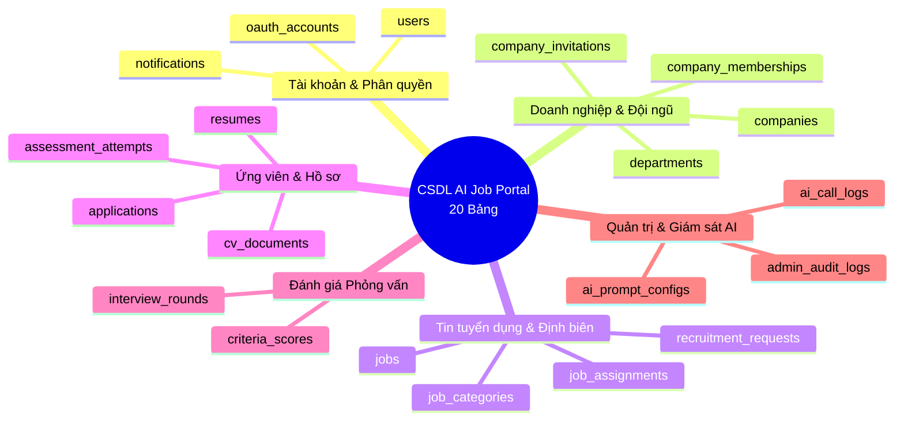
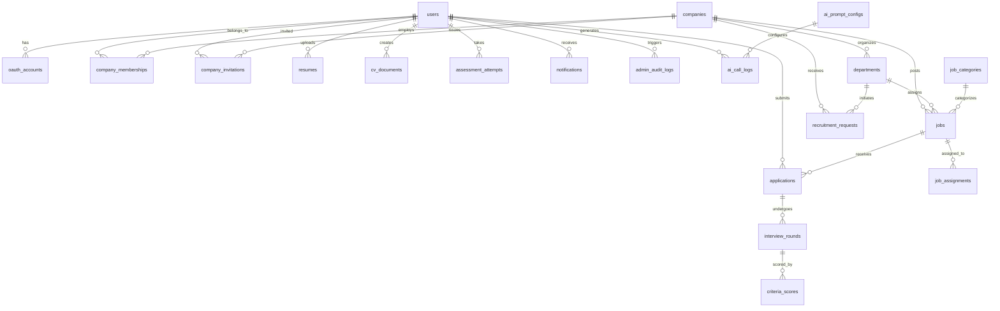

# 🗄️ THIẾT KẾ CƠ SỞ DỮ LIỆU & VECTOR SEARCH (DATABASE DESIGN)

**Dự án:** Nền tảng Tuyển dụng Thông minh Tích hợp Trí tuệ Nhân tạo (**AI-Powered Job Portal**)  
**Học phần:** Ứng dụng Trí tuệ Nhân tạo  
**Hệ quản trị CSDL:** PostgreSQL 17 + Extension `pgvector` (Hỗ trợ Vector Search đa chiều)  
**ORM:** SQLAlchemy 2.0 (Declarative Base) + Pydantic v2  
**Phiên bản:** 2.0 (Chuẩn hóa toàn diện 20 bảng thực tế)

---

## 1. TỔNG QUAN KIẾN TRÚC DỮ LIỆU

Cơ sở dữ liệu của dự án được thiết kế theo chuẩn hóa dạng 3NF (Third Normal Form), kết hợp khả năng lưu trữ và truy vấn vector tương đồng cao tốc thông qua extension **`pgvector`**. Hệ thống quản lý toàn bộ vòng đời của nền tảng B2B SaaS gồm 20 bảng thực thể, được chia thành 6 nhóm nghiệp vụ chính:



---

## 2. SƠ ĐỒ THỰC THỂ LIÊN KẾT (ERD MERMAID DIAGRAM)



---

## 3. CHI TIẾT ĐẶC TẢ 20 BẢNG DỮ LIỆU THỰC TẾ

### 3.1. Nhóm 1: Quản lý Tài khoản & Phân quyền (3 Bảng)

#### Bảng `users` (Người dùng hệ thống)
Lưu trữ thông tin định danh và tài khoản đăng nhập của toàn bộ các đối tượng người dùng.
| Tên Cột | Kiểu Dữ Liệu | Ràng Buộc | Mô Tả Nghiệp Vụ |
| :--- | :--- | :--- | :--- |
| `id` | `INTEGER` | PK, Auto Increment | Khóa chính |
| `email` | `VARCHAR(255)` | Unique, Not Null, Index | Email đăng nhập chính thức |
| `hashed_password` | `VARCHAR(255)` | Nullable | Mật khẩu mã hóa bằng bcrypt (null nếu login Google) |
| `full_name` | `VARCHAR(255)` | Not Null | Họ và tên đầy đủ |
| `role` | `VARCHAR(50)` | Not Null, Default 'candidate' | Vai trò: `candidate`, `employer`, `admin` |
| `phone` | `VARCHAR(20)` | Nullable | Số điện thoại liên hệ |
| `avatar_url` | `VARCHAR(500)` | Nullable | Đường dẫn ảnh đại diện cá nhân |
| `is_active` | `BOOLEAN` | Default True | Trạng thái hoạt động (khóa tài khoản khi false) |
| `is_verified` | `BOOLEAN` | Default False | Trạng thái đã xác minh email |
| `created_at` | `TIMESTAMP` | Default NOW() | Thời điểm tạo tài khoản |
| `updated_at` | `TIMESTAMP` | Default NOW() | Thời điểm cập nhật gần nhất |

#### Bảng `oauth_accounts` (Tài khoản liên kết ngoài)
Lưu trữ thông tin liên kết Google OAuth2 để đăng nhập một chạm.
| Tên Cột | Kiểu Dữ Liệu | Ràng Buộc | Mô Tả Nghiệp Vụ |
| :--- | :--- | :--- | :--- |
| `id` | `INTEGER` | PK, Auto Increment | Khóa chính |
| `user_id` | `INTEGER` | FK -> `users.id`, Not Null | Liên kết tới người dùng |
| `provider` | `VARCHAR(50)` | Not Null | Nhà cung cấp: `google` |
| `provider_account_id`| `VARCHAR(255)` | Not Null | Mã định danh người dùng từ Google |
| `created_at` | `TIMESTAMP` | Default NOW() | Thời điểm liên kết |

#### Bảng `notifications` (Thông báo người dùng)
Lưu trữ lịch sử thông báo hệ thống (lịch phỏng vấn, kết quả duyệt đơn).
| Tên Cột | Kiểu Dữ Liệu | Ràng Buộc | Mô Tả Nghiệp Vụ |
| :--- | :--- | :--- | :--- |
| `id` | `INTEGER` | PK, Auto Increment | Khóa chính |
| `user_id` | `INTEGER` | FK -> `users.id`, Not Null | Người nhận thông báo |
| `title` | `VARCHAR(255)` | Not Null | Tiêu đề thông báo |
| `message` | `TEXT` | Not Null | Nội dung thông báo |
| `type` | `VARCHAR(50)` | Default 'info' | Phân loại: `interview`, `application`, `system` |
| `is_read` | `BOOLEAN` | Default False | Đã đọc hay chưa |
| `created_at` | `TIMESTAMP` | Default NOW() | Thời điểm gửi |

---

### 3.2. Nhóm 2: Doanh nghiệp & Quản lý Đội ngũ Tuyển dụng (4 Bảng)

#### Bảng `companies` (Hồ sơ Doanh nghiệp)
Lưu trữ thông tin pháp nhân của các công ty tuyển dụng trên nền tảng.
| Tên Cột | Kiểu Dữ Liệu | Ràng Buộc | Mô Tả Nghiệp Vụ |
| :--- | :--- | :--- | :--- |
| `id` | `INTEGER` | PK, Auto Increment | Khóa chính |
| `name` | `VARCHAR(255)` | Not Null, Index | Tên doanh nghiệp chính thức |
| `tax_code` | `VARCHAR(50)` | Nullable | Mã số thuế doanh nghiệp |
| `website` | `VARCHAR(255)` | Nullable | Website công ty |
| `logo_url` | `VARCHAR(500)` | Nullable | Đường dẫn logo doanh nghiệp |
| `company_size` | `VARCHAR(50)` | Nullable | Quy mô: `10-50`, `50-200`, `200-1000`, `1000+` |
| `industry` | `VARCHAR(100)` | Nullable | Ngành nghề hoạt động chính |
| `address` | `VARCHAR(255)` | Nullable | Địa chỉ trụ sở chính |
| `description` | `TEXT` | Nullable | Giới thiệu doanh nghiệp |
| `is_active` | `BOOLEAN` | Default True | Admin kiểm duyệt phê duyệt công ty |
| `created_at` | `TIMESTAMP` | Default NOW() | Ngày khởi tạo |

#### Bảng `departments` (Cơ cấu Phòng ban)
Phục vụ phân quyền tuyển dụng theo phạm vi phòng ban (Engineering, Marketing, Sales).
| Tên Cột | Kiểu Dữ Liệu | Ràng Buộc | Mô Tả Nghiệp Vụ |
| :--- | :--- | :--- | :--- |
| `id` | `INTEGER` | PK, Auto Increment | Khóa chính |
| `company_id` | `INTEGER` | FK -> `companies.id`, Not Null | Thuộc công ty nào |
| `name` | `VARCHAR(100)` | Not Null | Tên phòng ban |
| `description` | `VARCHAR(255)` | Nullable | Mô tả chức năng phòng ban |
| `created_at` | `TIMESTAMP` | Default NOW() | Ngày tạo |

#### Bảng `company_memberships` (Thành viên Doanh nghiệp)
Quản lý vai trò phân quyền nội bộ trong doanh nghiệp.
| Tên Cột | Kiểu Dữ Liệu | Ràng Buộc | Mô Tả Nghiệp Vụ |
| :--- | :--- | :--- | :--- |
| `id` | `INTEGER` | PK, Auto Increment | Khóa chính |
| `user_id` | `INTEGER` | FK -> `users.id`, Not Null | Người dùng |
| `company_id` | `INTEGER` | FK -> `companies.id`, Not Null | Doanh nghiệp |
| `department_id` | `INTEGER` | FK -> `departments.id`, Nullable | Thuộc phòng ban nào |
| `role` | `VARCHAR(50)` | Not Null, Default 'member' | Vai trò: `owner`, `admin`, `member`, `reviewer` |
| `is_active` | `BOOLEAN` | Default True | Trạng thái làm việc |
| `created_at` | `TIMESTAMP` | Default NOW() | Ngày tham gia |

#### Bảng `company_invitations` (Lời mời Gia nhập Doanh nghiệp)
Lưu trữ token mời nhân sự qua email gia nhập công ty.
| Tên Cột | Kiểu Dữ Liệu | Ràng Buộc | Mô Tả Nghiệp Vụ |
| :--- | :--- | :--- | :--- |
| `id` | `INTEGER` | PK, Auto Increment | Khóa chính |
| `company_id` | `INTEGER` | FK -> `companies.id`, Not Null | Công ty gửi lời mời |
| `department_id` | `INTEGER` | FK -> `departments.id`, Nullable | Phòng ban phân bổ |
| `email` | `VARCHAR(255)` | Not Null | Email người nhận |
| `role` | `VARCHAR(50)` | Not Null | Quyền hạn phân bổ |
| `token` | `VARCHAR(255)` | Unique, Not Null | Mã token bí mật dùng để chấp nhận |
| `status` | `VARCHAR(50)` | Default 'pending' | Trạng thái: `pending`, `accepted`, `expired` |
| `expires_at` | `TIMESTAMP` | Not Null | Thời hạn hết hiệu lực của token |

---

### 3.3. Nhóm 3: Tin Tuyển Dụng & Nhu Cầu Định Biên (4 Bảng)

#### Bảng `job_categories` (Danh mục Ngành nghề)
Phân loại tin tuyển dụng: Công nghệ thông tin, Marketing, Tài chính...
| Tên Cột | Kiểu Dữ Liệu | Ràng Buộc | Mô Tả Nghiệp Vụ |
| :--- | :--- | :--- | :--- |
| `id` | `INTEGER` | PK, Auto Increment | Khóa chính |
| `name` | `VARCHAR(100)` | Unique, Not Null | Tên danh mục |
| `slug` | `VARCHAR(100)` | Unique, Not Null | Đường dẫn thân thiện URL |
| `icon` | `VARCHAR(50)` | Nullable | Icon nhận diện |

#### Bảng `jobs` (Tin Tuyển dụng)
Thực thể trung tâm lưu trữ chi tiết công việc và **Vector Embedding**.
| Tên Cột | Kiểu Dữ Liệu | Ràng Buộc | Mô Tả Nghiệp Vụ |
| :--- | :--- | :--- | :--- |
| `id` | `INTEGER` | PK, Auto Increment | Khóa chính |
| `company_id` | `INTEGER` | FK -> `companies.id`, Not Null | Công ty đăng tin |
| `category_id` | `INTEGER` | FK -> `job_categories.id`, Nullable | Ngành nghề |
| `department_id` | `INTEGER` | FK -> `departments.id`, Nullable | Thuộc phòng ban nào |
| `title` | `VARCHAR(255)` | Not Null, Index | Tiêu đề công việc |
| `description` | `TEXT` | Not Null | Mô tả chi tiết công việc (JD) |
| `requirements` | `TEXT` | Not Null | Yêu cầu kỹ năng chuyên môn |
| `benefits` | `TEXT` | Nullable | Phúc lợi đãi ngộ |
| `salary_min` | `INTEGER` | Nullable | Mức lương tối thiểu (VNĐ) |
| `salary_max` | `INTEGER` | Nullable | Mức lương tối đa (VNĐ) |
| `location` | `VARCHAR(255)` | Not Null | Địa điểm: Hà Nội, TP.HCM, Remote |
| `employment_type`| `VARCHAR(50)` | Default 'full_time' | `full_time`, `part_time`, `remote` |
| `is_active` | `BOOLEAN` | Default True, Index | Cờ bật/tắt hiển thị (Soft Delete) |
| **`embedding`** | **`vector(384)`** | Nullable, Index (HNSW) | **Vector Embedding 384 chiều của tin tuyển dụng** |
| `created_at` | `TIMESTAMP` | Default NOW() | Ngày đăng |
| `updated_at` | `TIMESTAMP` | Default NOW() | Ngày cập nhật |

#### Bảng `job_assignments` (Phân công Quản lý Tin tuyển dụng)
Gán nhân sự HR cụ thể chịu trách nhiệm quản lý tin tuyển dụng.
| Tên Cột | Kiểu Dữ Liệu | Ràng Buộc | Mô Tả Nghiệp Vụ |
| :--- | :--- | :--- | :--- |
| `id` | `INTEGER` | PK, Auto Increment | Khóa chính |
| `job_id` | `INTEGER` | FK -> `jobs.id`, Not Null | Tin tuyển dụng |
| `user_id` | `INTEGER` | FK -> `users.id`, Not Null | Nhân sự phụ trách |
| `assigned_at` | `TIMESTAMP` | Default NOW() | Thời điểm phân công |

#### Bảng `recruitment_requests` (Phiếu Nhu cầu Tuyển dụng Nội bộ)
Trưởng bộ phận đề xuất tuyển thêm nhân sự mới lên Ban Giám đốc và HR.
| Tên Cột | Kiểu Dữ Liệu | Ràng Buộc | Mô Tả Nghiệp Vụ |
| :--- | :--- | :--- | :--- |
| `id` | `INTEGER` | PK, Auto Increment | Khóa chính |
| `company_id` | `INTEGER` | FK -> `companies.id`, Not Null | Doanh nghiệp |
| `department_id` | `INTEGER` | FK -> `departments.id`, Not Null | Phòng ban đề xuất |
| `requested_by` | `INTEGER` | FK -> `users.id`, Not Null | Người tạo phiếu (TechLead) |
| `title` | `VARCHAR(255)` | Not Null | Tên vị trí cần tuyển |
| `quantity` | `INTEGER` | Not Null, Default 1 | Số lượng nhân sự |
| `reason` | `TEXT` | Nullable | Lý do tuyển dụng |
| `status` | `VARCHAR(50)` | Default 'pending' | `pending`, `approved`, `rejected` |
| `created_at` | `TIMESTAMP` | Default NOW() | Ngày tạo phiếu |

---

### 3.4. Nhóm 4: Ứng Viên, CV & Đơn Ứng Tuyển (4 Bảng)

#### Bảng `resumes` (CV Tải lên File PDF)
Lưu file CV tải lên và **Vector Embedding** của ứng viên.
| Tên Cột | Kiểu Dữ Liệu | Ràng Buộc | Mô Tả Nghiệp Vụ |
| :--- | :--- | :--- | :--- |
| `id` | `INTEGER` | PK, Auto Increment | Khóa chính |
| `user_id` | `INTEGER` | FK -> `users.id`, Not Null | Ứng viên sở hữu |
| `file_name` | `VARCHAR(255)` | Not Null | Tên file gốc |
| `file_path` | `VARCHAR(500)` | Not Null | Đường dẫn lưu trữ file trên server |
| `raw_text` | `TEXT` | Nullable | Văn bản bóc tách từ file PDF |
| **`embedding`** | **`vector(384)`** | Nullable | **Vector Embedding 384 chiều của CV ứng viên** |
| `is_primary` | `BOOLEAN` | Default True | CV chính dùng để so khớp tự động |
| `created_at` | `TIMESTAMP` | Default NOW() | Ngày tải lên |

#### Bảng `cv_documents` (CV Tạo bằng Trình soạn thảo ATS)
Lưu cấu trúc CV trực tuyến dạng JSON do ứng viên tự tạo trên web.
| Tên Cột | Kiểu Dữ Liệu | Ràng Buộc | Mô Tả Nghiệp Vụ |
| :--- | :--- | :--- | :--- |
| `id` | `INTEGER` | PK, Auto Increment | Khóa chính |
| `user_id` | `INTEGER` | FK -> `users.id`, Not Null | Ứng viên sở hữu |
| `title` | `VARCHAR(255)` | Not Null | Tiêu đề CV (ví dụ: Fullstack Resume 2026) |
| `cv_data` | `JSONB` | Not Null | Cấu trúc dữ liệu JSON đầy đủ các phần của CV |
| `is_published` | `BOOLEAN` | Default False | Công khai để nhà tuyển dụng tìm kiếm |
| `created_at` | `TIMESTAMP` | Default NOW() | Ngày tạo |
| `updated_at` | `TIMESTAMP` | Default NOW() | Ngày cập nhật |

#### Bảng `applications` (Đơn Ứng tuyển)
Thực thể kết nối ứng viên và tin tuyển dụng, lưu điểm **AI Matching Score** và trạng thái Pipeline.
| Tên Cột | Kiểu Dữ Liệu | Ràng Buộc | Mô Tả Nghiệp Vụ |
| :--- | :--- | :--- | :--- |
| `id` | `INTEGER` | PK, Auto Increment | Khóa chính |
| `job_id` | `INTEGER` | FK -> `jobs.id`, Not Null | Tin tuyển dụng ứng tuyển |
| `candidate_id` | `INTEGER` | FK -> `users.id`, Not Null | Ứng viên nộp đơn |
| `resume_id` | `INTEGER` | FK -> `resumes.id`, Nullable | File CV đính kèm |
| `cv_document_id`| `INTEGER` | FK -> `cv_documents.id`, Nullable | Bản CV trực tuyến đính kèm |
| `cover_letter` | `TEXT` | Nullable | Thư giới thiệu bản thân |
| `status` | `VARCHAR(50)` | Default 'pending', Index | Trạng thái: `pending`, `reviewed`, `shortlisted`, `interview`, `accepted`, `rejected` |
| `ai_match_score`| `FLOAT` | Nullable | Điểm số tương thích AI (0.0 - 100.0) |
| `created_at` | `TIMESTAMP` | Default NOW() | Ngày nộp hồ sơ |
| `updated_at` | `TIMESTAMP` | Default NOW() | Ngày chuyển trạng thái |

#### Bảng `assessment_attempts` (Lịch sử Trắc nghiệm MBTI / MI)
Lưu điểm trắc nghiệm nghề nghiệp và nhóm tính cách của ứng viên.
| Tên Cột | Kiểu Dữ Liệu | Ràng Buộc | Mô Tả Nghiệp Vụ |
| :--- | :--- | :--- | :--- |
| `id` | `INTEGER` | PK, Auto Increment | Khóa chính |
| `user_id` | `INTEGER` | FK -> `users.id`, Not Null | Ứng viên làm bài |
| `test_type` | `VARCHAR(50)` | Not Null | Loại bài: `mbti` hoặc `multiple_intelligences` |
| `result_type` | `VARCHAR(50)` | Not Null | Kết quả: `INTJ`, `ENFP`, `Logical-Mathematical`... |
| `score_data` | `JSONB` | Not Null | Chi tiết điểm số từng nhóm năng lực |
| `created_at` | `TIMESTAMP` | Default NOW() | Ngày làm bài |

---

### 3.5. Nhóm 5: Đánh Giá Phỏng Vấn & Tiêu Chí Năng Lực (2 Bảng)

#### Bảng `interview_rounds` (Các Vòng Phỏng vấn)
Quản lý lịch phỏng vấn chi tiết qua từng vòng cho ứng viên.
| Tên Cột | Kiểu Dữ Liệu | Ràng Buộc | Mô Tả Nghiệp Vụ |
| :--- | :--- | :--- | :--- |
| `id` | `INTEGER` | PK, Auto Increment | Khóa chính |
| `application_id`| `INTEGER` | FK -> `applications.id`, Not Null | Thuộc đơn ứng tuyển nào |
| `round_number` | `INTEGER` | Not Null, Default 1 | Vòng thứ mấy (Vòng 1, 2, 3) |
| `round_name` | `VARCHAR(100)` | Not Null | Tên vòng: Phỏng vấn Kỹ thuật, HR, Văn hóa |
| `scheduled_at` | `TIMESTAMP` | Nullable | Ngày giờ hẹn phỏng vấn |
| `interviewer_id`| `INTEGER` | FK -> `users.id`, Nullable | Người phỏng vấn chính |
| `meeting_link` | `VARCHAR(500)` | Nullable | Link họp Google Meet / Teams |
| `status` | `VARCHAR(50)` | Default 'scheduled' | `scheduled`, `completed`, `cancelled` |
| `notes` | `TEXT` | Nullable | Nhận xét chung của hội đồng |

#### Bảng `criteria_scores` (Điểm Đánh giá theo Tiêu chí)
Lưu điểm chấm chi tiết thang 1-10 cho từng kỹ năng chuyên môn của ứng viên.
| Tên Cột | Kiểu Dữ Liệu | Ràng Buộc | Mô Tả Nghiệp Vụ |
| :--- | :--- | :--- | :--- |
| `id` | `INTEGER` | PK, Auto Increment | Khóa chính |
| `round_id` | `INTEGER` | FK -> `interview_rounds.id`, Not Null | Thuộc vòng phỏng vấn nào |
| `criteria_name` | `VARCHAR(100)` | Not Null | Tiêu chí: Kiến trúc hệ thống, React, SQL... |
| `score` | `FLOAT` | Not Null | Điểm số (thang 1.0 đến 10.0) |
| `comment` | `VARCHAR(255)` | Nullable | Đánh giá nhận xét tiêu chí |

---

### 3.6. Nhóm 6: Quản Trị Hệ Thống, Giám Sát AI & Audit Logs (3 Bảng)

#### Bảng `ai_prompt_configs` (Cấu hình Prompt Hệ thống)
Cho phép Admin tùy biến nội dung các System Prompt động mà không cần sửa code.
| Tên Cột | Kiểu Dữ Liệu | Ràng Buộc | Mô Tả Nghiệp Vụ |
| :--- | :--- | :--- | :--- |
| `id` | `INTEGER` | PK, Auto Increment | Khóa chính |
| `prompt_key` | `VARCHAR(100)` | Unique, Not Null | Khóa: `cv_evaluate`, `summarize_cv`, `generate_email`... |
| `prompt_text` | `TEXT` | Not Null | Nội dung khuôn mẫu System Prompt |
| `description` | `VARCHAR(255)` | Nullable | Mô tả mục đích sử dụng |
| `temperature` | `FLOAT` | Default 0.3 | Độ sáng tạo (chống ảo giác) |
| `updated_at` | `TIMESTAMP` | Default NOW() | Ngày cập nhật gần nhất |

#### Bảng `ai_call_logs` (Nhật ký Cuộc gọi AI)
Ghi vết chi tiết từng lần gọi LLM để giám sát chi phí và độ trễ.
| Tên Cột | Kiểu Dữ Liệu | Ràng Buộc | Mô Tả Nghiệp Vụ |
| :--- | :--- | :--- | :--- |
| `id` | `INTEGER` | PK, Auto Increment | Khóa chính |
| `user_id` | `INTEGER` | FK -> `users.id`, Nullable | Người dùng kích hoạt cuộc gọi |
| `feature` | `VARCHAR(100)` | Not Null | Tính năng: `summarize_cv`, `generate_email`... |
| `model` | `VARCHAR(100)` | Not Null | Mô hình sử dụng: `deepseek-chat`, `gpt-4o` |
| `prompt_tokens` | `INTEGER` | Default 0 | Số lượng token đầu vào |
| `completion_tokens`| `INTEGER` | Default 0 | Số lượng token đầu ra |
| `cost_usd` | `FLOAT` | Default 0.0 | Chi phí ước tính theo USD |
| `latency_ms` | `INTEGER` | Default 0 | Độ trễ phản hồi tính theo mili-giây |
| `status` | `VARCHAR(50)` | Default 'success' | Trạng thái: `success`, `failed` |
| `error_message` | `TEXT` | Nullable | Chi tiết lỗi nếu thất bại |
| `created_at` | `TIMESTAMP` | Default NOW() | Thời điểm ghi log |

#### Bảng `admin_audit_logs` (Nhật ký Kiểm toán Bất biến)
Truy vết bất biến các hành động quan trị nhạy cảm nhằm tuân thủ an toàn thông tin.
| Tên Cột | Kiểu Dữ Liệu | Ràng Buộc | Mô Tả Nghiệp Vụ |
| :--- | :--- | :--- | :--- |
| `id` | `INTEGER` | PK, Auto Increment | Khóa chính |
| `admin_id` | `INTEGER` | FK -> `users.id`, Not Null | Quản trị viên thực hiện |
| `action` | `VARCHAR(100)` | Not Null | Hành động: `APPROVE_COMPANY`, `BAN_USER`, `DELETE_JOB` |
| `target_entity` | `VARCHAR(100)` | Not Null | Bảng bị tác động: `companies`, `users`, `jobs` |
| `target_id` | `INTEGER` | Not Null | ID bản ghi bị tác động |
| `details` | `JSONB` | Nullable | Chi tiết thay đổi trước và sau |
| `ip_address` | `VARCHAR(50)` | Nullable | Địa chỉ IP người thực hiện |
| `created_at` | `TIMESTAMP` | Default NOW() | Thời điểm can thiệp |

---

## 4. THIẾT KẾ VECTOR SEARCH & CHỈ MỤC TĂNG TỐC (PGVECTOR)

### 4.1. Kích hoạt Extension và Cấu hình Cột Vector
Extension `pgvector` được kích hoạt trực tiếp trong PostgreSQL:
```sql
CREATE EXTENSION IF NOT EXISTS vector;
```
Cột `embedding` trong bảng `jobs` và `resumes` được định kiểu `vector(384)`, khớp chính xác với số chiều đầu ra của mô hình nhúng đa ngôn ngữ `sentence-transformers/paraphrase-multilingual-MiniLM-L12-v2`.

### 4.2. Chỉ mục Tăng tốc HNSW (Hierarchical Navigable Small World)
Để truy vấn vector đạt tốc độ dưới 100ms trên cơ sở dữ liệu lớn, hệ thống thiết lập chỉ mục HNSW cho toán tử Cosine Distance:
```sql
CREATE INDEX idx_jobs_embedding_hnsw 
ON jobs 
USING hnsw (embedding vector_cosine_ops)
WITH (m = 16, ef_construction = 64);
```

### 4.3. Thuật toán Truy vấn và Quy đổi Điểm Tương đồng (AI Matching Score)
Câu lệnh SQL tối ưu hóa đối sánh ngữ nghĩa giữa vector CV và vector JD:
```sql
SELECT 
    id, 
    title, 
    company_id,
    -- Tính toán chuyển đổi Cosine Distance sang thang % chuẩn 0 - 100%
    ROUND(
        GREATEST(0.0, LEAST(100.0, (1.0 - (embedding <=> :cv_vector)) * 100.0))::numeric, 
        1
    ) AS match_score
FROM jobs
WHERE is_active = true 
  AND embedding IS NOT NULL
ORDER BY embedding <=> :cv_vector ASC
LIMIT 10;
```

---

## 5. CHIẾN LƯỢC TOÀN VẸN DỮ LIỆU & SOFT DELETE

1. **Rủi ro vỡ khóa ngoại (Foreign Key Violation):** Trong hệ thống tuyển dụng thực tế, một tin tuyển dụng (`jobs`) sau khi đăng tải thường liên kết với nhiều đơn ứng tuyển (`applications`), vòng phỏng vấn (`interview_rounds`) và lịch sử ứng viên. Nếu thực hiện `DELETE FROM jobs WHERE id = X`, hệ thống sẽ bị lỗi `IntegrityError` hoặc xóa oan dữ liệu lịch sử của ứng viên.
2. **Giải pháp Soft Delete chuẩn Enterprise:**
   - Trường `is_active` đóng vai trò cờ logic.
   - Khi Nhà tuyển dụng bấm "Xóa tin", Backend kiểm tra:
     - Nếu tin tuyển dụng **chưa có ứng viên nào nộp đơn**, cho phép xóa cứng (Hard Delete) để làm sạch CSDL.
     - Nếu tin tuyển dụng **đã có ít nhất 1 đơn nộp**, hệ thống tự động kích hoạt **Soft Delete**: `UPDATE jobs SET is_active = false WHERE id = X`.
   - Tin tuyển dụng sẽ biến mất khỏi cổng tìm việc của ứng viên nhưng toàn bộ dữ liệu lịch sử ứng tuyển vẫn được bảo toàn nguyên vẹn cho doanh nghiệp.
