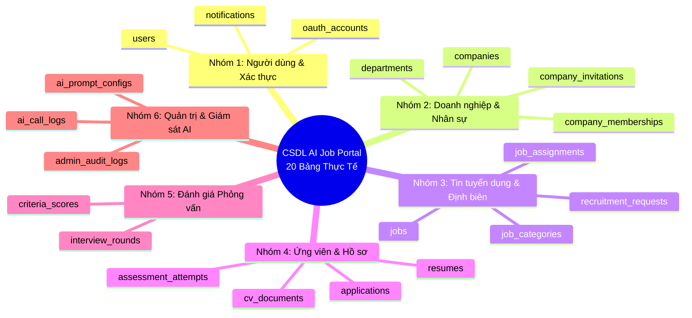
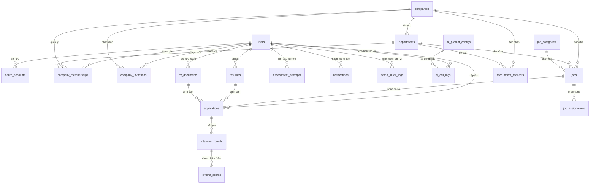

# 🗄️ THIẾT KẾ CƠ SỞ DỮ LIỆU & VECTOR SEARCH (DATABASE DESIGN)

**Dự án:** Nền tảng Tuyển dụng Thông minh Tích hợp Trí tuệ Nhân tạo (**AI-Powered Job Portal**)  
**Học phần:** Khóa luận Tốt nghiệp / Đồ án Ứng dụng Trí tuệ Nhân tạo  
**Hệ quản trị CSDL:** PostgreSQL 17 + Phần mở rộng **`pgvector`** (Hỗ trợ Vector Search không gian cao chiều)  
**Công nghệ ORM:** SQLAlchemy 2.0 (Declarative Base) + Pydantic v2  
**Phiên bản:** 3.0 (Đặc tả chi tiết toàn diện 20 bảng thực tế, chỉ mục HNSW và trích lục DDL chuẩn)

---

## 1. TỔNG QUAN KIẾN TRÚC DỮ LIỆU

Cơ sở dữ liệu của dự án được thiết kế theo chuẩn hóa dạng **3NF (Third Normal Form)**, bảo đảm tính toàn vẹn tham chiếu chặt chẽ, kết hợp khả năng lưu trữ và truy vấn vector tương đồng cao tốc thông qua extension **`pgvector`**. Hệ thống quản lý toàn bộ vòng đời của nền tảng B2B SaaS gồm **20 bảng thực thể**, được chia thành 6 phân nhóm nghiệp vụ logic:



---

## 2. SƠ ĐỒ THỰC THỂ LIÊN KẾT (ERD MERMAID DIAGRAM)



---

## 3. CHI TIẾT ĐẶC TẢ 20 BẢNG CSDL THỰC TẾ

### 3.1. Nhóm 1: Quản lý Người dùng & Xác thực (3 Bảng)

#### 1. Bảng `users` (Tài khoản người dùng toàn hệ thống)
Lưu trữ thông tin định danh và tài khoản đăng nhập của toàn bộ 3 nhóm vai trò (`candidate`, `employer`, `admin`).
| Tên Cột | Kiểu Dữ Liệu | Ràng Buộc | Mô Tả Nghiệp Vụ |
| :--- | :--- | :--- | :--- |
| `id` | `INTEGER` | PK, Auto Increment | Khóa chính |
| `email` | `VARCHAR(255)` | Unique, Not Null, Index | Email đăng nhập chính thức |
| `hashed_password` | `VARCHAR(255)` | Nullable | Mật khẩu mã hóa bằng bcrypt (null nếu login Google) |
| `full_name` | `VARCHAR(255)` | Not Null | Họ và tên đầy đủ |
| `role` | `VARCHAR(50)` | Not Null, Default 'candidate' | Vai trò hệ thống: `candidate`, `employer`, `admin` |
| `phone` | `VARCHAR(20)` | Nullable | Số điện thoại liên hệ |
| `avatar_url` | `VARCHAR(500)` | Nullable | Đường dẫn ảnh đại diện cá nhân |
| `is_active` | `BOOLEAN` | Default True | Trạng thái hoạt động (khóa tài khoản khi false) |
| `created_at` | `TIMESTAMP` | Default NOW() | Thời điểm tạo tài khoản |
| `updated_at` | `TIMESTAMP` | Default NOW() | Thời điểm cập nhật cuối cùng |

#### 2. Bảng `oauth_accounts` (Tài khoản liên kết mạng xã hội SSO)
Lưu trữ thông tin xác thực một chạm qua bên thứ ba (Google OAuth2).
| Tên Cột | Kiểu Dữ Liệu | Ràng Buộc | Mô Tả Nghiệp Vụ |
| :--- | :--- | :--- | :--- |
| `id` | `INTEGER` | PK, Auto Increment | Khóa chính |
| `user_id` | `INTEGER` | FK -> `users.id`, Cascade | Định danh người dùng sở hữu |
| `provider` | `VARCHAR(50)` | Not Null | Nhà cung cấp SSO (ví dụ: `google`) |
| `provider_user_id`| `VARCHAR(255)` | Not Null, Unique | ID định danh từ phía Google |
| `access_token` | `TEXT` | Nullable | Token truy cập OAuth |
| `created_at` | `TIMESTAMP` | Default NOW() | Thời điểm liên kết |

#### 3. Bảng `notifications` (Thông báo ứng dụng nội bộ)
Lưu trữ các thông báo sự kiện đẩy thời gian thực cho ứng viên và nhà tuyển dụng.
| Tên Cột | Kiểu Dữ Liệu | Ràng Buộc | Mô Tả Nghiệp Vụ |
| :--- | :--- | :--- | :--- |
| `id` | `INTEGER` | PK, Auto Increment | Khóa chính |
| `user_id` | `INTEGER` | FK -> `users.id`, Cascade | Người nhận thông báo |
| `title` | `VARCHAR(255)` | Not Null | Tiêu đề thông báo |
| `message` | `TEXT` | Not Null | Nội dung chi tiết thông báo |
| `type` | `VARCHAR(50)` | Not Null | Loại thông báo: `application_update`, `interview_invite`, `system` |
| `is_read` | `BOOLEAN` | Default False | Trạng thái đã đọc hay chưa |
| `created_at` | `TIMESTAMP` | Default NOW() | Thời điểm phát sinh thông báo |

---

### 3.2. Nhóm 2: Doanh nghiệp, Phòng ban & Đội ngũ Tuyển dụng (4 Bảng)

#### 4. Bảng `companies` (Hồ sơ pháp nhân doanh nghiệp)
| Tên Cột | Kiểu Dữ Liệu | Ràng Buộc | Mô Tả Nghiệp Vụ |
| :--- | :--- | :--- | :--- |
| `id` | `INTEGER` | PK, Auto Increment | Khóa chính |
| `name` | `VARCHAR(255)` | Not Null, Index | Tên thương hiệu/pháp nhân công ty |
| `tax_code` | `VARCHAR(50)` | Nullable, Unique | Mã số thuế doanh nghiệp |
| `website` | `VARCHAR(255)` | Nullable | Địa chỉ website chính thức |
| `company_size` | `VARCHAR(50)` | Nullable | Quy mô: `1-10`, `11-50`, `51-200`, `200+` |
| `address` | `VARCHAR(255)` | Nullable | Địa chỉ trụ sở văn phòng |
| `logo_url` | `VARCHAR(500)` | Nullable | Logo nhận diện thương hiệu |
| `description` | `TEXT` | Nullable | Giới thiệu môi trường và văn hóa công ty |
| `is_verified` | `BOOLEAN` | Default False | Đã được Admin phê duyệt hay chưa |
| `created_at` | `TIMESTAMP` | Default NOW() | Thời điểm đăng ký doanh nghiệp |

#### 5. Bảng `departments` (Phòng ban trực thuộc doanh nghiệp)
| Tên Cột | Kiểu Dữ Liệu | Ràng Buộc | Mô Tả Nghiệp Vụ |
| :--- | :--- | :--- | :--- |
| `id` | `INTEGER` | PK, Auto Increment | Khóa chính |
| `company_id` | `INTEGER` | FK -> `companies.id`, Cascade | Thuộc doanh nghiệp nào |
| `name` | `VARCHAR(100)` | Not Null | Tên phòng ban (Kỹ thuật, Marketing, Sales...) |
| `created_at` | `TIMESTAMP` | Default NOW() | Thời điểm tạo phòng ban |

#### 6. Bảng `company_memberships` (Phân quyền thành viên nội bộ)
| Tên Cột | Kiểu Dữ Liệu | Ràng Buộc | Mô Tả Nghiệp Vụ |
| :--- | :--- | :--- | :--- |
| `id` | `INTEGER` | PK, Auto Increment | Khóa chính |
| `company_id` | `INTEGER` | FK -> `companies.id`, Cascade | Thuộc công ty |
| `user_id` | `INTEGER` | FK -> `users.id`, Cascade | Tài khoản người dùng |
| `member_role` | `VARCHAR(50)` | Not Null | Vai trò: `owner`, `hr`, `reviewer` |
| `department_id` | `INTEGER` | FK -> `departments.id`, Nullable| Gán phòng ban (áp dụng cho `reviewer`) |
| `is_active` | `BOOLEAN` | Default True | Trạng thái hoạt động |
| `created_at` | `TIMESTAMP` | Default NOW() | Ngày gia nhập đội ngũ |

#### 7. Bảng `company_invitations` (Quản lý lời mời tham gia qua Token)
| Tên Cột | Kiểu Dữ Liệu | Ràng Buộc | Mô Tả Nghiệp Vụ |
| :--- | :--- | :--- | :--- |
| `id` | `INTEGER` | PK, Auto Increment | Khóa chính |
| `company_id` | `INTEGER` | FK -> `companies.id`, Cascade | Lời mời từ công ty nào |
| `email` | `VARCHAR(255)` | Not Null | Email người được mời |
| `role` | `VARCHAR(50)` | Not Null | Vai trò bổ nhiệm khi chấp nhận |
| `department_id` | `INTEGER` | FK -> `departments.id`, Nullable| Phòng ban chỉ định |
| `token` | `VARCHAR(255)` | Not Null, Unique | Chuỗi token bảo mật 64 ký tự |
| `expires_at` | `TIMESTAMP` | Not Null | Hạn sử dụng của lời mời (48 giờ) |
| `is_accepted` | `BOOLEAN` | Default False | Trạng thái đã chấp nhận hay chưa |

---

### 3.3. Nhóm 3: Tin Tuyển dụng & Định biên Nhân sự (4 Bảng)

#### 8. Bảng `job_categories` (Danh mục ngành nghề IT)
| Tên Cột | Kiểu Dữ Liệu | Ràng Buộc | Mô Tả Nghiệp Vụ |
| :--- | :--- | :--- | :--- |
| `id` | `INTEGER` | PK, Auto Increment | Khóa chính |
| `name` | `VARCHAR(100)` | Not Null, Unique | Tên ngành nghề (Frontend, Backend, AI/ML...) |
| `slug` | `VARCHAR(100)` | Not Null, Unique | Đường dẫn SEO thân thiện |

#### 9. Bảng `jobs` (Tin tuyển dụng - Chứa Vector Embeddings 384 Chiều)
| Tên Cột | Kiểu Dữ Liệu | Ràng Buộc | Mô Tả Nghiệp Vụ |
| :--- | :--- | :--- | :--- |
| `id` | `INTEGER` | PK, Auto Increment | Khóa chính |
| `employer_id` | `INTEGER` | FK -> `users.id`, Cascade | Người đăng tin (HR) |
| `company_id` | `INTEGER` | FK -> `companies.id`, Cascade | Thuộc pháp nhân công ty |
| `department_id` | `INTEGER` | FK -> `departments.id`, Nullable| Thuộc phòng ban chuyên môn |
| `category_id` | `INTEGER` | FK -> `job_categories.id`, Nullable| Thuộc danh mục ngành nghề |
| `title` | `VARCHAR(255)` | Not Null, Index | Chức danh vị trí tuyển dụng |
| `description` | `TEXT` | Not Null | Mô tả chi tiết công việc |
| `requirements` | `TEXT` | Not Null | Yêu cầu kỹ năng và kinh nghiệm |
| `benefits` | `TEXT` | Nullable | Phúc lợi đãi ngộ |
| `location` | `VARCHAR(255)` | Nullable | Địa điểm làm việc (Hà Nội, TP.HCM, Remote) |
| `salary_min` | `INTEGER` | Nullable | Mức lương khởi điểm (VND) |
| `salary_max` | `INTEGER` | Nullable | Mức lương trần (VND) |
| `employment_type`| `VARCHAR(50)` | Default 'full_time' | Loại hình: `full_time`, `part_time`, `contract` |
| `status` | `VARCHAR(50)` | Default 'open', Index | Trạng thái: `open`, `closed`, `draft` |
| `is_active` | `BOOLEAN` | Default True, Index | **Xóa mềm (Soft delete)**: false khi bị xóa |
| `embedding` | `VECTOR(384)` | Nullable | **Vector đặc trưng ngữ nghĩa 384 chiều** |
| `created_at` | `TIMESTAMP` | Default NOW() | Ngày xuất bản tin tuyển dụng |
| `updated_at` | `TIMESTAMP` | Default NOW() | Ngày cập nhật tin tuyển dụng |

#### 10. Bảng `job_assignments` (Phân công người phụ trách tuyển dụng)
| Tên Cột | Kiểu Dữ Liệu | Ràng Buộc | Mô Tả Nghiệp Vụ |
| :--- | :--- | :--- | :--- |
| `id` | `INTEGER` | PK, Auto Increment | Khóa chính |
| `job_id` | `INTEGER` | FK -> `jobs.id`, Cascade | Tin tuyển dụng |
| `membership_id` | `INTEGER` | FK -> `company_memberships.id` | Thành viên phụ trách (HR/Reviewer) |

#### 11. Bảng `recruitment_requests` (Phiếu đề xuất nhu cầu nhân sự nội bộ)
| Tên Cột | Kiểu Dữ Liệu | Ràng Buộc | Mô Tả Nghiệp Vụ |
| :--- | :--- | :--- | :--- |
| `id` | `INTEGER` | PK, Auto Increment | Khóa chính |
| `company_id` | `INTEGER` | FK -> `companies.id`, Cascade | Doanh nghiệp |
| `department_id` | `INTEGER` | FK -> `departments.id`, Cascade | Phòng ban đề xuất |
| `requester_id` | `INTEGER` | FK -> `users.id` | Trưởng bộ phận lập phiếu |
| `title` | `VARCHAR(255)` | Not Null | Chức danh cần tuyển thêm |
| `headcount` | `INTEGER` | Not Null, Default 1 | Số lượng nhân sự cần tuyển |
| `budget_range` | `VARCHAR(100)` | Nullable | Mức ngân sách dự kiến |
| `reason` | `TEXT` | Not Null | Lý do đề xuất (mở rộng dự án/thay thế) |
| `status` | `VARCHAR(50)` | Default 'pending' | Trạng thái: `pending`, `approved`, `rejected` |
| `created_at` | `TIMESTAMP` | Default NOW() | Thời điểm tạo phiếu |

---

### 3.4. Nhóm 4: Ứng viên, Hồ sơ CV & Đơn Ứng tuyển (4 Bảng)

#### 12. Bảng `resumes` (CV Ứng viên Tải lên - Chứa Vector Embeddings 384 Chiều)
| Tên Cột | Kiểu Dữ Liệu | Ràng Buộc | Mô Tả Nghiệp Vụ |
| :--- | :--- | :--- | :--- |
| `id` | `INTEGER` | PK, Auto Increment | Khóa chính |
| `user_id` | `INTEGER` | FK -> `users.id`, Cascade | Ứng viên sở hữu |
| `title` | `VARCHAR(255)` | Not Null | Tên hiển thị bản CV |
| `file_url` | `VARCHAR(500)` | Nullable | Đường dẫn file lưu trữ trên ổ đĩa (`/uploads/...`) |
| `raw_text` | `TEXT` | Nullable | Toàn bộ văn bản trích xuất từ PDF |
| `ai_evaluation_json`| `TEXT` | Nullable | Kết quả đánh giá ATS dạng JSON |
| `embedding` | `VECTOR(384)` | Nullable | **Vector đặc trưng ngữ nghĩa 384 chiều** |
| `created_at` | `TIMESTAMP` | Default NOW() | Ngày tải lên hồ sơ |

#### 13. Bảng `cv_documents` (Bản CV Trực tuyến tạo từ CV Builder)
| Tên Cột | Kiểu Dữ Liệu | Ràng Buộc | Mô Tả Nghiệp Vụ |
| :--- | :--- | :--- | :--- |
| `id` | `INTEGER` | PK, Auto Increment | Khóa chính |
| `user_id` | `INTEGER` | FK -> `users.id`, Cascade | Ứng viên sở hữu |
| `title` | `VARCHAR(255)` | Not Null | Tiêu đề CV |
| `template_key` | `VARCHAR(50)` | Default 'ats-minimal' | 1 trong 5 template: `ats-minimal`, `modern-two-column`... |
| `content_json` | `JSONB` | Not Null | Cấu trúc dữ liệu CV (Personal, Experience, Skills...) |
| `status` | `VARCHAR(50)` | Default 'draft' | Trạng thái: `draft`, `published` |
| `created_at` | `TIMESTAMP` | Default NOW() | Ngày tạo CV trực tuyến |
| `updated_at` | `TIMESTAMP` | Default NOW() | Ngày chỉnh sửa cuối |

#### 14. Bảng `applications` (Đơn nộp Ứng tuyển & Quản trị Pipeline)
| Tên Cột | Kiểu Dữ Liệu | Ràng Buộc | Mô Tả Nghiệp Vụ |
| :--- | :--- | :--- | :--- |
| `id` | `INTEGER` | PK, Auto Increment | Khóa chính |
| `job_id` | `INTEGER` | FK -> `jobs.id`, Cascade | Ứng tuyển vào vị trí nào |
| `candidate_id` | `INTEGER` | FK -> `users.id`, Cascade | Ứng viên nộp đơn |
| `resume_id` | `INTEGER` | FK -> `resumes.id`, Nullable, Set Null | Đính kèm CV tải lên |
| `cv_document_id`| `INTEGER` | FK -> `cv_documents.id`, Nullable, Set Null | Đính kèm CV Builder |
| `cover_letter` | `TEXT` | Nullable | Thư giới thiệu bản thân |
| `status` | `VARCHAR(50)` | Default 'pending', Index | Trạng thái Kanban 6 bước |
| `ai_matching_score`| `FLOAT` | Nullable | **Điểm AI tương thích (0 - 100%)** |
| `ai_feedback` | `TEXT` | Nullable | Nhận định của AI về hồ sơ |
| `hiring_recommendation`| `VARCHAR(50)`| Nullable | Ý kiến Reviewer: `recommended`, `not_recommended` |
| `recommendation_note`| `TEXT` | Nullable | Ghi chú của Trưởng bộ phận |
| `applied_at` | `TIMESTAMP` | Default NOW() | Thời điểm nộp đơn ứng tuyển |

#### 15. Bảng `assessment_attempts` (Kết quả Trắc nghiệm Hướng nghiệp)
| Tên Cột | Kiểu Dữ Liệu | Ràng Buộc | Mô Tả Nghiệp Vụ |
| :--- | :--- | :--- | :--- |
| `id` | `INTEGER` | PK, Auto Increment | Khóa chính |
| `user_id` | `INTEGER` | FK -> `users.id`, Cascade | Ứng viên thực hiện |
| `test_type` | `VARCHAR(50)` | Not Null | Loại bài test: `mbti`, `multiple_intelligences` |
| `answers_json` | `JSONB` | Not Null | Tập câu trả lời trắc nghiệm của ứng viên |
| `result_json` | `JSONB` | Not Null | Kết quả chấm điểm toán học tất định (Nhóm tính cách, điểm trục) |
| `created_at` | `TIMESTAMP` | Default NOW() | Thời điểm hoàn thành bài kiểm tra |

---

### 3.5. Nhóm 5: Đánh giá Phỏng vấn Đa vòng & Tiêu chí Kỹ thuật (2 Bảng)

#### 16. Bảng `interview_rounds` (Các chặng phỏng vấn trong Pipeline)
| Tên Cột | Kiểu Dữ Liệu | Ràng Buộc | Mô Tả Nghiệp Vụ |
| :--- | :--- | :--- | :--- |
| `id` | `INTEGER` | PK, Auto Increment | Khóa chính |
| `application_id`| `INTEGER` | FK -> `applications.id`, Cascade | Thuộc đơn ứng tuyển nào |
| `round_type` | `VARCHAR(50)` | Not Null | `cv_screen`, `tech_interview`, `culture_fit`, `final`, `custom` |
| `round_name` | `VARCHAR(100)` | Not Null | Tên chặng (ví dụ: "Phỏng vấn Kỹ thuật Vòng 1") |
| `round_number` | `INTEGER` | Not Null, Default 1 | Số thứ tự chặng |
| `scheduled_at` | `TIMESTAMP` | Nullable, Index | Thời gian bắt đầu phỏng vấn |
| `location` | `VARCHAR(500)` | Nullable | Địa điểm phòng họp hoặc link Google Meet |
| `status` | `VARCHAR(50)` | Default 'pending' | Trạng thái: `pending`, `scheduled`, `passed`, `failed` |
| `created_at` | `TIMESTAMP` | Default NOW() | Thời điểm tạo chặng |

#### 17. Bảng `criteria_scores` (Phiếu chấm điểm tiêu chí chuyên môn)
| Tên Cột | Kiểu Dữ Liệu | Ràng Buộc | Mô Tả Nghiệp Vụ |
| :--- | :--- | :--- | :--- |
| `id` | `INTEGER` | PK, Auto Increment | Khóa chính |
| `round_id` | `INTEGER` | FK -> `interview_rounds.id`, Cascade | Thuộc chặng phỏng vấn nào |
| `criteria_name` | `VARCHAR(100)` | Not Null | Tên tiêu chí (Thuật toán, React, Tư duy hệ thống...) |
| `score` | `FLOAT` | Not Null | Thang điểm từ 1.0 đến 10.0 |
| `weight` | `FLOAT` | Default 1.0 | Trọng số tiêu chí |
| `notes` | `TEXT` | Nullable | Nhận xét chi tiết của người chấm |

---

### 3.6. Nhóm 6: Quản trị Trung tâm Prompt & Giám sát AI (3 Bảng)

#### 18. Bảng `ai_prompt_configs` (Trung tâm Quản trị System Prompt Động)
| Tên Cột | Kiểu Dữ Liệu | Ràng Buộc | Mô Tả Nghiệp Vụ |
| :--- | :--- | :--- | :--- |
| `id` | `INTEGER` | PK, Auto Increment | Khóa chính |
| `feature_name` | `VARCHAR(100)` | Not Null, Unique, Index | `cv_evaluate`, `roadmap`, `summarize_cv`, `interview_questions`, `generate_email` |
| `system_prompt`| `TEXT` | Not Null | Toàn văn chỉ thị hệ thống gửi tới LLM |
| `temperature` | `FLOAT` | Default 0.3 | Độ sáng tạo của mô hình (0.0 đến 1.0) |
| `max_tokens` | `INTEGER` | Default 1500 | Giới hạn số token đầu ra tối đa |
| `is_active` | `BOOLEAN` | Default True | Bật hoặc tắt tính năng AI |
| `updated_at` | `TIMESTAMP` | Default NOW() | Thời điểm cập nhật prompt gần nhất |

#### 19. Bảng `ai_call_logs` (Nhật ký Theo dõi Token & Chi phí LLM)
| Tên Cột | Kiểu Dữ Liệu | Ràng Buộc | Mô Tả Nghiệp Vụ |
| :--- | :--- | :--- | :--- |
| `id` | `INTEGER` | PK, Auto Increment | Khóa chính |
| `user_id` | `INTEGER` | FK -> `users.id`, Nullable | Người kích hoạt lệnh gọi AI |
| `feature_name` | `VARCHAR(100)` | Not Null | Tính năng AI đã thực thi |
| `prompt_tokens`| `INTEGER` | Default 0 | Số lượng token đầu vào |
| `completion_tokens`| `INTEGER`| Default 0 | Số lượng token mô hình trả về |
| `total_tokens` | `INTEGER` | Default 0 | Tổng token tiêu thụ |
| `latency_ms` | `INTEGER` | Default 0 | Thời gian phản hồi mạng (mili-giây) |
| `estimated_cost`| `FLOAT` | Default 0.0 | Chi phí ước tính bằng USD |
| `created_at` | `TIMESTAMP` | Default NOW() | Thời điểm phát sinh cuộc gọi |

#### 20. Bảng `admin_audit_logs` (Nhật ký Kiểm toán Hệ thống Chuẩn Zero-PII)
| Tên Cột | Kiểu Dữ Liệu | Ràng Buộc | Mô Tả Nghiệp Vụ |
| :--- | :--- | :--- | :--- |
| `id` | `INTEGER` | PK, Auto Increment | Khóa chính |
| `admin_id` | `INTEGER` | FK -> `users.id` | Quản trị viên thực hiện thao tác |
| `action` | `VARCHAR(100)` | Not Null | Hành động (`block_user`, `approve_company`, `update_prompt`...) |
| `target_type` | `VARCHAR(50)` | Not Null | Đối tượng tác động (`user`, `company`, `job`, `prompt`) |
| `target_id` | `INTEGER` | Not Null | Khóa chính của đối tượng bị tác động |
| `details` | `TEXT` | Nullable | Chi tiết hành động (Đảm bảo nguyên tắc Zero-PII) |
| `ip_address` | `VARCHAR(50)` | Nullable | Địa chỉ IP thực hiện |
| `created_at` | `TIMESTAMP` | Default NOW() | Thời điểm ghi nhận nhật ký |

---

## 4. CHIẾN LƯỢC TỐI ƯU HÓA VECTOR INDEX (HNSW INDEXING)

Để đạt tốc độ tìm kiếm tương đồng vector dưới **15ms** trên hàng trăm nghìn bản ghi tin tuyển dụng và hồ sơ ứng viên, hệ thống thiết lập chỉ mục **Hierarchical Navigable Small World (HNSW)** trên PostgreSQL với toán tử khoảng cách Cosine Distance (`vector_cosine_ops`):

```sql
-- Kích hoạt extension pgvector
CREATE EXTENSION IF NOT EXISTS vector;

-- Chỉ mục HNSW cho vector tin tuyển dụng (jobs.embedding)
CREATE INDEX IF NOT EXISTS idx_jobs_embedding_hnsw 
ON jobs 
USING hnsw (embedding vector_cosine_ops)
WITH (m = 16, ef_construction = 64);

-- Chỉ mục HNSW cho vector hồ sơ ứng viên (resumes.embedding)
CREATE INDEX IF NOT EXISTS idx_resumes_embedding_hnsw 
ON resumes 
USING hnsw (embedding vector_cosine_ops)
WITH (m = 16, ef_construction = 64);
```

### Công thức Toán học Tính điểm Tương thích AI Matching Score
Khoảng cách Cosine Distance (`<=>`) giữa vector của CV ($u$) và vector của JD ($v$) trả về giá trị $d \in [0, 2]$:
$$d = 1 - \frac{u \cdot v}{\|u\|_2 \|v\|_2}$$
Hệ thống ánh xạ sang thang điểm phần trăm trực quan:
$$\text{Match Score} = \max\left(0, \min\left(100, (1 - d) \times 100\right)\right)$$
- Nếu $d = 0$: Hai vector trùng khít hoàn toàn $\rightarrow \text{Score} = 100\%$.
- Nếu $d = 0.2$: Tương đồng rất cao $\rightarrow \text{Score} = 80\%$.
- Nếu $d \ge 1.0$: Góc lệch $\ge 90^\circ$ (không có điểm chung) $\rightarrow \text{Score} = 0\%$.

---

## 5. MÃ NGUỒN DDL SQL KHỞI TẠO CSDL CHUẨN (DDL EXTRACT)

```sql
-- ============================================================
-- DDL KHỞI TẠO CSDL AI JOB PORTAL (POSTGRESQL 17 + PGVECTOR)
-- ============================================================

CREATE EXTENSION IF NOT EXISTS vector;

-- 1. users
CREATE TABLE users (
    id SERIAL PRIMARY KEY,
    email VARCHAR(255) NOT NULL UNIQUE,
    hashed_password VARCHAR(255),
    full_name VARCHAR(255) NOT NULL,
    role VARCHAR(50) NOT NULL DEFAULT 'candidate',
    phone VARCHAR(20),
    avatar_url VARCHAR(500),
    is_active BOOLEAN NOT NULL DEFAULT TRUE,
    created_at TIMESTAMP NOT NULL DEFAULT CURRENT_TIMESTAMP,
    updated_at TIMESTAMP NOT NULL DEFAULT CURRENT_TIMESTAMP
);
CREATE INDEX idx_users_email ON users(email);
CREATE INDEX idx_users_role ON users(role);

-- 2. oauth_accounts
CREATE TABLE oauth_accounts (
    id SERIAL PRIMARY KEY,
    user_id INTEGER NOT NULL REFERENCES users(id) ON DELETE CASCADE,
    provider VARCHAR(50) NOT NULL,
    provider_user_id VARCHAR(255) NOT NULL UNIQUE,
    access_token TEXT,
    created_at TIMESTAMP NOT NULL DEFAULT CURRENT_TIMESTAMP
);

-- 3. notifications
CREATE TABLE notifications (
    id SERIAL PRIMARY KEY,
    user_id INTEGER NOT NULL REFERENCES users(id) ON DELETE CASCADE,
    title VARCHAR(255) NOT NULL,
    message TEXT NOT NULL,
    type VARCHAR(50) NOT NULL,
    is_read BOOLEAN NOT NULL DEFAULT FALSE,
    created_at TIMESTAMP NOT NULL DEFAULT CURRENT_TIMESTAMP
);

-- 4. companies
CREATE TABLE companies (
    id SERIAL PRIMARY KEY,
    name VARCHAR(255) NOT NULL,
    tax_code VARCHAR(50) UNIQUE,
    website VARCHAR(255),
    company_size VARCHAR(50),
    address VARCHAR(255),
    logo_url VARCHAR(500),
    description TEXT,
    is_verified BOOLEAN NOT NULL DEFAULT FALSE,
    created_at TIMESTAMP NOT NULL DEFAULT CURRENT_TIMESTAMP
);

-- 5. departments
CREATE TABLE departments (
    id SERIAL PRIMARY KEY,
    company_id INTEGER NOT NULL REFERENCES companies(id) ON DELETE CASCADE,
    name VARCHAR(100) NOT NULL,
    created_at TIMESTAMP NOT NULL DEFAULT CURRENT_TIMESTAMP
);

-- 6. company_memberships
CREATE TABLE company_memberships (
    id SERIAL PRIMARY KEY,
    company_id INTEGER NOT NULL REFERENCES companies(id) ON DELETE CASCADE,
    user_id INTEGER NOT NULL REFERENCES users(id) ON DELETE CASCADE,
    member_role VARCHAR(50) NOT NULL,
    department_id INTEGER REFERENCES departments(id) ON DELETE SET NULL,
    is_active BOOLEAN NOT NULL DEFAULT TRUE,
    created_at TIMESTAMP NOT NULL DEFAULT CURRENT_TIMESTAMP
);

-- 7. company_invitations
CREATE TABLE company_invitations (
    id SERIAL PRIMARY KEY,
    company_id INTEGER NOT NULL REFERENCES companies(id) ON DELETE CASCADE,
    email VARCHAR(255) NOT NULL,
    role VARCHAR(50) NOT NULL,
    department_id INTEGER REFERENCES departments(id) ON DELETE SET NULL,
    token VARCHAR(255) NOT NULL UNIQUE,
    expires_at TIMESTAMP NOT NULL,
    is_accepted BOOLEAN NOT NULL DEFAULT FALSE
);

-- 8. job_categories
CREATE TABLE job_categories (
    id SERIAL PRIMARY KEY,
    name VARCHAR(100) NOT NULL UNIQUE,
    slug VARCHAR(100) NOT NULL UNIQUE
);

-- 9. jobs
CREATE TABLE jobs (
    id SERIAL PRIMARY KEY,
    employer_id INTEGER NOT NULL REFERENCES users(id) ON DELETE CASCADE,
    company_id INTEGER NOT NULL REFERENCES companies(id) ON DELETE CASCADE,
    department_id INTEGER REFERENCES departments(id) ON DELETE SET NULL,
    category_id INTEGER REFERENCES job_categories(id) ON DELETE SET NULL,
    title VARCHAR(255) NOT NULL,
    description TEXT NOT NULL,
    requirements TEXT NOT NULL,
    benefits TEXT,
    location VARCHAR(255),
    salary_min INTEGER,
    salary_max INTEGER,
    employment_type VARCHAR(50) NOT NULL DEFAULT 'full_time',
    status VARCHAR(50) NOT NULL DEFAULT 'open',
    is_active BOOLEAN NOT NULL DEFAULT TRUE,
    embedding VECTOR(384),
    created_at TIMESTAMP NOT NULL DEFAULT CURRENT_TIMESTAMP,
    updated_at TIMESTAMP NOT NULL DEFAULT CURRENT_TIMESTAMP
);
CREATE INDEX idx_jobs_status_active ON jobs(status, is_active);
CREATE INDEX idx_jobs_company_dept ON jobs(company_id, department_id);

-- 10. job_assignments
CREATE TABLE job_assignments (
    id SERIAL PRIMARY KEY,
    job_id INTEGER NOT NULL REFERENCES jobs(id) ON DELETE CASCADE,
    membership_id INTEGER NOT NULL REFERENCES company_memberships(id) ON DELETE CASCADE
);

-- 11. recruitment_requests
CREATE TABLE recruitment_requests (
    id SERIAL PRIMARY KEY,
    company_id INTEGER NOT NULL REFERENCES companies(id) ON DELETE CASCADE,
    department_id INTEGER NOT NULL REFERENCES departments(id) ON DELETE CASCADE,
    requester_id INTEGER NOT NULL REFERENCES users(id) ON DELETE CASCADE,
    title VARCHAR(255) NOT NULL,
    headcount INTEGER NOT NULL DEFAULT 1,
    budget_range VARCHAR(100),
    reason TEXT NOT NULL,
    status VARCHAR(50) NOT NULL DEFAULT 'pending',
    created_at TIMESTAMP NOT NULL DEFAULT CURRENT_TIMESTAMP
);

-- 12. resumes
CREATE TABLE resumes (
    id SERIAL PRIMARY KEY,
    user_id INTEGER NOT NULL REFERENCES users(id) ON DELETE CASCADE,
    title VARCHAR(255) NOT NULL,
    file_url VARCHAR(500),
    raw_text TEXT,
    ai_evaluation_json TEXT,
    embedding VECTOR(384),
    created_at TIMESTAMP NOT NULL DEFAULT CURRENT_TIMESTAMP
);

-- 13. cv_documents
CREATE TABLE cv_documents (
    id SERIAL PRIMARY KEY,
    user_id INTEGER NOT NULL REFERENCES users(id) ON DELETE CASCADE,
    title VARCHAR(255) NOT NULL,
    template_key VARCHAR(50) NOT NULL DEFAULT 'ats-minimal',
    content_json JSONB NOT NULL,
    status VARCHAR(50) NOT NULL DEFAULT 'draft',
    created_at TIMESTAMP NOT NULL DEFAULT CURRENT_TIMESTAMP,
    updated_at TIMESTAMP NOT NULL DEFAULT CURRENT_TIMESTAMP
);

-- 14. applications
CREATE TABLE applications (
    id SERIAL PRIMARY KEY,
    job_id INTEGER NOT NULL REFERENCES jobs(id) ON DELETE CASCADE,
    candidate_id INTEGER NOT NULL REFERENCES users(id) ON DELETE CASCADE,
    resume_id INTEGER REFERENCES resumes(id) ON DELETE SET NULL,
    cv_document_id INTEGER REFERENCES cv_documents(id) ON DELETE SET NULL,
    cover_letter TEXT,
    status VARCHAR(50) NOT NULL DEFAULT 'pending',
    ai_matching_score FLOAT,
    ai_feedback TEXT,
    hiring_recommendation VARCHAR(50),
    recommendation_note TEXT,
    applied_at TIMESTAMP NOT NULL DEFAULT CURRENT_TIMESTAMP
);
CREATE INDEX idx_applications_job_status ON applications(job_id, status);
CREATE INDEX idx_applications_candidate ON applications(candidate_id);

-- 15. assessment_attempts
CREATE TABLE assessment_attempts (
    id SERIAL PRIMARY KEY,
    user_id INTEGER NOT NULL REFERENCES users(id) ON DELETE CASCADE,
    test_type VARCHAR(50) NOT NULL,
    answers_json JSONB NOT NULL,
    result_json JSONB NOT NULL,
    created_at TIMESTAMP NOT NULL DEFAULT CURRENT_TIMESTAMP
);

-- 16. interview_rounds
CREATE TABLE interview_rounds (
    id SERIAL PRIMARY KEY,
    application_id INTEGER NOT NULL REFERENCES applications(id) ON DELETE CASCADE,
    round_type VARCHAR(50) NOT NULL,
    round_name VARCHAR(100) NOT NULL,
    round_number INTEGER NOT NULL DEFAULT 1,
    scheduled_at TIMESTAMP,
    location VARCHAR(500),
    status VARCHAR(50) NOT NULL DEFAULT 'pending',
    created_at TIMESTAMP NOT NULL DEFAULT CURRENT_TIMESTAMP
);

-- 17. criteria_scores
CREATE TABLE criteria_scores (
    id SERIAL PRIMARY KEY,
    round_id INTEGER NOT NULL REFERENCES interview_rounds(id) ON DELETE CASCADE,
    criteria_name VARCHAR(100) NOT NULL,
    score FLOAT NOT NULL,
    weight FLOAT NOT NULL DEFAULT 1.0,
    notes TEXT
);

-- 18. ai_prompt_configs
CREATE TABLE ai_prompt_configs (
    id SERIAL PRIMARY KEY,
    feature_name VARCHAR(100) NOT NULL UNIQUE,
    system_prompt TEXT NOT NULL,
    temperature FLOAT NOT NULL DEFAULT 0.3,
    max_tokens INTEGER NOT NULL DEFAULT 1500,
    is_active BOOLEAN NOT NULL DEFAULT TRUE,
    updated_at TIMESTAMP NOT NULL DEFAULT CURRENT_TIMESTAMP
);

-- 19. ai_call_logs
CREATE TABLE ai_call_logs (
    id SERIAL PRIMARY KEY,
    user_id INTEGER REFERENCES users(id) ON DELETE SET NULL,
    feature_name VARCHAR(100) NOT NULL,
    prompt_tokens INTEGER NOT NULL DEFAULT 0,
    completion_tokens INTEGER NOT NULL DEFAULT 0,
    total_tokens INTEGER NOT NULL DEFAULT 0,
    latency_ms INTEGER NOT NULL DEFAULT 0,
    estimated_cost FLOAT NOT NULL DEFAULT 0.0,
    created_at TIMESTAMP NOT NULL DEFAULT CURRENT_TIMESTAMP
);

-- 20. admin_audit_logs
CREATE TABLE admin_audit_logs (
    id SERIAL PRIMARY KEY,
    admin_id INTEGER NOT NULL REFERENCES users(id) ON DELETE CASCADE,
    action VARCHAR(100) NOT NULL,
    target_type VARCHAR(50) NOT NULL,
    target_id INTEGER NOT NULL,
    details TEXT,
    ip_address VARCHAR(50),
    created_at TIMESTAMP NOT NULL DEFAULT CURRENT_TIMESTAMP
);
```
