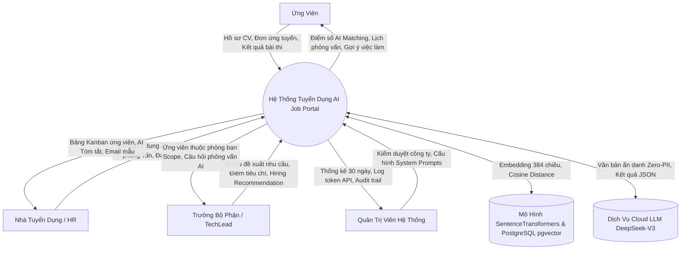
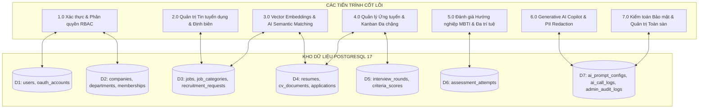
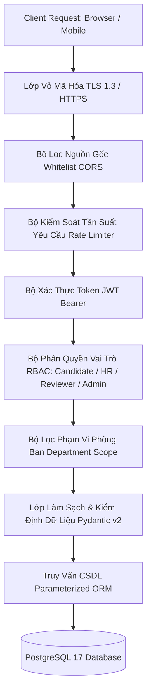

# 📋 ĐẶC TẢ YÊU CẦU HỆ THỐNG (SOFTWARE REQUIREMENTS SPECIFICATION - SRS)

**Dự án:** Nền tảng Tuyển dụng Thông minh Tích hợp Trí tuệ Nhân tạo (**AI-Powered Job Portal**)  
**Tiêu chuẩn thiết kế:** ISO/IEC/IEEE 29148:2018 Systems and software engineering — Life cycle processes — Requirements engineering  
**Kiến trúc:** B2B Multi-tenant SaaS Enterprise-Ready (React 19 / TypeScript + Python FastAPI + PostgreSQL 17 pgvector)  
**Phiên bản:** 3.0 (Đặc tả toàn diện 24 Functional Requirements, 12 Non-Functional Requirements, DFD, Ma trận Mã lỗi & Kiến trúc Bảo mật)

---

## 1. TỔNG QUAN HỆ THỐNG & BỐI CẢNH DỰ ÁN

### 1.1. Bối cảnh thực tiễn và Vấn đề nghiên cứu
Trong kỷ nguyên số hóa thị trường lao động, các cổng tuyển dụng truyền thống (Job Boards) bộc lộ nhiều điểm nghẽn nghiêm trọng:
1. **Quá tải hồ sơ & Sàng lọc thủ công (Information Overload):** Một tin tuyển dụng công nghệ (IT) trung bình nhận từ 50 - 200 hồ sơ. Chuyên viên nhân sự (HR) mất 3 - 5 phút để đọc lướt một CV, dẫn đến mệt mỏi nhận thức và bỏ sót các ứng viên tiềm năng.
2. **Hạn chế của bộ lọc từ khóa chính xác (Keyword Matching Gap):** Các hệ thống lọc cũ (ATS dựa trên SQL `LIKE '%keyword%'`) chỉ so khớp từ khóa cơ học. Ứng viên ghi "ReactJS" có thể bị loại nếu tin tuyển dụng yêu cầu "React 19" hoặc "Frontend Web Developer".
3. **Thiếu sự cộng tác đa phòng ban (Siloed Hiring Communication):** Doanh nghiệp vừa và lớn cần sự tham gia của Trưởng bộ phận chuyên môn (Tech Lead / Engineering Manager), nhưng quy trình gửi CV qua email/chat nội bộ rời rạc, thiếu nhật ký thẩm định và không bảo mật dữ liệu.
4. **Ứng viên thiếu công cụ định vị năng lực (Lack of Career Navigation):** Ứng viên khó biết được hồ sơ của mình khớp bao nhiêu phần trăm với JD, thiếu công cụ tạo CV chuẩn ATS quốc tế và không có lộ trình bù đắp kỹ năng còn thiếu.

### 1.2. Mục tiêu và Phạm vi của Hệ thống
Hệ thống **AI-Powered Job Portal** được thiết kế nhằm hiện đại hóa toàn diện quy trình tuyển dụng theo chuẩn B2B SaaS với 5 mục tiêu cốt lõi:
- **Mục tiêu 1 - Semantic Search & Matching:** Tích hợp mô hình Embeddings đa ngôn ngữ cục bộ (`SentenceTransformers`) kết hợp chỉ mục vector không gian cao chiều (`pgvector HNSW`) trên PostgreSQL 17 để tính điểm tương thích tức thời (AI Matching Score từ 0% đến 100% với tốc độ truy vấn dưới 15ms).
- **Mục tiêu 2 - Bộ Trợ lý AI Nhân sự Toàn diện (AI HR Copilot):** Tự động bóc tách CV theo JD (CV Summarizer), gợi ý bộ câu hỏi phỏng vấn kỹ thuật bám sát dự án thực tế của ứng viên, và soạn thảo thư mời/từ chối 1-click chuẩn mực không thiên lệch (*Bias-Free & Human-in-the-Loop*).
- **Mục tiêu 3 - Trao quyền tối đa cho Ứng viên (Candidate Empowerment):** Trình tạo CV Studio chuẩn ATS trực tuyến xuất PDF A4 pixel-perfect, bài đánh giá tính cách và thiên hướng nghề nghiệp (MBTI 16 nhóm tính cách & Thuyết Đa trí thông minh Gardner), cùng Chatbot tư vấn lộ trình sự nghiệp (Career Roadmap).
- **Mục tiêu 4 - Quy trình Tuyển dụng Đa vòng & Đa bên (B2B SaaS Multi-round Pipeline):** Quản trị ứng viên qua bảng Kanban 6 cột trực quan, hỗ trợ thiết lập quy trình tuyển dụng đa chặng (Duyệt CV, Phỏng vấn kỹ thuật, Phỏng vấn văn hóa, Đề nghị tuyển dụng), xuất lịch phỏng vấn chuẩn iCalendar (`.ics`), và cơ chế phân quyền theo phòng ban (*Department Scope*).
- **Mục tiêu 5 - Quản trị An toàn & Minh bạch (Enterprise Security & Zero-PII):** Kiểm soát tuyệt đối thông tin định danh cá nhân, lưu vết hành động bảo mật (*Audit Log*), giám sát chi phí token API và cho phép Quản trị viên tinh chỉnh System Prompt động mà không cần can thiệp mã nguồn.

---

## 2. YÊU CẦU CHỨC NĂNG (FUNCTIONAL REQUIREMENTS - FR)

Hệ thống bao gồm **24 Yêu cầu chức năng chính** được phân bổ theo 4 nhóm tác nhân (Actors):

```mermaid
graph TD
    System[AI-Powered Job Portal System]
    
    System --> CAN[Phân hệ Ứng viên - 8 FRs]
    System --> EMP[Phân hệ Nhà tuyển dụng HR - 8 FRs]
    System --> REV[Phân hệ Trưởng bộ phận Reviewer - 4 FRs]
    System --> ADM[Phân hệ Quản trị viên Admin - 4 FRs]

    CAN --> F1[FR-CAN-01: Xác thực JWT & Google OAuth2]
    CAN --> F2[FR-CAN-02: Tìm kiếm & Bộ lọc Việc làm Đa chiều]
    CAN --> F3[FR-CAN-03: AI Matching Score Thời gian thực]
    CAN --> F4[FR-CAN-04: Trình tạo CV ATS Builder & Xuất PDF]
    CAN --> F5[FR-CAN-05: Nộp đơn & Theo dõi Trạng thái Tuyển dụng]
    CAN --> F6[FR-CAN-06: Đánh giá Hướng nghiệp MBTI / Đa trí tuệ]
    CAN --> F7[FR-CAN-07: Dashboard Cá nhân & Biểu đồ Radar Kỹ năng]
    CAN --> F8[FR-CAN-08: AI Career Copilot & Lộ trình Thăng tiến]

    EMP --> F9[FR-EMP-01: Quản trị Hồ sơ Pháp nhân Doanh nghiệp]
    EMP --> F10[FR-EMP-02: Đăng tin & Quản lý Vòng đời Job Soft-Delete]
    EMP --> F11[FR-EMP-03: Tuyển dụng ATS Kanban Board 6 Cột]
    EMP --> F12[FR-EMP-04: AI Tóm tắt Năng lực CV theo JD]
    EMP --> F13[FR-EMP-05: AI Gợi ý Bộ câu hỏi Phỏng vấn Kỹ thuật]
    EMP --> F14[FR-EMP-06: AI Soạn thảo Thư Tuyển dụng Bias-free]
    EMP --> F15[FR-EMP-07: Quản lý Lịch Phỏng vấn Đa vòng & Xuất .ics]
    EMP --> F16[FR-EMP-08: Chấm điểm Tiêu chí Phỏng vấn Chuyên môn]

    REV --> F17[FR-REV-01: Mời & Phân quyền Thành viên Doanh nghiệp]
    REV --> F18[FR-REV-02: Phân quyền Phạm vi Phòng ban Department Scope]
    REV --> F19[FR-REV-03: Thẩm định Kỹ thuật & Ghi nhận Đề xuất Tuyển dụng]
    REV --> F20[FR-REV-04: Lập Phiếu Đề xuất Nhu cầu Tuyển dụng Nội bộ]

    ADM --> F21[FR-ADM-01: Dashboard Thống kê Tăng trưởng Nền tảng 30 Ngày]
    ADM --> F22[FR-ADM-02: Kiểm duyệt Doanh nghiệp, Khóa Tài khoản & Job]
    ADM --> F23[FR-ADM-03: Quản trị Trung tâm Prompt AI & Test Sandbox]
    ADM --> F24[FR-ADM-04: Giám sát Chi phí Token & Nhật ký Zero-PII Audit Log]
```



### 2.1. Phân hệ Ứng viên & Khách thăm quan (Candidate Portal)

| Mã YC | Tên Yêu Cầu Chức Năng | Mô Tả Đặc Tả Chi Tiết Nghiệp Vụ | Mức Độ |
| :--- | :--- | :--- | :---: |
| **FR-CAN-01** | **Xác thực & Quản lý Tài khoản Đa kênh** | Hỗ trợ đăng ký/đăng nhập bằng Email/Password mã hóa bcrypt. Đăng nhập 1 chạm Google OAuth2 tự động cấp phát JWT Access Token (hạn dùng 30 phút, thuật toán HS256). Quản lý profile, đổi mật khẩu, tải ảnh đại diện an toàn (giới hạn 5MB, định dạng PNG/JPG/WEBP). | **Bắt buộc** |
| **FR-CAN-02** | **Tìm kiếm & Bộ lọc Việc làm Đa chiều** | Tìm kiếm tin tuyển dụng kết hợp từ khóa ngữ nghĩa và bộ lọc đa tiêu chí: Địa điểm (Hà Nội, TP.HCM, Đà Nẵng, Remote), Mức lương (Min - Max VND), Cấp bậc (Intern, Fresher, Junior, Middle, Senior, Lead), Loại hình (Full-time, Part-time, Contract). Hỗ trợ chuyển đổi giao diện Danh sách (List View) và Thẻ lưới (Grid View). | **Bắt buộc** |
| **FR-CAN-03** | **Điểm số AI Matching Score Thời gian thực** | Khi ứng viên truy cập trang chi tiết công việc, hệ thống tự động trích xuất vector embedding của hồ sơ ứng viên (384 chiều) và so sánh khoảng cách Cosine Distance (`<=>`) với vector của JD. Trả về điểm phần trăm phù hợp (0% – 100%) kèm nhãn trực quan: *Rất phù hợp (>=80%), Tiềm năng (60-79%), Cần bổ sung kỹ năng (<60%)*. | **Bắt buộc** |
| **FR-CAN-04** | **Trình tạo CV Chuẩn ATS (CV Builder Studio)** | Trình soạn thảo CV trực tuyến phản hồi thời gian thực. Hỗ trợ 5 mẫu giao diện chuẩn quốc tế (`ats-minimal`, `modern-two-column`, `professional-blue`, `executive`, `creative-clean`). Kiểm tra cấu trúc CV theo công thức Google XYZ, tính điểm ATS thời gian thực, lưu trữ cấu trúc JSON và xuất file PDF chuẩn in ấn A4 (210mm x 297mm, không dính UI controls). | **Bắt buộc** |
| **FR-CAN-05** | **Nộp hồ sơ Ứng tuyển & Theo dõi Trạng thái Tuyển dụng** | Cho phép ứng viên ứng tuyển bằng CV tạo từ hệ thống hoặc tải lên file PDF từ máy tính (có kiểm tra Magic Bytes `%PDF-` và kiểm định ATS hợp lệ). Theo dõi trạng thái đơn nộp theo 6 chặng của Pipeline (`pending` $\rightarrow$ `reviewed` $\rightarrow$ `shortlisted` $\rightarrow$ `interview` $\rightarrow$ `accepted` / `rejected`), hiển thị lịch hẹn phỏng vấn kèm đường dẫn Google Meet. | **Bắt buộc** |
| **FR-CAN-06** | **Đánh giá Hướng nghiệp MBTI & Đa trí tuệ Gardner** | Cung cấp bài trắc nghiệm 16 nhóm tính cách MBTI và Thuyết Đa trí thông minh (Multiple Intelligences). Động cơ chấm điểm toán học tất định (Deterministic Engine) bảo đảm tính chính xác 100%, không bị sai lệch. Trả về bản phân tích điểm mạnh, môi trường làm việc lý tưởng và danh sách ngành nghề công nghệ phù hợp. | **Quan trọng** |
| **FR-CAN-07** | **Dashboard Cá nhân & Biểu đồ Radar Kỹ năng** | Bảng điều khiển cá nhân hóa hiển thị: Biểu đồ mạng nhện Radar Chart 6 trục kỹ năng (React, TypeScript, Backend, Database, Cloud/DevOps, System Design); danh sách các việc làm gợi ý thông minh; banner nhắc lịch phỏng vấn sắp diễn ra và bảng quản lý toàn bộ các bản CV đã lưu. | **Quan trọng** |
| **FR-CAN-08** | **Trợ lý AI Career Copilot & Lộ trình Thăng tiến** | Kích hoạt trợ lý AI phân tích khoảng cách kỹ năng giữa hồ sơ hiện tại và vị trí mục tiêu mong muốn (Gap Analysis). Tự động sinh lộ trình học tập 3 giai đoạn (0-3 tháng, 3-6 tháng, 6-12 tháng) kèm tài liệu, khóa học và chứng chỉ quốc tế được đề xuất. | **Bổ sung** |

---

### 2.2. Phân hệ Nhà tuyển dụng & Quản trị Nhân sự (Employer HR Portal)

| Mã YC | Tên Yêu Cầu Chức Năng | Mô Tả Đặc Tả Chi Tiết Nghiệp Vụ | Mức Độ |
| :--- | :--- | :--- | :---: |
| **FR-EMP-01** | **Quản trị Hồ sơ Pháp nhân Doanh nghiệp** | Cập nhật thông tin công ty: Tên pháp nhân, mã số thuế, website, quy mô nhân sự, địa chỉ trụ sở chính, logo nhận diện thương hiệu và bài viết giới thiệu văn hóa doanh nghiệp. | **Bắt buộc** |
| **FR-EMP-02** | **Đăng tin & Quản lý Vòng đời Tuyển dụng** | Đăng tin tuyển dụng chuẩn SEO: Tiêu đề vị trí, phòng ban trực thuộc, khoảng lương, yêu cầu kỹ năng bắt buộc, phúc lợi đãi ngộ. Tự động sinh vector ngữ nghĩa cho JD ngay khi xuất bản. Hỗ trợ thao tác: Mở tin (`open`), Tạm đóng (`closed`), Gia hạn, và **Xóa mềm (Soft Delete - `is_active=False`)** bảo toàn lịch sử đơn nộp. | **Bắt buộc** |
| **FR-EMP-03** | **Đường ống Tuyển dụng ATS Kanban Board 6 Cột** | Không gian làm việc cực rộng (Ultra-wide Canvas 1840px) quản lý ứng viên theo dạng bảng danh sách hoặc bảng kéo thả Kanban 6 cột: `Chờ duyệt` $\rightarrow$ `Đang xem xét` $\rightarrow$ `Chọn lọc` $\rightarrow$ `Phỏng vấn` $\rightarrow$ `Trúng tuyển` $\rightarrow$ `Từ chối`. Thẻ ứng viên hiển thị điểm AI Matching, huy hiệu vòng phỏng vấn hiện tại và các nút thao tác nhanh. | **Bắt buộc** |
| **FR-EMP-04** | **Trợ lý AI Tóm tắt Năng lực CV theo JD (CV Summarizer)** | Bóc tách và so sánh nhanh CV ứng viên với JD trong 3 giây: Tổng hợp 3 điểm mạnh nổi bật, 2 điểm cần lưu ý/khoảng trống kinh nghiệm, và bản nhận định khách quan 2 câu. Dữ liệu gửi sang LLM được xóa bỏ toàn bộ thông tin định danh nhạy cảm (Zero-PII). | **Bắt buộc** |
| **FR-EMP-05** | **Trợ lý AI Gợi ý Bộ câu hỏi Phỏng vấn Kỹ thuật** | Dựa trên các dự án và công nghệ ứng viên ghi trong CV, AI tự động sinh 3-5 câu hỏi phỏng vấn kỹ thuật chuyên sâu và câu hỏi tình huống thực tế kèm câu trả lời mẫu tham khảo cho người phỏng vấn. | **Bắt buộc** |
| **FR-EMP-06** | **Trợ lý AI Soạn thảo Email Tuyển dụng Không Thiên lệch** | Tạo thư mời phỏng vấn (tự động nhúng thông tin giờ hẹn, phòng họp trực tuyến) hoặc thư từ chối lịch sự, tôn trọng ứng viên. Tuân thủ nguyên tắc không thiên lệch (*Bias-Free AI*). Hỗ trợ chỉnh sửa nội dung trong form, hoàn tác bản gốc và sao chép 1-click hoặc mở trực tiếp trên giao diện Gmail. | **Bắt buộc** |
| **FR-EMP-07** | **Quản lý Lịch Phỏng vấn Đa vòng & Xuất .ics** | Thiết lập các chặng phỏng vấn cho ứng viên (`CV_SCREEN`, `TECH_INTERVIEW`, `CULTURE_FIT`, `FINAL`, `CUSTOM`). Ghi nhận thời gian bắt đầu, hình thức (Online/Trực tiếp), địa điểm hoặc link họp. **Hỗ trợ xuất file iCalendar (.ics)** chuẩn RFC 5545 để đồng bộ 1 chạm vào Google Calendar / Microsoft Outlook / Apple Calendar. | **Quan trọng** |
| **FR-EMP-08** | **Chấm điểm Tiêu chí Phỏng vấn Chuyên môn (Criteria Scoring)** | Thiết lập phiếu đánh giá kỹ năng thang điểm 1 - 10 cho từng vòng thi (ví dụ: Thuật toán, React, Tư duy hệ thống, Kỹ năng giao tiếp). Cho phép người phỏng vấn lưu điểm chi tiết và ghi nhận nhận xét đánh giá để làm căn cứ ra quyết định tuyển chọn. | **Quan trọng** |

---

### 2.3. Phân hệ Cộng tác Đội ngũ & Trưởng bộ phận (Team Collaboration & Reviewer)

| Mã YC | Tên Yêu Cầu Chức Năng | Mô Tả Đặc Tả Chi Tiết Nghiệp Vụ | Mức Độ |
| :--- | :--- | :--- | :---: |
| **FR-REV-01** | **Mời & Phân quyền Thành viên Doanh nghiệp** | Cho phép tài khoản `Owner` hoặc `HR Admin` gửi email mời thành viên mới gia nhập công ty qua mã Token mã hóa an toàn có thời hạn 48 giờ. Phân cấp 3 vai trò: `Owner`, `HR`, `Reviewer` (Trưởng bộ phận chuyên môn). | **Bắt buộc** |
| **FR-REV-02** | **Phân quyền Phạm vi Phòng ban (Department Scope)** | Cơ chế cô lập dữ liệu theo phòng ban: Tài khoản Trưởng bộ phận (`Reviewer`) khi đăng nhập chỉ có quyền xem các tin tuyển dụng và hồ sơ ứng viên thuộc phòng ban mình được gán phụ trách (ví dụ: Phòng Engineering), không xem được dữ liệu của phòng Marketing hay Sales. | **Bắt buộc** |
| **FR-REV-03** | **Thẩm định Kỹ thuật & Ghi nhận Đề xuất Tuyển dụng** | Trưởng bộ phận xem xét hồ sơ kỹ thuật, xem bản CV nhúng và bảng điểm tiêu chí. Gửi phiếu ý kiến đề xuất tuyển dụng chính thức: `Đề xuất tuyển (Recommended)`, `Cần phỏng vấn thêm (Needs Review)`, hoặc `Không phù hợp (Not Recommended)` kèm ghi chú thẩm định nội bộ. | **Bắt buộc** |
| **FR-REV-04** | **Lập Phiếu Đề xuất Nhu cầu Tuyển dụng Nội bộ (Recruitment Request)** | Trưởng bộ phận chủ động tạo phiếu xin định biên nhân sự mới: Chức danh công việc, số lượng nhân sự cần tuyển, mức ngân sách dự kiến, lý do đề xuất (Mở rộng dự án / Thay thế nhân sự). Phiếu được chuyển đến HR và Ban Giám đốc phê duyệt (`pending` $\rightarrow$ `approved` $\rightarrow$ `rejected`). | **Quan trọng** |

---

### 2.4. Phân hệ Quản trị Viên Hệ thống Cấp cao (Admin Command Center)

| Mã YC | Tên Yêu Cầu Chức Năng | Mô Tả Đặc Tả Chi Tiết Nghiệp Vụ | Mức Độ |
| :--- | :--- | :--- | :---: |
| **FR-ADM-01** | **Dashboard Thống kê Tăng trưởng Nền tảng 30 Ngày** | Biểu đồ trực quan hóa số liệu toàn sàn: Tổng số người dùng mới, số tin tuyển dụng phát sinh, số đơn ứng tuyển theo thời gian thực. Báo cáo tỷ lệ chuyển đổi và phân bố kỹ năng thị trường. | **Bắt buộc** |
| **FR-ADM-02** | **Kiểm duyệt Doanh nghiệp, Khóa Tài khoản & Quản lý Job** | Quản lý danh sách toàn bộ doanh nghiệp: Phê duyệt pháp nhân mới, từ chối doanh nghiệp không đủ tiêu chuẩn. Khóa/mở khóa tài khoản người dùng vi phạm quy chế sàn. Quản lý danh mục ngành nghề việc làm (`job_categories`). | **Bắt buộc** |
| **FR-ADM-03** | **Quản trị Trung tâm Prompt AI & Test Sandbox** | Giao diện cấu hình trực tiếp 5 System Prompt của hệ thống trong bảng `ai_prompt_configs`. Tùy chỉnh tham số nhiệt độ `temperature` (0.0 - 1.0), giới hạn `max_tokens` và bật/tắt kích hoạt (`is_active`). Cung cấp khung thử nghiệm Prompt Sandbox trực tiếp mà không cần sửa code hay redeploy. | **Bắt buộc** |
| **FR-ADM-04** | **Giám sát Chi phí Token & Nhật ký Zero-PII Audit Log** | Bảng điều khiển theo dõi mức tiêu thụ token LLM của từng tính năng AI, tính toán chi phí vận hành tích lũy theo thời gian thực. Nhật ký kiểm toán `admin_audit_logs` ghi nhận mọi hành vi quản trị, thay đổi trạng thái theo chuẩn **Zero-PII** (tuyệt đối không lưu mật khẩu, CCCD, số điện thoại). | **Quan trọng** |

---

## 3. MA TRẬN TRUY VẾT YÊU CẦU (TRACEABILITY MATRIX)

Ma trận dưới đây bảo đảm tính liên kết toàn diện giữa **24 Yêu cầu chức năng (FR)**, **24 Ca sử dụng (UC)**, **20 Bảng cơ sở dữ liệu** và **17 Module API**:

| Mã Yêu Cầu (FR) | Tên Chức Năng | Ca Sử Dụng (UC) | Bảng CSDL Tương Ứng | Module API Router (FastAPI) |
| :--- | :--- | :--- | :--- | :--- |
| **FR-CAN-01** | Xác thực & Quản lý Tài khoản | UC-01 | `users`, `oauth_accounts` | `/auth`, `/users` |
| **FR-CAN-02** | Tìm kiếm & Bộ lọc Việc làm | UC-02 | `jobs`, `companies`, `job_categories` | `/jobs` |
| **FR-CAN-03** | AI Matching Score Thời gian thực | UC-03 | `jobs`, `resumes`, `cv_documents` | `/ai`, `/resumes`, `/jobs` |
| **FR-CAN-04** | Trình tạo CV ATS & Xuất PDF | UC-04 | `cv_documents` | `/cv-documents` |
| **FR-CAN-05** | Nộp đơn & Theo dõi Trạng thái | UC-05 | `applications`, `interview_rounds` | `/applications` |
| **FR-CAN-06** | Đánh giá MBTI & Đa trí tuệ | UC-06 | `assessment_attempts` | `/assessments` |
| **FR-CAN-07** | Dashboard Cá nhân & Radar Kỹ năng | UC-07 | `resumes`, `applications`, `notifications` | `/users`, `/notifications`, `/resumes` |
| **FR-CAN-08** | AI Career Copilot & Lộ trình | UC-08 | `ai_call_logs` | `/ai` |
| **FR-EMP-01** | Quản trị Hồ sơ Doanh nghiệp | UC-09 | `companies` | `/employer` |
| **FR-EMP-02** | Đăng tin & Quản lý Vòng đời Job | UC-10 | `jobs`, `job_assignments` | `/jobs` |
| **FR-EMP-03** | Tuyển dụng ATS Kanban Board | UC-11 | `applications`, `interview_rounds` | `/applications`, `/employer` |
| **FR-EMP-04** | AI Tóm tắt Năng lực CV theo JD | UC-12 | `applications`, `resumes`, `ai_call_logs` | `/ai` |
| **FR-EMP-05** | AI Gợi ý Bộ câu hỏi Phỏng vấn | UC-13 | `applications`, `resumes`, `ai_call_logs` | `/ai` |
| **FR-EMP-06** | AI Soạn thảo Email Tuyển dụng | UC-14 | `applications`, `ai_call_logs` | `/ai` |
| **FR-EMP-07** | Quản lý Lịch Phỏng vấn & Xuất .ics | UC-15 | `interview_rounds`, `applications` | `/interview-rounds` |
| **FR-EMP-08** | Chấm điểm Tiêu chí Phỏng vấn | UC-16 | `criteria_scores`, `interview_rounds` | `/criteria-scores` |
| **FR-REV-01** | Mời & Phân quyền Thành viên Team | UC-17 | `company_memberships`, `company_invitations` | `/company-team` |
| **FR-REV-02** | Phân quyền Phạm vi Department Scope | UC-18 | `departments`, `company_memberships` | `/company-team`, `/employer` |
| **FR-REV-03** | Thẩm định Kỹ thuật & Đề xuất Tuyển | UC-19 | `applications`, `criteria_scores` | `/applications` |
| **FR-REV-04** | Lập Phiếu Nhu cầu Tuyển dụng | UC-20 | `recruitment_requests`, `departments` | `/recruitment-requests` |
| **FR-ADM-01** | Dashboard Thống kê Toàn sàn 30 Ngày | UC-21 | `users`, `jobs`, `applications` | `/admin` |
| **FR-ADM-02** | Kiểm duyệt Doanh nghiệp, Khóa User | UC-22 | `companies`, `users`, `jobs` | `/admin` |
| **FR-ADM-03** | Quản trị Trung tâm Prompt AI | UC-23 | `ai_prompt_configs` | `/admin-ai` |
| **FR-ADM-04** | Giám sát Token & Zero-PII Audit Log | UC-24 | `ai_call_logs`, `admin_audit_logs` | `/admin`, `/admin-ai` |

---

## 4. YÊU CẦU PHI CHỨC NĂNG (NON-FUNCTIONAL REQUIREMENTS - NFR)

### 4.1. Hiệu năng & Khả năng Đáp ứng (Performance - NFR-01 đến NFR-03)
- **NFR-01 (Vector Search Latency):** Truy vấn so khớp tương đồng ngữ nghĩa Cosine Similarity (`<=>`) trên tập dữ liệu hàng chục nghìn tin tuyển dụng và CV có chỉ mục `HNSW Index` phải trả kết quả trong thời gian **dưới 15ms**.
- **NFR-02 (API Response Time):** Đối với các truy vấn CRUD dữ liệu chuẩn (PostgreSQL 3NF), 95% số yêu cầu (P95) phải hoàn tất phản hồi trong thời gian **dưới 200ms**.
- **NFR-03 (Generative AI Streaming/Timeout):** Các tác vụ gọi Cloud LLM (`deepseek-chat`) được thiết lập thời gian chờ tối đa (timeout) là **60 giây**. Nếu mạng suy hao, cơ chế thử lại tự động (Exponential Backoff) được kích hoạt tối đa 2 lần trước khi trả lỗi chuẩn tắc về client.

### 4.2. Bảo mật & Toàn vẹn Dữ liệu (Security & Privacy - NFR-04 đến NFR-07)
- **NFR-04 (Mã hóa Mật khẩu & Token):** 100% mật khẩu người dùng phải được băm bằng thuật toán `bcrypt` với muối an toàn trước khi lưu vào CSDL. Token xác thực JWT ký bằng thuật toán bảo mật `HS256`, thiết lập thời gian hết hạn hợp lý (30 phút cho Access Token).
- **NFR-05 (Nguyên tắc Bảo vệ Thông tin Định danh - Zero-PII):** Tuyệt đối không ghi nhận các thông tin định danh cá nhân nhạy cảm (Số CCCD/CMND, số thẻ ngân hàng, mật khẩu thô) vào bảng nhật ký `admin_audit_logs` hoặc payload gửi ra LLM API bên ngoài.
- **NFR-06 (Phân quyền Đa tầng - Multi-tenant Isolation):** Cơ chế bảo mật dữ liệu doanh nghiệp đa bên bắt buộc mọi truy vấn đọc/sửa dữ liệu nhân sự, tin đăng và ứng viên phải có mệnh đề lọc `company_id`. Ngăn chặn triệt để lỗ hổng truy cập chéo trái phép (BOLA / IDOR).
- **NFR-07 (Chống tấn công Phổ biến):** Toàn bộ truy vấn CSDL phải thông qua SQLAlchemy ORM hoặc Parameterized Queries để loại trừ 100% nguy cơ SQL Injection. Tất cả nội dung đầu vào do người dùng gửi lên đều được làm sạch qua lớp Schema Validation của Pydantic v2 để chống XSS.

### 4.3. Kiến trúc Đóng gói & Độ sẵn sàng (Reliability & DevOps - NFR-08 đến NFR-10)
- **NFR-08 (Đóng gói Containerization):** Toàn bộ hệ thống phải chạy ổn định trên môi trường Docker Compose gồm 3 container độc lập:
  - `aijob-db`: PostgreSQL 17 kèm pgvector image.
  - `aijob-backend`: Python 3.13 FastAPI kết nối qua cổng 8000.
  - `aijob-frontend`: React 19 SPA phục vụ qua Nginx Reverse Proxy tại cổng 3000.
- **NFR-09 (Kiểm thử Hồi quy Tự động):** Toàn bộ hệ sinh thái mã nguồn phải duy trì độ tin cậy với bộ kiểm thử tự động `pytest` (tối thiểu 180 unit/integration tests pass 100%) và `npm run build` (0 lỗi linter/typecheck TypeScript Strict Mode).
- **NFR-10 (Cơ chế Phục hồi & Khả năng Chịu lỗi):** Hệ thống có endpoint liveness probe (`/healthz`) và readiness probe (`/readyz`) để kiểm tra trạng thái kết nối CSDL và tự động tái khởi động container khi phát sinh sự cố.

### 4.4. Nguyên tắc Vận hành Trí tuệ Nhân tạo (AI Guardrails & HITL - NFR-11 đến NFR-12)
- **NFR-11 (Đầu ra LLM Cấu trúc Chuẩn xác):** Mọi lệnh gọi API Generative AI bắt buộc yêu cầu định dạng JSON có cấu trúc (`response_format={"type": "json_object"}`). Dữ liệu phản hồi được kiểm định nghiêm ngặt qua Pydantic Model trước khi hiển thị cho người dùng.
- **NFR-12 (Con người Kiểm soát Tối cao - Human-in-the-Loop):** Tuyệt đối **không** cho phép AI tự động loại hồ sơ ứng viên (*No Auto-Reject*) hoặc tự động gửi email mà chưa có sự kiểm tra, phê duyệt của chuyên viên nhân sự (*No Auto-Send*). AI chỉ đóng vai trò là Trợ lý hỗ trợ (Copilot).

---

## 5. MÔ HÌNH LUỒNG DỮ LIỆU HỆ THỐNG (DATA FLOW DIAGRAMS - DFD)

### 5.1. DFD Mức 0 (Sơ đồ Ngữ cảnh Toàn thể - Context Diagram)



### 5.2. DFD Mức 1 (Phân rã các Tiến trình Xử lý Cốt lõi)



---

## 6. DANH MỤC MÃ LỖI CHUẨN TẮC & MA TRẬN KIỂM ĐỊNH (ERROR CODES & VALIDATION)

Hệ thống tuân thủ nghiêm ngặt chuẩn định dạng lỗi RFC 7807 (Problem Details for HTTP APIs). Mọi phản hồi lỗi đều trả về cấu trúc JSON nhất quán:
```json
{
  "detail": "Thông điệp lỗi chi tiết bằng Tiếng Việt thân thiện với người dùng",
  "error_code": "STRING_ERROR_CODE",
  "status_code": 400
}
```

| HTTP Code | Error Code | Ý Nghĩa Nghiệp Vụ & Tình Huống Kích Hoạt | Hành Động Khắc Phục Khuyến Nghị |
| :---: | :--- | :--- | :--- |
| **400** | `INVALID_INPUT_DATA` | Dữ liệu gửi lên không đúng định dạng Pydantic Schema. | Kiểm tra lại các trường bắt buộc trong form. |
| **401** | `TOKEN_EXPIRED` | JWT Access Token đã hết hạn sử dụng (quá 30 phút). | Điều hướng người dùng đăng nhập lại để làm mới token. |
| **401** | `INVALID_CREDENTIALS` | Sai email hoặc mật khẩu không khớp. | Nhập lại mật khẩu hoặc sử dụng Google OAuth2. |
| **403** | `PERMISSION_DENIED` | Người dùng không đủ quyền hạn (ví dụ: Candidate cố truy cập Admin API). | Hệ thống từ chối và ghi log cảnh báo bảo mật. |
| **403** | `DEPARTMENT_SCOPE_VIOLATION` | Reviewer cố xem ứng viên ngoài phòng ban phụ trách. | Chặn truy cập và thông báo chỉ được xem hồ sơ phòng ban mình. |
| **403** | `ACCOUNT_SUSPENDED` | Tài khoản bị Quản trị viên tạm khóa do vi phạm chính sách. | Liên hệ quản trị viên sàn để được mở khóa. |
| **404** | `RESOURCE_NOT_FOUND` | Không tìm thấy Job, CV, Application hoặc Doanh nghiệp theo ID. | Kiểm tra lại ID hoặc kiểm tra xem tài nguyên đã bị xóa chưa. |
| **409** | `DUPLICATE_APPLICATION` | Ứng viên đã nộp đơn vào tin tuyển dụng này trước đó. | Thông báo ứng viên đã nộp và hướng dẫn xem tiến trình tại Dashboard. |
| **422** | `INVALID_CV_STRUCTURE` | File CV tải lên không đạt chuẩn ATS (quét scan ảnh rỗng, thiếu 4 mục cốt lõi). | Hướng dẫn ứng viên bổ sung Kinh nghiệm, Kỹ năng, Liên hệ. |
| **422** | `FILE_TOO_LARGE` | Dung lượng file CV hoặc ảnh vượt quá giới hạn (5MB). | Nén file PDF hoặc tối ưu ảnh trước khi tải lên. |
| **500** | `AI_SERVICE_UNAVAILABLE` | Cloud LLM API bị gián đoạn kết nối hoặc hết quota. | Kích hoạt Fallback an toàn và ghi log lỗi vào `ai_call_logs`. |

---

## 7. KIẾN TRÚC AN TOÀN THÔNG TIN & PHÂN QUYỀN ĐA TẦNG (SECURITY ARCHITECTURE)



1. **Mã hóa và Kiểm soát Nguồn gốc (TLS & CORS):** Toàn bộ lưu lượng truyền tải trên môi trường Production đều qua kênh mã hóa an toàn TLS 1.3. Cấu hình CORS chỉ cho phép các tên miền được chỉ định trước trong biến môi trường `.env` (`FRONTEND_URL`).
2. **Kiểm soát Tần suất Truy cập (Rate Limiting):** Áp dụng thuật toán Token Bucket giới hạn tối đa 60 requests/phút cho các API thông thường và 10 requests/phút cho các API gọi Generative AI để ngăn chặn tấn công từ chối dịch vụ (DDoS) và cạn kiệt tài chính.
3. **Phân quyền Đa tầng & Cô lập Dữ liệu Doanh nghiệp:**
   - Cấp 1 (Role-Based): Kiểm tra vai trò người dùng trong Token (`candidate`, `employer`, `admin`).
   - Cấp 2 (Tenant Isolation): Mọi truy vấn liên quan đến doanh nghiệp bắt buộc lọc theo `company_id`.
   - Cấp 3 (Department Scope): Reviewer chỉ có quyền đọc các bản ghi có `department_id` trùng khớp.

---

## 8. CHÍNH SÁCH QUẢN TRỊ & SAO LƯU DỮ LIỆU (DATA RETENTION & RECOVERY)

1. **Chính sách Xóa mềm Dữ liệu (Soft-Delete Integrity Policy):**
   - Khi Nhà tuyển dụng đóng hoặc xóa tin tuyển dụng đã có ứng viên nộp hồ sơ, hệ thống bắt buộc cập nhật trường `is_active = false`. Tuyệt đối không thực thi lệnh `DELETE FROM jobs` để tránh gây lỗi khóa ngoại mồ côi (*Foreign Key Cascade Orphan*) và bảo vệ dữ liệu lịch sử của ứng viên.
2. **Chính sách Kiểm toán Bất biến (Immutable Audit Trail):**
   - Các bản ghi trong bảng `admin_audit_logs` và `ai_call_logs` chỉ hỗ trợ thao tác Ghi (`INSERT`) và Đọc (`SELECT`). Nghiêm cấm mọi hành vi Cập nhật (`UPDATE`) hay Xóa (`DELETE`) để bảo đảm tính pháp lý khi đối soát.
3. **Chiến lược Sao lưu & Khôi phục Thảm họa (Backup & Disaster Recovery):**
   - Script tự động `export_db.bat` kích hoạt tiện ích `pg_dump` tạo tệp sao lưu CSDL `backup_demo.sql` chứa toàn bộ cấu trúc Schema và dữ liệu mẫu.
   - Thời gian khôi phục mục tiêu (RTO - Recovery Time Objective): Dưới **10 phút** khi khởi động lại qua Docker Compose.
   - Điểm khôi phục mục tiêu (RPO - Recovery Point Objective): Dưới **24 giờ** đối với môi trường sao lưu định kỳ.
