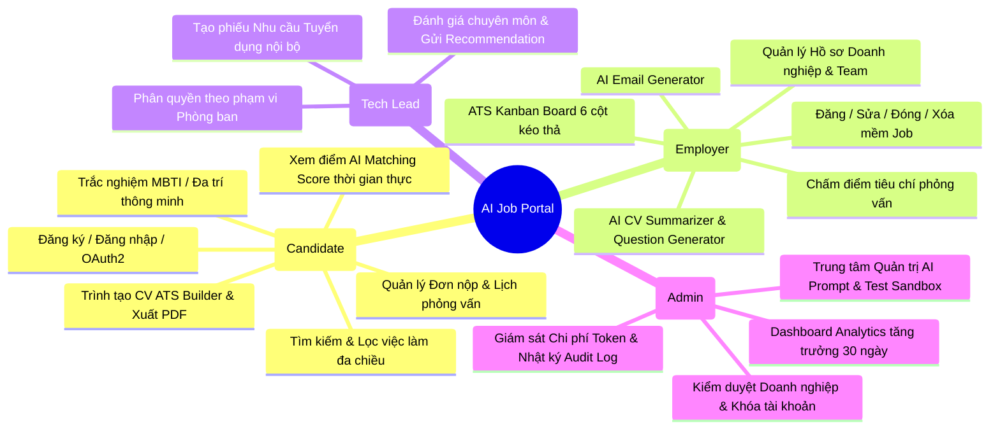

# 📋 ĐẶC TẢ YÊU CẦU HỆ THỐNG (SOFTWARE REQUIREMENTS SPECIFICATION)

**Dự án:** Nền tảng Tuyển dụng Thông minh Tích hợp Trí tuệ Nhân tạo (**AI-Powered Job Portal**)  
**Học phần:** Ứng dụng Trí tuệ Nhân tạo  
**Kiến trúc:** B2B SaaS Enterprise-ready (React 19 / TypeScript + Python FastAPI + PostgreSQL pgvector)  
**Phiên bản:** 2.0 (Cập nhật hoàn thiện)

---

## 1. TỔNG QUAN HỆ THỐNG & MỤC TIÊU ĐỀ TÀI

### 1.1. Bối cảnh thực tiễn
Trong quy trình tuyển dụng truyền thống, các doanh nghiệp và chuyên viên nhân sự (HR) thường phải đối mặt với tình trạng quá tải hồ sơ (Information Overload), sàng lọc CV thủ công tốn kém thời gian (trung bình 3-5 phút/CV), dễ bỏ sót ứng viên tiềm năng do hạn chế của các bộ lọc từ khóa chính xác (Keyword Matching Gap). Đồng thời, ứng viên gặp khó khăn trong việc định vị bản thân và tìm kiếm các công việc thực sự phù hợp với năng lực kỹ năng thực tế.

### 1.2. Mục tiêu giải pháp
Nền tảng **AI-Powered Job Portal** được xây dựng nhằm giải quyết triệt để các vấn đề trên với 4 mục tiêu trọng tâm:
1. **Tìm kiếm & Đối sánh Ngữ nghĩa Tức thời (Semantic Vector Matching):** Ứng dụng mô hình `SentenceTransformers` cục bộ kết hợp phần mở rộng `pgvector` trên PostgreSQL để tính toán điểm tương thích (`AI Matching Score`) từ 0% đến 100% dựa trên khoảng cách Cosine Distance, vượt qua rào cản tìm kiếm từ khóa truyền thống.
2. **Bộ Công cụ Trợ lý AI Toàn diện cho HR (AI HR Copilot):** Tự động hóa tóm tắt CV theo JD, đề xuất câu hỏi phỏng vấn theo từng kỹ năng ứng viên, và sinh dự thảo email tuyển dụng (mời phỏng vấn/từ chối) theo nguyên tắc không thiên lệch (*Bias-Free AI*).
3. **Trao quyền cho Ứng viên (Candidate Empowerment):** Cung cấp trình soạn thảo CV chuẩn ATS xuất PDF trực tiếp, trắc nghiệm định hướng nghề nghiệp (MBTI & Đa trí tuệ Gardner), biểu đồ Radar kỹ năng 6 trục và gợi ý lộ trình thăng tiến.
4. **Quản trị Chuẩn B2B SaaS & Phân quyền Đa cấp:** Hỗ trợ mô hình công ty đa thành viên (*Owner, HR Member, Department Head*), quản lý phễu tuyển dụng Kanban Board 6 cột, và hệ thống kiểm toán bất biến (*Audit Trail*).

---

## 2. YÊU CẦU CHỨC NĂNG (FUNCTIONAL REQUIREMENTS - FR)

Hệ thống phục vụ 4 nhóm tác nhân chính: **Ứng viên (Candidate)**, **Nhà tuyển dụng (Employer/HR)**, **Trưởng bộ phận (TechLead/Reviewer)**, và **Quản trị viên (System Admin)**.

---

### 2.1. Phân hệ Ứng viên & Người dùng Công khai (Candidate Portal)

| Mã YC | Tên Yêu Cầu Chức Năng | Mô Tả Chi Tiết Nghiệp Vụ | Mức Độ |
| :--- | :--- | :--- | :--- |
| **FR-CAN-01** | Xác thực & Quản lý Tài khoản | Đăng ký, đăng nhập bằng Email/Mật khẩu (bcrypt) hoặc Google OAuth2 một chạm. Quản lý thông tin cá nhân, cập nhật avatar, kỹ năng. | **Bắt buộc** |
| **FR-CAN-02** | Tìm kiếm & Bộ lọc Việc làm Đa chiều | Tìm kiếm theo từ khóa ngữ nghĩa; lọc kết hợp theo: Địa điểm (Hà Nội, TP.HCM, Đà Nẵng, Remote), Mức lương (min/max), Loại hình (Full-time, Part-time, Remote), Kinh nghiệm làm việc. Hỗ trợ chuyển đổi giao diện List View / Grid View. | **Bắt buộc** |
| **FR-CAN-03** | Điểm số AI Matching Score Thời gian thực | Khi xem chi tiết tin tuyển dụng (JD), hệ thống tự động so sánh vector CV của ứng viên với vector của JD, hiển thị điểm số phần trăm tương thích (0% – 100%) kèm phân loại (Rất phù hợp, Tiềm năng, Cần bổ sung kỹ năng). | **Bắt buộc** |
| **FR-CAN-04** | Trình tạo CV Chuẩn ATS (CV Builder) | Trình soạn thảo CV tương tác thời gian thực: Thông tin cá nhân, Kinh nghiệm làm việc, Học vấn, Kỹ năng, Dự án. Lưu trữ cấu trúc JSON và hỗ trợ xuất bản in / tải file PDF chất lượng cao. | **Bắt buộc** |
| **FR-CAN-05** | Nộp hồ sơ Ứng tuyển & Theo dõi Trạng thái | Nộp hồ sơ bằng CV đã lưu trên hệ thống hoặc tải lên file PDF mới. Theo dõi trạng thái hồ sơ qua 6 bước của Pipeline (`pending` $\rightarrow$ `reviewed` $\rightarrow$ `shortlisted` $\rightarrow$ `interview` $\rightarrow$ `accepted` / `rejected`). | **Bắt buộc** |
| **FR-CAN-06** | Dashboard Ứng viên & Biểu đồ Radar Kỹ năng | Bảng điều khiển cá nhân hóa hiển thị: Biểu đồ Radar 6 trục kỹ năng (React, TypeScript, Backend, Database, Cloud/DevOps, System Design); Banner thông báo lịch phỏng vấn sắp tới; Bảng lịch sử ứng tuyển. | **Quan trọng** |
| **FR-CAN-07** | Trắc nghiệm Nghề nghiệp (MBTI & Đa trí tuệ) | Làm bài kiểm tra tâm lý nghề nghiệp 16 nhóm tính cách MBTI và Thuyết Đa trí thông minh Gardner (MI). Nhận báo cáo phân tích điểm mạnh, gợi ý ngành nghề phù hợp. | **Quan trọng** |
| **FR-CAN-08** | Trợ lý AI Career Copilot & Lộ trình Kỹ năng | Chatbot AI định hướng nghề nghiệp, đề xuất lộ trình học tập, chứng chỉ và kỹ năng còn thiếu để ứng tuyển vào vị trí mục tiêu. | **Bổ sung** |

---

### 2.2. Phân hệ Nhà tuyển dụng & Quản trị Nhân sự (Employer Portal)

| Mã YC | Tên Yêu Cầu Chức Năng | Mô Tả Chi Tiết Nghiệp Vụ | Mức Độ |
| :--- | :--- | :--- | :--- |
| **FR-EMP-01** | Quản lý Hồ sơ Doanh nghiệp | Cập nhật thông tin pháp nhân: Tên công ty, logo, website, mã số thuế, quy mô nhân sự, địa chỉ trụ sở, mô tả giới thiệu doanh nghiệp. | **Bắt buộc** |
| **FR-EMP-02** | Đăng tin & Quản lý Vòng đời Tuyển dụng | Form đăng tin chuẩn SEO: Tiêu đề, phòng ban, mức lương min-max, địa điểm, mô tả công việc, yêu cầu kỹ năng, phúc lợi. Chuyển đổi trạng thái nhanh: Mở tuyển, Tạm đóng, Mở lại. Hỗ trợ **Soft Delete** an toàn bảo vệ CSDL. | **Bắt buộc** |
| **FR-EMP-03** | Đường ống Tuyển dụng ATS Kanban Board | Không gian làm việc cực rộng (Ultra-wide Canvas) quản lý ứng viên dạng bảng hoặc kéo thả **Kanban 6 cột**: `Chờ duyệt` $\rightarrow$ `Đang xem xét` $\rightarrow$ `Hồ sơ chọn lọc` $\rightarrow$ `Vòng phỏng vấn` $\rightarrow$ `Trúng tuyển` $\rightarrow$ `Từ chối`. | **Bắt buộc** |
| **FR-EMP-04** | Trợ lý AI Tóm tắt CV (CV Summarizer) | AI tự động bóc tách CV ứng viên theo yêu cầu của JD: Tóm tắt 3 điểm mạnh nổi bật, 2 điểm cần lưu ý/khoảng trống kinh nghiệm, và chấm điểm tương thích sơ bộ. | **Bắt buộc** |
| **FR-EMP-05** | Trợ lý AI Gợi ý Câu hỏi Phỏng vấn | AI tự động sinh 3-5 câu hỏi phỏng vấn kỹ thuật và tình huống chuyên sâu, bám sát các dự án thực tế ghi trong CV của ứng viên. | **Bắt buộc** |
| **FR-EMP-06** | Trợ lý AI Soạn thảo Email Tuyển dụng | Sinh thư mời phỏng vấn (tự điền thời gian, phòng họp Google Meet/địa điểm) hoặc thư từ chối lịch sự, tuân thủ nguyên tắc không phân biệt đối xử. Hỗ trợ chỉnh sửa nội dung, hoàn tác bản gốc và sao chép 1-click. | **Bắt buộc** |
| **FR-EMP-07** | Quản lý Lịch Phỏng vấn & Đánh giá Tiêu chí | Lên lịch hẹn phỏng vấn (vòng 1, vòng 2, văn hóa). Bảng chấm điểm tiêu chí phỏng vấn (Criteria Scoring) thang điểm 1-10 cho từng kỹ năng chuyên môn. | **Quan trọng** |
| **FR-EMP-08** | Quản lý Đội ngũ Tuyển dụng & Phân quyền | Mời thành viên mới vào công ty qua email token. Phân bổ vai trò: `Owner`, `HR Admin`, `Interviewer/Reviewer`. Phân quyền phụ trách từng tin tuyển dụng. | **Quan trọng** |
| **FR-EMP-09** | Báo cáo Phễu Tuyển dụng & Thống kê KPI | Bảng điều khiển trực quan hóa 4 chỉ số KPI chính (Tổng đơn, Tin đang mở, Tỷ lệ nhận việc, Lịch phỏng vấn); biểu đồ phễu chuyển đổi ứng viên thời gian thực. | **Quan trọng** |

---

### 2.3. Phân hệ Trưởng bộ phận Chuyên môn (Department Head / TechLead)

| Mã YC | Tên Yêu Cầu Chức Năng | Mô Tả Chi Tiết Nghiệp Vụ | Mức Độ |
| :--- | :--- | :--- | :--- |
| **FR-REV-01** | Phân quyền Phạm vi Phòng ban (Department Scope) | Trưởng bộ phận chỉ có quyền xem và thao tác trên các tin tuyển dụng và hồ sơ ứng viên thuộc phòng ban mình phụ trách (ví dụ: Phòng Kỹ thuật & Công nghệ). | **Bắt buộc** |
| **FR-REV-02** | Thẩm định Kỹ thuật & Ghi nhận Nhận xét | Xem chi tiết CV, các dự án mẫu và mã nguồn của ứng viên. Chấm điểm tiêu chí chuyên môn và ghi nhận nhận xét đánh giá nội bộ. | **Bắt buộc** |
| **FR-REV-03** | Đưa ra Đề xuất Tuyển dụng (Hiring Recommendation) | Gửi ý kiến đề xuất tuyển dụng chính thức: `Đề xuất tuyển (Recommended)`, `Cần phỏng vấn thêm (Needs Review)`, hoặc `Không phù hợp (Not Recommended)`. | **Bắt buộc** |
| **FR-REV-04** | Tạo Phiếu Nhu cầu Tuyển dụng Nội bộ | Soạn thảo và gửi phiếu đề xuất tuyển thêm nhân sự (Vị trí, số lượng, lý do, mức ngân sách dự kiến) lên Ban Giám đốc và phòng Nhân sự phê duyệt. | **Quan trọng** |

---

### 2.4. Phân hệ Quản trị Viên Hệ thống Cấp cao (Admin Command Center)

| Mã YC | Tên Yêu Cầu Chức Năng | Mô Tả Chi Tiết Nghiệp Vụ | Mức Độ |
| :--- | :--- | :--- | :--- |
| **FR-ADM-01** | Bảng Điều khiển Phân tích Vĩ mô (Analytics) | Giám sát toàn diện chỉ số nền tảng: Tổng số người dùng mới (30 ngày), tổng số doanh nghiệp, tổng tin tuyển dụng đang hoạt động, phễu ứng tuyển toàn sàn. | **Bắt buộc** |
| **FR-ADM-02** | Quản trị & Kiểm duyệt Doanh nghiệp | Duyệt hồ sơ pháp nhân doanh nghiệp mới đăng ký (`is_active = true`); khóa/mở khóa doanh nghiệp vi phạm quy chế sàn. | **Bắt buộc** |
| **FR-ADM-03** | Giám sát Tin Tuyển dụng Toàn sàn | Tra cứu, rà soát nội dung toàn bộ tin tuyển dụng trên hệ thống. Tự động gắn cờ hoặc đóng tin tuyển dụng chứa nội dung lừa đảo/sai phạm. | **Bắt buộc** |
| **FR-ADM-04** | Quản lý Toàn bộ Người dùng Hệ thống | Tra cứu danh sách người dùng theo vai trò (`candidate`, `employer`, `admin`). Thực hiện thao tác Khóa (Ban) / Mở khóa tài khoản bảo vệ an ninh sàn. | **Bắt buộc** |
| **FR-ADM-05** | Trung tâm Kiểm soát Cấu hình AI (AI Prompt Center) | Quản lý và tùy biến 5 Prompt hệ thống động. Tích hợp màn hình **Test Sandbox** gọi trực tiếp DeepSeek API kèm thanh giới hạn tần suất (Rate Limiter). | **Quan trọng** |
| **FR-ADM-06** | Bảng Giám sát Chi phí Token & Nhật ký Kiểm toán | Theo dõi chi tiết lượng Token sử dụng, chi phí ước tính (USD), độ trễ phản hồi (ms) cho từng cuộc gọi AI. Truy vết bảng `admin_audit_logs` bất biến. | **Quan trọng** |

---

## 3. YÊU CẦU PHI CHỨC NĂNG (NON-FUNCTIONAL REQUIREMENTS - NFR)

### 3.1. Hiệu năng & Khả năng Phản hồi (Performance - NFR-PERF)
- **NFR-PERF-01 (API Latency):** Thời gian phản hồi trung bình của 95% các API truy vấn nghiệp vụ thông thường (không gọi LLM ngoài) phải đạt $\le 200\text{ ms}$.
- **NFR-PERF-02 (Vector Search Speed):** Tốc độ thực hiện phép toán Cosine Distance `<=>` trên 10,000 bản ghi vector bằng extension PostgreSQL `pgvector` với chỉ mục HNSW/IVFFlat phải đạt $\le 100\text{ ms}$.
- **NFR-PERF-03 (Tải trang Frontend):** Điểm hiệu năng Google Lighthouse trên máy tính bàn đạt $\ge 90$ điểm; thời gian tương tác đầu tiên (Time to Interactive - TTI) $\le 1.5\text{ giây}$.
- **NFR-PERF-04 (Xử lý Bất đồng bộ):** Các tác vụ xử lý AI ngoài (DeepSeek/OpenAI LLM) có độ trễ phụ thuộc mạng phải có giao diện hiển thị trạng thái chờ mượt mà (Skeleton loading shimmer), không làm đơ cứng giao diện người dùng.

### 3.2. An toàn & Bảo mật Thông tin (Security - NFR-SEC)
- **NFR-SEC-01 (Mã hóa Mật khẩu):** Toàn bộ mật khẩu người dùng phải được mã hóa một chiều bằng giải thuật `bcrypt` với muối ngẫu nhiên (salt rounds $\ge 12$). Tuyệt đối không lưu mật khẩu thô trong cơ sở dữ liệu.
- **NFR-SEC-02 (Phiên làm việc & Phân quyền):** Sử dụng chuẩn `JWT` (JSON Web Token) thuật toán `HS256`, thời hạn hết hạn token 24 giờ. Cơ chế bảo vệ 2 lớp (Frontend Protected Routes + Backend Role Dependencies).
- **NFR-SEC-03 (Bảo mật Khóa API & Môi trường):** Toàn bộ bí mật hệ thống (Secret Key, Database URL, AI API Key) bắt buộc cấu hình qua tệp môi trường `.env`, tuyệt đối không hardcode trong mã nguồn.
- **NFR-SEC-04 (Bảo vệ Dữ liệu Cá nhân - PII Redaction):** Trước khi gửi dữ liệu CV sang các dịch vụ LLM bên thứ ba, hệ thống phải tự động ẩn danh hoặc loại bỏ các thông tin nhạy cảm (Số điện thoại, địa chỉ cụ thể, CMND/CCCD).

### 3.3. Độ tin cậy & Tính Toàn vẹn Dữ liệu (Reliability - NFR-RELI)
- **NFR-RELI-01 (Toàn vẹn Khóa ngoại & Soft Delete):** Đối với các thực thể quan trọng có ràng buộc liên kết (như Tin tuyển dụng đã có ứng viên nộp đơn), hệ thống áp dụng cơ chế **Soft Delete** (`is_active = false`), tuyệt đối không dùng Hard Delete gây lỗi `ForeignKeyViolation`.
- **NFR-RELI-02 (Xử lý Ngoại lệ Toàn cục):** Backend triển khai bộ Exception Handler tập trung, chuyển đổi mọi lỗi hệ thống (DatabaseError, ValidationError) thành mã trạng thái HTTP chuẩn kèm thông điệp tiếng Việt dễ hiểu.
- **NFR-RELI-03 (Khả năng Đóng gói Docker):** Toàn bộ hệ thống phải được đóng gói chuẩn hóa trong `docker-compose.yml`, cho phép triển khai chạy thử trên môi trường mới chỉ với một câu lệnh duy nhất.

### 3.4. Thiết kế Giao diện & Trải nghiệm Người dùng (Usability - NFR-UX)
- **NFR-UX-01 (Thiết kế Chuẩn B2B SaaS):** Giao diện thiết kế theo phong cách hiện đại (lấy cảm hứng từ Stripe, Vercel, TopCV B2B), sử dụng bảng màu HSL hài hòa, đường viền nhạt (`border-gray-200`), shadow-sm mềm mại và các badge bo tròn tinh tế.
- **NFR-UX-02 (Bố cục Không Tràn Viền):** Mọi trang màn hình đều bọc trong Container chuẩn mực (`max-w-7xl` hoặc Ultra-wide `max-w-[1840px]` cho Kanban ATS), đảm bảo tương thích 100% không bị vỡ bố cục trên mọi độ phân giải màn hình (Desktop, Tablet, Mobile).
- **NFR-UX-03 (Đủ 4 Trạng thái Giao diện):** Mọi thành phần danh sách hoặc bảng biểu đều hiển thị đủ 4 trạng thái: *Ideal State (Có dữ liệu)*, *Loading State (Skeleton Shimmer)*, *Empty State (Hình minh họa & Nút hành động tạo mới)*, và *Error State (Nút thử lại)*.

---

## 4. RÀNG BUỘC KỸ THUẬT & CÔNG NGHỆ ÁP DỤNG

| Thành phần | Công Nghệ / Thư Viện Được Chỉ Định | Lý Do Lựa Chọn |
| :--- | :--- | :--- |
| **Frontend Framework** | React 19, TypeScript, Vite | Tốc độ biên dịch cực nhanh, kiểm soát kiểu dữ liệu chặt chẽ tránh lỗi runtime. |
| **CSS & Components** | Tailwind CSS v3/v4, Shadcn UI | Tùy biến linh hoạt, kích thước bundle tối ưu, thẩm mỹ chuẩn Enterprise B2B. |
| **State Management** | Zustand | Nhẹ hơn Redux, không boilerplate, hiệu năng cập nhật state tức thời. |
| **Icons & Animation** | Lucide React, Framer Motion | Bộ icon hiện đại chuẩn SaaS; hiệu ứng chuyển cảnh mượt mà 60fps. |
| **Backend Framework** | Python 3.11+, FastAPI, Pydantic v2 | Xử lý bất đồng bộ (async/await), tự động sinh tài liệu Swagger/OpenAPI docs. |
| **Database & Vector** | PostgreSQL 17 + extension `pgvector` | Hệ quản trị CSDL quan hệ mạnh mẽ kết hợp tìm kiếm vector tương đồng 384 chiều. |
| **AI Integration** | SentenceTransformers (Local) + DeepSeek API | Embedding ngữ nghĩa bảo mật cục bộ; LLM thế hệ mới chi phí rẻ và chất lượng cao. |
