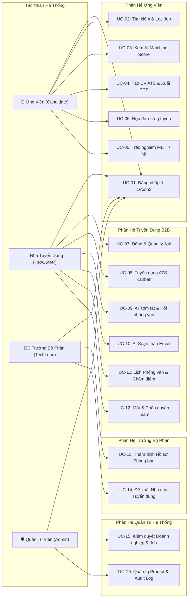

# 🎯 PHÂN TÍCH & ĐẶC TẢ CA SỬ DỤNG (USE CASE SPECIFICATIONS)

**Dự án:** Nền tảng Tuyển dụng Thông minh Tích hợp Trí tuệ Nhân tạo (**AI-Powered Job Portal**)  
**Học phần:** Ứng dụng Trí tuệ Nhân tạo  
**Kiến trúc:** B2B SaaS Multi-role Enterprise-ready  
**Phiên bản:** 2.0 (Cập nhật chuẩn hóa)

---

## 1. DANH SÁCH CÁC TÁC NHÂN HỆ THỐNG (SYSTEM ACTORS)

Hệ thống được thiết kế theo mô hình nền tảng đa bên (Multi-sided Platform) phục vụ 4 tác nhân tương tác chính:

| STT | Tác Nhân (Actor) | Phân Loại | Vai Trò & Trách Nhiệm Cốt Lõi |
| :---: | :--- | :--- | :--- |
| **1** | **Ứng viên (Candidate)** | Người dùng ngoài | Tìm kiếm việc làm thông minh, tạo CV chuẩn ATS, xem điểm AI Matching Score, nộp hồ sơ, làm trắc nghiệm nghề nghiệp và theo dõi tiến độ phỏng vấn. |
| **2** | **Nhà tuyển dụng (Employer Owner / HR)** | Doanh nghiệp | Đại diện pháp nhân doanh nghiệp, đăng và quản lý vòng đời tin tuyển dụng, quản trị Pipeline ứng viên Kanban 6 cột, kích hoạt các trợ lý AI (Tóm tắt CV, câu hỏi phỏng vấn, email), chấm điểm tiêu chí. |
| **3** | **Trưởng bộ phận (TechLead / Reviewer)** | Doanh nghiệp | Chuyên gia kỹ thuật trực thuộc phòng ban, phụ trách thẩm định hồ sơ chuyên môn trong phạm vi phòng ban, chấm điểm kỹ thuật và gửi ý kiến Đề xuất tuyển dụng (Recommendation). |
| **4** | **Quản trị viên (System Admin)** | Quản trị viên | Vận hành toàn sàn, phân tích số liệu tăng trưởng, kiểm duyệt hồ sơ công ty và tin tuyển dụng, quản lý tài khoản người dùng, cấu hình Prompt AI và truy vết Audit Logs. |

---

## 2. SƠ ĐỒ USE CASE TỔNG THỂ (USE CASE DIAGRAMS)

### 2.1. Sơ đồ Quan hệ Giữa Tác Nhân và Các Phân Hệ Chức Năng

---

## 3. MA TRẬN PHÂN QUYỀN CA SỬ DỤNG (USE CASE TRACEABILITY MATRIX)

| Mã UC | Tên Ca Sử Dụng | Candidate | Employer HR | TechLead | System Admin |
| :--- | :--- | :---: | :---: | :---: | :---: |
| **UC-01** | Đăng ký, Đăng nhập JWT & Google OAuth2 | ✅ | ✅ | ✅ | ✅ |
| **UC-02** | Tìm kiếm & Bộ lọc Việc làm Đa chiều | ✅ | ✅ | ✅ | ✅ |
| **UC-03** | Tính điểm AI Matching Score (Vector Search) | ✅ | ✅ | ✅ | ❌ |
| **UC-04** | Soạn thảo CV Chuẩn ATS (CV Builder) & Xuất PDF | ✅ | ❌ | ❌ | ❌ |
| **UC-05** | Nộp hồ sơ ứng tuyển & Theo dõi Pipeline | ✅ | ❌ | ❌ | ❌ |
| **UC-06** | Làm bài Trắc nghiệm MBTI / MI & Lộ trình AI | ✅ | ❌ | ❌ | ❌ |
| **UC-07** | Đăng tin, Quản lý trạng thái & Xóa mềm Job | ❌ | ✅ | ❌ | ❌ |
| **UC-08** | Quản lý Pipeline Ứng viên (ATS Kanban 6 cột) | ❌ | ✅ | ❌ | ❌ |
| **UC-09** | Gọi Trợ lý AI Tóm tắt CV & Gợi ý Câu hỏi | ❌ | ✅ | ✅ | ❌ |
| **UC-10** | Gọi Trợ lý AI Soạn thảo Thư Mời / Thư Từ chối | ❌ | ✅ | ❌ | ❌ |
| **UC-11** | Lên lịch Phỏng vấn & Chấm điểm Tiêu chí kỹ thuật | ❌ | ✅ | ✅ | ❌ |
| **UC-12** | Quản lý Đội ngũ Tuyển dụng & Mời qua Token | ❌ | ✅ (Owner) | ❌ | ❌ |
| **UC-13** | Thẩm định Năng lực theo Phạm vi Phòng ban | ❌ | ❌ | ✅ | ❌ |
| **UC-14** | Tạo & Gửi Phiếu Nhu cầu Tuyển dụng Nội bộ | ❌ | ✅ (Duyệt) | ✅ (Tạo) | ❌ |
| **UC-15** | Giám sát Toàn sàn, Duyệt Doanh nghiệp & Khóa User | ❌ | ❌ | ❌ | ✅ |
| **UC-16** | Trung tâm Kiểm soát Prompt AI & Tra cứu Audit Log | ❌ | ❌ | ❌ | ✅ |

---

## 4. ĐẶC TẢ CHI TIẾT CÁC USE CASE TRỌNG TÂM

### 4.1. UC-03: Đối sánh Hồ sơ & Tính điểm AI Matching Score
- **Tác nhân chính:** Ứng viên (Candidate) / Nhà tuyển dụng (Employer).
- **Mục tiêu:** Tính toán độ tương đồng ngữ nghĩa giữa CV ứng viên và bản mô tả công việc (JD) bằng giải thuật vector, trả về điểm số phần trăm trực quan.
- **Tiền điều kiện:** Ứng viên đã tải lên CV (đã được sinh vector embedding 384 chiều trong bảng `resumes`); Tin tuyển dụng có trường `embedding` trong bảng `jobs`.
- **Luồng sự kiện chính (Basic Flow):**
  1. Người dùng mở trang chi tiết tin tuyển dụng (`/jobs/:id`) hoặc nhà tuyển dụng xem danh sách ứng viên nộp vào công việc (`/employer/candidates`).
  2. Frontend gửi yêu cầu `GET /api/jobs/{job_id}/matching-score` (hoặc truy vấn qua Router matching).
  3. Backend truy vấn vector CV và vector JD từ cơ sở dữ liệu PostgreSQL.
  4. Backend thực hiện phép tính khoảng cách Cosine Distance thông qua toán tử `<=>` của `pgvector`:  
     $$\text{distance} = \vec{V}_{\text{CV}} \Leftrightarrow \vec{V}_{\text{JD}}$$
  5. Backend quy đổi khoảng cách sang điểm số tương đồng theo công thức chuẩn hóa:  
     $$\text{score} = \text{round}\Big(\max\big(0.0, \min(100.0, (1.0 - \text{distance}) \times 100.0)\big), 1\Big)$$
  6. Backend gắn nhãn xếp loại:
     - $\ge 85\%$: **"Rất phù hợp (Strong Match)"** (Huy hiệu màu xanh lá).
     - $70\% - 84\%$: **"Tiềm năng (Good Match)"** (Huy hiệu màu xanh dương).
     - $50\% - 69\%$: **"Cần rèn luyện thêm (Moderate Match)"** (Huy hiệu màu vàng).
     - $< 50\%$: **"Chưa phù hợp (Low Match)"** (Huy hiệu màu xám).
  7. Frontend hiển thị huy hiệu điểm số kèm hiệu ứng loading shimmer mượt mà.
- **Luồng ngoại lệ (Exception Flow):**
  - *Ứng viên chưa tải CV lên:* Hệ thống hiển thị thông báo "Vui lòng tải CV lên hồ sơ để kích hoạt tính năng AI Matching Score" kèm nút điều hướng đến trang tải CV.
  - *Extension pgvector chưa kích hoạt:* Hệ thống tự động chuyển đổi sang hàm Python fallback `_cosine_similarity_python` độc lập, đảm bảo không gián đoạn dịch vụ.

---

### 4.2. UC-08: Quản lý Tuyển dụng Ứng viên (ATS Kanban Board 6 Cột)
- **Tác nhân chính:** Nhà tuyển dụng (Employer HR / Owner).
- **Mục tiêu:** Theo dõi và chuyển đổi linh hoạt trạng thái của ứng viên qua 6 giai đoạn tuyển dụng bằng giao diện kéo thả trực quan.
- **Tiền điều kiện:** Nhà tuyển dụng đã đăng nhập thành công và thuộc doanh nghiệp sở hữu tin tuyển dụng.
- **Luồng sự kiện chính (Basic Flow):**
  1. Nhà tuyển dụng truy cập trang Tuyển dụng (`/employer/candidates`).
  2. Hệ thống tải toàn bộ danh sách đơn ứng tuyển (`applications`) nhóm thành 6 cột Kanban:
     - Cột 1: `Chờ duyệt (Pending)`
     - Cột 2: `Đang xem xét (Reviewed)`
     - Cột 3: `Hồ sơ chọn lọc (Shortlisted)`
     - Cột 4: `Vòng phỏng vấn (Interviewing)`
     - Cột 5: `Trúng tuyển (Accepted)`
     - Cột 6: `Từ chối (Rejected)`
  3. Người dùng nắm và kéo thẻ ứng viên từ cột này thả sang cột khác (sử dụng thư viện `Framer Motion`).
  4. Frontend gửi yêu cầu `PATCH /api/applications/{id}` cập nhật `status = new_status`.
  5. Backend kiểm tra quyền sở hữu, cập nhật trạng thái trong CSDL và ghi nhận thời gian thay đổi.
  6. Nếu chuyển sang trạng thái `Interviewing`, hệ thống gợi ý mở Modal Lên lịch phỏng vấn.
  7. Nếu chuyển sang `Rejected` hoặc `Accepted`, hệ thống gợi ý mở Modal Soạn thảo Email AI.
- **Hậu điều kiện:** Trạng thái ứng viên được cập nhật tức thời trên màn hình và thông báo tự động được gửi tới ứng viên.

---

### 4.3. UC-09: Trợ lý AI Tóm tắt CV & Gợi ý Câu hỏi Phỏng vấn
- **Tác nhân chính:** Nhà tuyển dụng (Employer HR) / Trưởng bộ phận (TechLead).
- **Mục tiêu:** Bóc tách CV ứng viên và tạo nhanh bộ câu hỏi phỏng vấn chuyên sâu theo JD chỉ trong 3 giây.
- **Tiền điều kiện:** Ứng viên đã nộp CV hợp lệ; hệ thống đã cấu hình DeepSeek LLM API.
- **Luồng sự kiện chính (Basic Flow):**
  1. Người dùng bấm nút **"AI Tóm tắt CV"** trên thẻ hồ sơ ứng viên.
  2. Frontend kích hoạt Modal với Skeleton Shimmer đang tải và gửi yêu cầu `POST /api/ai/summarize-cv`.
  3. Backend thực hiện tiền xử lý: Ẩn danh thông tin cá nhân (PII Redaction: số điện thoại, địa chỉ, tuổi).
  4. Backend nạp prompt template `summarize_cv` từ bảng `ai_prompt_configs`, chèn nội dung CV đã ẩn danh và yêu cầu JD.
  5. Backend gọi API DeepSeek Chat Completions với tham số `temperature = 0.3` để chống ảo giác.
  6. AI trả về cấu trúc JSON chuẩn:
     - `strengths`: Danh sách 3 điểm mạnh cốt lõi.
     - `concerns`: Danh sách 2 điểm lưu ý hoặc kỹ năng còn thiếu.
     - `interview_questions`: Bộ 3-5 câu hỏi phỏng vấn kỹ thuật gợi ý.
  7. Backend ghi nhận bản ghi mới vào bảng `ai_call_logs` (thời gian, model, tokens, chi phí USD, latency).
  8. Frontend hiển thị kết quả trực quan trên Modal với giao diện thẻ Card sang trọng, cho phép HR sao chép nội dung chỉ bằng 1-click.
- **Hậu điều kiện:** Dữ liệu tóm tắt được lưu tạm vào hồ sơ ứng viên để các thành viên khác trong ban phỏng vấn cùng xem.

---

### 4.4. UC-10: Trợ lý AI Soạn thảo Email Tuyển dụng
- **Tác nhân chính:** Nhà tuyển dụng (Employer HR).
- **Mục tiêu:** Sinh thư mời phỏng vấn hoặc thư từ chối tự động, tôn trọng ứng viên và không thiên lệch.
- **Tiền điều kiện:** Ứng viên đã có đơn ứng tuyển trong hệ thống.
- **Luồng sự kiện chính (Basic Flow):**
  1. Nhà tuyển dụng bấm **"Soạn Email bằng AI"** tại hồ sơ ứng viên, chọn loại thư:
     - `interview_invitation`: Thư mời phỏng vấn.
     - `rejection`: Thư từ chối lịch sự.
  2. Người dùng nhập các thông tin bổ sung (Thời gian phỏng vấn, Địa điểm / Link Google Meet).
  3. Frontend gửi yêu cầu `POST /api/ai/generate-email`.
  4. Backend nạp System Prompt `generate_email`, truyền các tham số và gọi DeepSeek LLM.
  5. AI sinh bức thư hoàn chỉnh với tiêu đề trang trọng, văn phong chuẩn mực và điền sẵn các thông tin thời gian, địa điểm.
  6. Frontend hiển thị bản nháp trong trình soạn thảo `EmailDraftModal`.
  7. Nhà tuyển dụng đọc duyệt, có thể tự do gõ sửa câu chữ, bấm "Hoàn tác bản gốc" nếu muốn khôi phục hoặc bấm "Sao chép" / "Gửi trực tiếp".
- **Hậu điều kiện:** Email sẵn sàng được gửi tới ứng viên; nhật ký thao tác được lưu lại trong hệ thống.

---

### 4.5. UC-14: Tạo & Gửi Phiếu Nhu cầu Tuyển dụng Nội bộ
- **Tác nhân chính:** Trưởng bộ phận (TechLead / Reviewer).
- **Mục tiêu:** Đề xuất mở thêm chỉ tiêu nhân sự mới cho phòng ban trực thuộc.
- **Tiền điều kiện:** Người dùng có vai trò `reviewer` hoặc `department_head` trong công ty.
- **Luồng sự kiện chính (Basic Flow):**
  1. TechLead truy cập trang **Nhu cầu Tuyển dụng** (`/employer/recruitment-requests`).
  2. Bấm nút **"Tạo yêu cầu mới"** để mở biểu mẫu:
     - Tên vị trí cần tuyển (ví dụ: *Senior Backend Engineer*).
     - Số lượng nhân sự cần bổ sung (ví dụ: *02 người*).
     - Phòng ban phụ trách (tự động điền theo phòng ban của TechLead).
     - Lý do tuyển dụng & Dự kiến mức lương.
  3. Người dùng bấm **"Gửi yêu cầu"**.
  4. Backend kiểm tra hợp lệ, tạo bản ghi mới trong bảng `recruitment_requests` với trạng thái `pending`.
  5. Hệ thống bắn thông báo tới tài khoản `Owner / HR` của doanh nghiệp.
  6. HR truy cập màn hình, xem chi tiết và thực hiện thao tác **"Phê duyệt (Approve)"** hoặc **"Từ chối (Reject)"**.
- **Hậu điều kiện:** Khi được phê duyệt, HR có thể bấm 1-click chuyển đổi phiếu yêu cầu thành Tin tuyển dụng mới (`jobs`).

---

### 4.6. UC-16: Trung tâm Kiểm soát Prompt AI & Tra cứu Audit Log
- **Tác nhân chính:** Quản trị viên (System Admin).
- **Mục tiêu:** Quản trị tập trung các Prompt hệ thống, thử nghiệm chất lượng AI và giám sát nhật ký kiểm toán toàn sàn.
- **Tiền điều kiện:** Người dùng có quyền `admin`.
- **Luồng sự kiện chính (Basic Flow):**
  1. Admin truy cập Trung tâm AI (`/admin/ai/prompts`).
  2. Hệ thống hiển thị danh sách 5 System Prompt:
     - `cv_evaluate`: Đánh giá CV và xếp loại ATS.
     - `roadmap`: Xây dựng lộ trình sự nghiệp.
     - `summarize_cv`: Tóm tắt điểm mạnh / điểm yếu CV.
     - `interview_questions`: Gợi ý câu hỏi phỏng vấn.
     - `generate_email`: Soạn thảo thư mời và thư từ chối.
  3. Admin chọn một Prompt để tinh chỉnh văn phong, nhiệt độ (`temperature`) và token tối đa.
  4. Sử dụng công cụ **Test Sandbox**: Nhập dữ liệu thử nghiệm và bấm "Chạy thử nghiệm". Hệ thống gọi DeepSeek API và hiển thị kết quả phản hồi cùng chi phí token thực tế.
  5. Admin truy cập menu **Nhật ký Kiểm toán** (`/admin/audit-logs`): Tra cứu bảng lịch sử bất biến ghi nhận mọi thao tác nhạy cảm (duyệt công ty, khóa tài khoản, đổi cấu hình) kèm IP và thời gian chính xác.
- **Hậu điều kiện:** Cấu hình mới có hiệu lực ngay lập tức cho toàn bộ các cuộc gọi AI tiếp theo mà không cần khởi động lại máy chủ.
