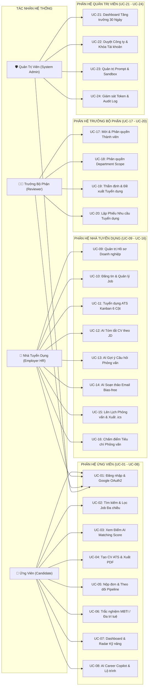
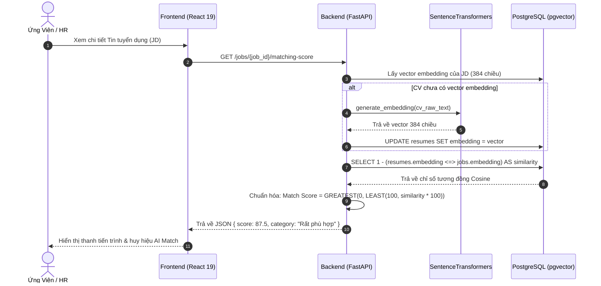
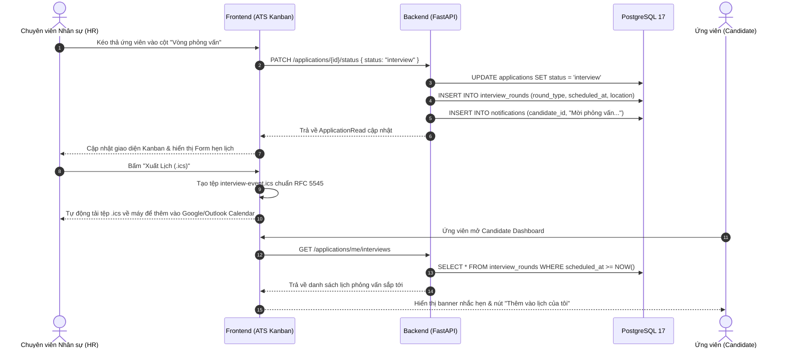
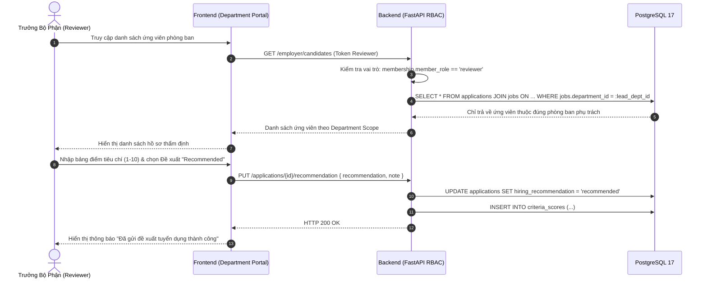
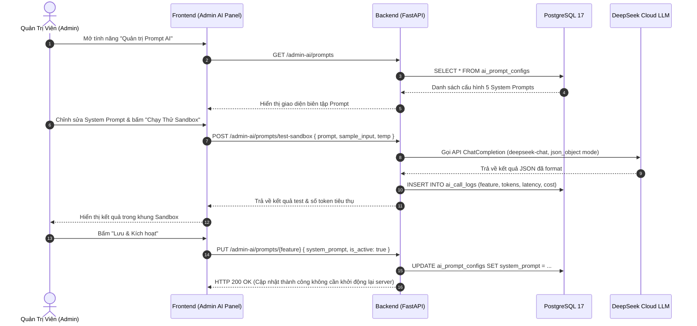

# 🎯 PHÂN TÍCH & ĐẶC TẢ CA SỬ DỤNG (USE CASE SPECIFICATIONS)

**Dự án:** Nền tảng Tuyển dụng Thông minh Tích hợp Trí tuệ Nhân tạo (**AI-Powered Job Portal**)  
**Học phần:** Khóa luận Tốt nghiệp / Đồ án Ứng dụng Trí tuệ Nhân tạo  
**Kiến trúc:** B2B SaaS Multi-role Enterprise-ready (React 19 + FastAPI + PostgreSQL 17 pgvector)  
**Tiêu chuẩn Thiết kế:** RUP (Rational Unified Process) & UML 2.5 Specification  
**Phiên bản:** 3.0 (Đặc tả đầy đủ toàn diện 24 Ca sử dụng cốt lõi, ma trận phân quyền RBAC và 4 sơ đồ Sequence Diagram chuẩn)

---

## 1. DANH SÁCH CÁC TÁC NHÂN HỆ THỐNG (SYSTEM ACTORS)

Hệ thống được thiết kế theo mô hình nền tảng tuyển dụng B2B SaaS đa bên (Multi-sided Enterprise Hiring Platform) phục vụ 4 nhóm tác nhân tương tác chính:

| STT | Tác Nhân (Actor) | Phân Loại | Vai Trò & Quyền Hạn Nghiệp Vụ Cốt Lõi |
| :---: | :--- | :--- | :--- |
| **1** | **Ứng viên (Candidate)** | Người dùng ngoài | Tìm kiếm việc làm bằng vector ngữ nghĩa, tạo CV chuẩn ATS, xem điểm AI Matching Score thời gian thực, nộp hồ sơ, làm trắc nghiệm hướng nghiệp (MBTI & Đa trí tuệ), quản lý lịch phỏng vấn cá nhân và khám phá lộ trình thăng tiến sự nghiệp. |
| **2** | **Nhà tuyển dụng (Employer HR / Owner)** | Doanh nghiệp | Đại diện pháp nhân doanh nghiệp, đăng và quản lý vòng đời tin tuyển dụng (Soft Delete), quản trị ứng viên qua ATS Kanban Board 6 cột, kích hoạt các trợ lý AI Copilot (Tóm tắt CV, câu hỏi phỏng vấn, soạn email), thiết lập lịch phỏng vấn và xuất lịch `.ics`. |
| **3** | **Trưởng bộ phận (TechLead / Reviewer)** | Doanh nghiệp | Chuyên gia kỹ thuật trực thuộc phòng ban cụ thể. Được phân quyền cô lập (*Department Scope*) chỉ xem hồ sơ ứng viên thuộc phòng ban mình, chấm điểm tiêu chí chuyên môn, gửi phiếu ý kiến Đề xuất tuyển dụng (*Hiring Recommendation*) và lập Phiếu nhu cầu tuyển dụng nội bộ. |
| **4** | **Quản trị viên (System Admin)** | Quản trị viên | Điều hành toàn bộ nền tảng, phân tích số liệu tăng trưởng 30 ngày, kiểm duyệt doanh nghiệp và tin tuyển dụng, khóa/mở khóa tài khoản người dùng, cấu hình System Prompt động và truy vết kiểm toán bảo mật (*Zero-PII Audit Log*). |

---

## 2. SƠ ĐỒ USE CASE TỔNG THỂ (SYSTEM USE CASE DIAGRAM)

---

## 3. MA TRẬN PHÂN QUYỀN CA SỬ DỤNG (RBAC PERMISSIONS MATRIX)

Bảng ma trận truy vết quyền truy cập của 24 Use Cases đối với 4 nhóm vai trò:

| Mã UC | Tên Ca Sử Dụng (Use Case Title) | Ứng viên (Candidate) | Nhà tuyển dụng (HR/Owner) | Trưởng bộ phận (Reviewer) | Quản trị viên (Admin) |
| :--- | :--- | :---: | :---: | :---: | :---: |
| **UC-01** | Đăng ký, Đăng nhập JWT & Google OAuth2 | ✅ | ✅ | ✅ | ✅ |
| **UC-02** | Tìm kiếm & Bộ lọc Việc làm Đa chiều | ✅ | ✅ | ✅ | ✅ |
| **UC-03** | Tính điểm AI Matching Score (Vector Search) | ✅ | ✅ | ✅ | ❌ |
| **UC-04** | Soạn thảo CV Chuẩn ATS & Xuất PDF In ấn | ✅ | ❌ | ❌ | ❌ |
| **UC-05** | Nộp đơn Ứng tuyển & Theo dõi Trạng thái | ✅ | ❌ | ❌ | ❌ |
| **UC-06** | Trắc nghiệm MBTI & Đa trí tuệ Gardner | ✅ | ❌ | ❌ | ❌ |
| **UC-07** | Dashboard Cá nhân & Biểu đồ Radar 6 Trục | ✅ | ❌ | ❌ | ❌ |
| **UC-08** | Chatbot AI Career Copilot & Lộ trình Thăng tiến | ✅ | ❌ | ❌ | ❌ |
| **UC-09** | Quản lý Hồ sơ Pháp nhân Doanh nghiệp | ❌ | ✅ | ❌ | ❌ |
| **UC-10** | Đăng tin, Đóng tin & Xóa mềm Job (Soft Delete)| ❌ | ✅ | ❌ | ❌ |
| **UC-11** | Tuyển dụng Ứng viên qua ATS Kanban Board 6 Cột | ❌ | ✅ | ❌ | ❌ |
| **UC-12** | AI Tóm tắt Năng lực CV theo JD Tuyển dụng | ❌ | ✅ | ✅ | ❌ |
| **UC-13** | AI Gợi ý Bộ câu hỏi Phỏng vấn Kỹ thuật | ❌ | ✅ | ✅ | ❌ |
| **UC-14** | AI Soạn thảo Email Tuyển dụng Bias-free 1-Click | ❌ | ✅ | ❌ | ❌ |
| **UC-15** | Quản lý Lịch Phỏng vấn Đa vòng & Xuất .ics | ❌ | ✅ | ✅ | ❌ |
| **UC-16** | Chấm điểm Tiêu chí Phỏng vấn Chuyên môn | ❌ | ✅ | ✅ | ❌ |
| **UC-17** | Mời & Phân quyền Thành viên Team qua Token | ❌ | ✅ (Owner/HR)| ❌ | ❌ |
| **UC-18** | Cô lập Dữ liệu Hồ sơ theo Phòng ban (Scope) | ❌ | ✅ | ✅ | ❌ |
| **UC-19** | Thẩm định Kỹ thuật & Gửi Hiring Recommendation| ❌ | ❌ | ✅ | ❌ |
| **UC-20** | Lập Phiếu Đề xuất Nhu cầu Tuyển dụng Nội bộ | ❌ | ❌ | ✅ | ❌ |
| **UC-21** | Dashboard Thống kê Tăng trưởng Nền tảng 30 Ngày | ❌ | ❌ | ❌ | ✅ |
| **UC-22** | Kiểm duyệt Doanh nghiệp & Khóa Tài khoản | ❌ | ❌ | ❌ | ✅ |
| **UC-23** | Quản trị Trung tâm Prompt AI & Test Sandbox | ❌ | ❌ | ❌ | ✅ |
| **UC-24** | Giám sát Chi phí Token & Zero-PII Audit Log | ❌ | ❌ | ❌ | ✅ |

---

## 4. ĐẶC TẢ CHI TIẾT TOÀN DIỆN 24 CA SỬ DỤNG HỆ THỐNG

---

### PHÂN HỆ 1: ỨNG VIÊN & NGƯỜI TÌM VIỆC (CANDIDATE PORTAL)

#### 4.1. UC-01: Đăng ký, Đăng nhập JWT & Google OAuth2
- **Tác nhân:** Ứng viên, Nhà tuyển dụng, Trưởng bộ phận, Quản trị viên.
- **Tiền điều kiện:** Người dùng có trình duyệt kết nối Internet, có tài khoản email hoặc tài khoản Google.
- **Kích hoạt (Trigger):** Người dùng bấm nút "Đăng nhập" hoặc "Đăng ký" trên thanh điều hướng.
- **Luồng chính (Main Flow):**
  1. Người dùng chọn phương thức xác thực: Đăng nhập mật khẩu truyền thống hoặc "Đăng nhập với Google".
  2. Nếu chọn mật khẩu: Nhập Email và Mật khẩu $\rightarrow$ Frontend gửi yêu cầu tới `POST /auth/login`.
  3. Backend truy vấn bảng `users`, xác thực mật khẩu qua hàm `bcrypt.verify()`.
  4. Nếu chọn Google OAuth2: Chuyển hướng tới Google Consent Screen $\rightarrow$ Callback về `GET /auth/google/callback` $\rightarrow$ Backend kiểm tra hoặc tự động tạo tài khoản trong `users` và `oauth_accounts`.
  5. Backend sinh mã JWT Access Token (thuật toán HS256, hạn 30 phút).
  6. Frontend lưu Token vào `localStorage` / Secure Cookie và chuyển hướng người dùng vào Dashboard tương ứng theo vai trò.
- **Luồng ngoại lệ (Exception Flows):**
  - *E1 - Sai thông tin đăng nhập:* Backend trả về HTTP 401 Unauthorized $\rightarrow$ Frontend hiển thị thông báo "Email hoặc mật khẩu không chính xác".
  - *E2 - Tài khoản bị khóa:* Backend phát hiện `is_active == False` $\rightarrow$ Trả về HTTP 403 Forbidden $\rightarrow$ Hiển thị "Tài khoản của bạn đã bị tạm khóa do vi phạm chính sách".
- **Hậu điều kiện:** Phiên làm việc được thiết lập, mọi yêu cầu API tiếp theo đính kèm header `Authorization: Bearer <token>`.

---

#### 4.2. UC-02: Tìm kiếm & Bộ lọc Việc làm Đa chiều
- **Tác nhân:** Ứng viên, Khách thăm quan.
- **Tiền điều kiện:** Hệ thống có các tin tuyển dụng đang ở trạng thái `is_active = true`.
- **Luồng chính (Main Flow):**
  1. Người dùng nhập từ khóa tìm kiếm (tiêu đề, kỹ năng) trên thanh tìm kiếm trang chủ hoặc trang `/jobs`.
  2. Người dùng tùy chọn các tiêu chí lọc đa chiều: Địa điểm (Hà Nội, TP.HCM, Remote), Mức lương tối thiểu - tối đa, Cấp bậc (Intern, Fresher, Junior, Senior), Loại hình công việc.
  3. Chọn chế độ hiển thị: Dạng danh sách (`viewMode: "list"`) hoặc dạng lưới (`viewMode: "grid"`).
  4. Frontend gửi yêu cầu truy vấn có phân trang `GET /jobs?keyword=...&location=...&page=1&limit=10`.
  5. Backend thực hiện truy vấn SQL kết hợp điều kiện `WHERE` và phân trang `OFFSET ... LIMIT ...`.
  6. Frontend hiển thị danh sách thẻ việc làm `JobCard`, hỗ trợ chuyển trang mượt mà.
- **Hậu điều kiện:** Người dùng xem được danh sách việc làm phù hợp, có thể bấm vào thẻ để xem chi tiết JD.

---

#### 4.3. UC-03: Tính điểm AI Matching Score Thời gian thực (Vector Search)
- **Tác nhân:** Ứng viên (Candidate), Nhà tuyển dụng (HR/Reviewer).
- **Tiền điều kiện:** Ứng viên đã có CV trong hệ thống (tải lên PDF hoặc tạo từ CV Studio); Tin tuyển dụng (JD) đã được số hóa vector embedding trong CSDL.
- **Luồng chính (Main Flow):**
  1. Người dùng mở trang chi tiết tin tuyển dụng (hoặc HR mở thẻ ứng viên trong Kanban).
  2. Frontend gửi yêu cầu lấy điểm tương thích tới Backend: `GET /jobs/{job_id}/matching-score`.
  3. Backend truy vấn vector embedding 384 chiều của CV và vector của JD từ PostgreSQL 17.
  4. Hệ thống thực hiện phép tính khoảng cách Cosine Distance (`<=>`) qua extension `pgvector`.
  5. Backend chuẩn hóa khoảng cách về điểm phần trăm: $\text{Match Score} = \max(0, \min(100, (1 - \text{distance}) \times 100))$.
  6. Frontend hiển thị huy hiệu điểm số trực quan kèm phân loại: *Rất phù hợp (>=80%), Tiềm năng (60-79%), Cần bổ sung kỹ năng (<60%)*.
- **Luồng ngoại lệ (Exception Flow):**
  - *E1 - Chưa có extension pgvector (môi trường test):* Kích hoạt hàm fallback Python thuần `_cosine_similarity_python()`.
  - *E2 - Ứng viên chưa tải CV:* Trả về HTTP 200 kèm `match_score: null`, UI hiển thị thông báo "Hãy tải lên CV để xem độ phù hợp".
- **Hậu điều kiện:** Điểm số được lưu tạm thời hoặc cập nhật vào cột `ai_matching_score` của bảng `applications`.

---

#### 4.4. UC-04: Soạn thảo CV Chuẩn ATS & Xuất PDF In ấn
- **Tác nhân:** Ứng viên (Candidate).
- **Tiền điều kiện:** Ứng viên đã đăng nhập tài khoản.
- **Luồng chính (Main Flow):**
  1. Ứng viên truy cập trình soạn thảo CV Studio (`/cv` hoặc `/cv/new`).
  2. Chọn 1 trong 5 mẫu giao diện chuẩn quốc tế (`ats-minimal`, `modern-two-column`, `professional-blue`, `executive`, `creative-clean`).
  3. Nhập dữ liệu: Thông tin cá nhân, Tóm tắt mục tiêu, Kinh nghiệm (theo công thức Google XYZ: Đạt được X, đo lường bởi Y, bằng cách làm Z), Học vấn, Dự án, Kỹ năng.
  4. Hệ thống tự động tính điểm cấu trúc ATS thời gian thực (thang 100 điểm).
  5. Ứng viên nhấn "Lưu bản ghi" $\rightarrow$ Dữ liệu được lưu trữ dạng JSON trong bảng `cv_documents`.
  6. Ứng viên nhấn nút **"Xuất PDF"** $\rightarrow$ Kích hoạt `window.print()`, định dạng CSS in ấn `@media print` thiết lập khổ giấy A4 (210mm x 297mm), ẩn toàn bộ thanh điều hướng và nút bấm, tạo tệp PDF sạch đẹp sắc nét.
- **Hậu điều kiện:** Bản CV được lưu trữ trong CSDL và tệp PDF chất lượng cao được lưu về máy người dùng.

---

#### 4.5. UC-05: Nộp đơn Ứng tuyển & Theo dõi Trạng thái Tuyển dụng
- **Tác nhân:** Ứng viên (Candidate).
- **Tiền điều kiện:** Ứng viên đã đăng nhập, tin tuyển dụng đang mở.
- **Luồng chính (Main Flow):**
  1. Tại trang chi tiết tin tuyển dụng, ứng viên nhấn nút "Ứng tuyển ngay".
  2. Modal hiển thị: Cho phép chọn nộp bằng CV tạo trên hệ thống hoặc tải lên file PDF mới từ máy tính.
  3. Nếu tải file mới: Hệ thống kiểm tra Magic Bytes `%PDF-`, quét virus và kiểm tra chuẩn định dạng ATS tối thiểu 4 phần (Thông tin liên hệ, Mục tiêu, Kinh nghiệm, Kỹ năng).
  4. Nhập thư giới thiệu ngắn (Cover Letter) nếu muốn và nhấn "Xác nhận nộp đơn".
  5. Backend lưu bản ghi mới vào bảng `applications` với trạng thái ban đầu `pending`.
  6. Tự động kích hoạt tính toán `ai_matching_score` giữa CV và JD.
  7. Ứng viên theo dõi tiến trình đơn nộp trên trang `/candidate/applications`, giao diện hiển thị thanh tiến độ 6 chặng `PipelineStepper`.
- **Hậu điều kiện:** Đơn ứng tuyển được chuyển đến bảng Kanban của Nhà tuyển dụng.

---

#### 4.6. UC-06: Trắc nghiệm Hướng nghiệp MBTI & Đa trí tuệ Gardner
- **Tác nhân:** Ứng viên (Candidate).
- **Tiền điều kiện:** Ứng viên đã đăng nhập.
- **Luồng chính (Main Flow):**
  1. Ứng viên truy cập trang Đánh giá năng lực (`/candidate/assessments`).
  2. Chọn loại bài kiểm tra: Trắc nghiệm Tính cách MBTI (60 câu hỏi) hoặc Đa trí thông minh Howard Gardner (40 câu hỏi).
  3. Hoàn thành trả lời các câu hỏi thang đo Likert (1 - Hoàn toàn không đồng ý đến 5 - Hoàn toàn đồng ý).
  4. Nhấn "Nộp bài đánh giá".
  5. Backend kích hoạt Động cơ chấm điểm toán học tất định (`scoring_service.py`), tính toán tổng điểm trọng số các miền tính cách / trí thông minh.
  6. Lưu kết quả vào bảng `assessment_attempts`.
  7. Trả về kết quả trực quan: Nhóm tính cách MBTI (ví dụ: `INTJ - Nhà kiến tạo`) hoặc Biểu đồ mạng nhện Radar Chart 8 đỉnh cho Đa trí tuệ.
- **Hậu điều kiện:** Điểm số đánh giá được liên kết vào hồ sơ ứng viên để làm cơ sở gợi ý nghề nghiệp và chia sẻ cho nhà tuyển dụng khi nộp đơn.

---

#### 4.7. UC-07: Dashboard Cá nhân & Biểu đồ Radar Kỹ năng
- **Tác nhân:** Ứng viên (Candidate).
- **Tiền điều kiện:** Ứng viên đã đăng nhập.
- **Luồng chính (Main Flow):**
  1. Ứng viên truy cập trang Dashboard cá nhân (`/candidate/dashboard`).
  2. Hệ thống tải dữ liệu tổng hợp:
     - Số lượng đơn ứng tuyển đang chờ phản hồi, đã vào vòng phỏng vấn, hoặc đã nhận đề nghị việc làm.
     - Biểu đồ mạng nhện Radar Chart 6 trục kỹ năng trọng yếu (Frontend, Backend, Database, Cloud/DevOps, System Design, Soft Skills).
     - Banner cảnh báo lịch hẹn phỏng vấn sắp tới kèm liên kết tham gia trực tiếp.
     - Danh sách 5 việc làm AI gợi ý phù hợp nhất dựa trên vector CV của ứng viên.
  3. Ứng viên xem nhanh và nhấp trực tiếp vào các tác vụ cần xử lý.
- **Hậu điều kiện:** Người dùng nắm bắt toàn diện tình trạng tìm việc và kế hoạch phỏng vấn cá nhân.

---

#### 4.8. UC-08: AI Career Copilot & Lộ trình Thăng tiến
- **Tác nhân:** Ứng viên (Candidate).
- **Tiền điều kiện:** Ứng viên đã đăng nhập và có ít nhất 1 bản CV trong hệ thống.
- **Luồng chính (Main Flow):**
  1. Ứng viên mở tính năng "Cố vấn nghề nghiệp AI" (`/candidate/career-copilot`).
  2. Nhập vị trí công việc mơ ước trong tương lai (ví dụ: *Senior Cloud Solution Architect*).
  3. Hệ thống gửi yêu cầu tới `POST /ai/career-roadmap` kèm dữ liệu kỹ năng hiện có (đã ẩn danh hóa Zero-PII).
  4. Backend áp dụng System Prompt `roadmap` từ bảng `ai_prompt_configs`, gọi DeepSeek-V3 LLM API.
  5. LLM phân tích khoảng cách kỹ năng (Skill Gap Analysis) và trả về kế hoạch học tập 3 giai đoạn:
     - Giai đoạn 1 (0-3 tháng): Lấp đầy lỗ hổng kỹ năng nền tảng.
     - Giai đoạn 2 (3-6 tháng): Thực hành dự án nâng cao và kiến trúc hệ thống.
     - Giai đoạn 3 (6-12 tháng): Xây dựng dấu ấn cá nhân và thi chứng chỉ quốc tế (AWS SAP, CKA).
  6. Frontend hiển thị lộ trình học tập dưới dạng Timeline tương tác, lưu lại lịch sử trong `ai_call_logs`.
- **Hậu điều kiện:** Kế hoạch nâng cao năng lực được lưu trong hồ sơ cá nhân để ứng viên đối chiếu định kỳ.

---

### PHÂN HỆ 2: NHÀ TUYỂN DỤNG & QUẢN TRỊ NHÂN SỰ (EMPLOYER HR PORTAL)

#### 4.9. UC-09: Quản trị Hồ sơ Pháp nhân Doanh nghiệp
- **Tác nhân:** Nhà tuyển dụng (Owner / HR Admin).
- **Tiền điều kiện:** Tài khoản đã đăng ký và thuộc công ty trong bảng `companies`.
- **Luồng chính (Main Flow):**
  1. HR truy cập trang Hồ sơ công ty (`/employer/company-profile`).
  2. Cập nhật các thông tin pháp nhân: Tên giao dịch, Mã số thuế, Quy mô nhân sự (ví dụ: 50-100 nhân viên), Website, Địa chỉ trụ sở chính, Giới thiệu văn hóa doanh nghiệp.
  3. Tải lên ảnh Logo và Ảnh bìa đại diện thương hiệu (hỗ trợ JPG/PNG/WEBP, dung lượng tối đa 5MB).
  4. Nhấn "Lưu thông tin" $\rightarrow$ Gửi yêu cầu `PUT /employer/company`.
  5. Backend kiểm tra tính hợp lệ và cập nhật dữ liệu vào bảng `companies`.
- **Hậu điều kiện:** Thông tin thương hiệu được cập nhật đồng bộ trên toàn bộ các tin tuyển dụng của công ty.

---

#### 4.10. UC-10: Đăng tin & Quản lý Vòng đời Tuyển dụng (Soft Delete)
- **Tác nhân:** Nhà tuyển dụng (HR / Owner).
- **Tiền điều kiện:** Doanh nghiệp có tài khoản hoạt động hợp lệ.
- **Luồng chính (Main Flow):**
  1. HR nhấn nút "Đăng tin tuyển dụng mới" (`/employer/jobs/create`).
  2. Điền thông tin JD: Tiêu đề vị trí, Phòng ban trực thuộc, Cấp bậc, Khoảng lương, Yêu cầu kỹ năng bắt buộc, Phúc lợi đãi ngộ, Hạn chót nộp hồ sơ.
  3. Nhấn "Xuất bản tin" $\rightarrow$ Backend tạo bản ghi trong bảng `jobs`.
  4. Ngay khi tạo tin thành công, Backend kích hoạt Background Task gọi mô hình `SentenceTransformers` sinh vector embedding 384 chiều cho JD và lưu vào cột `jobs.embedding`.
  5. **Quản lý vòng đời tin:** HR có thể chọn Đóng tin (`is_active = false`), Mở lại tin, hoặc Bấm xóa tin:
     - Nếu tin *chưa có ứng viên nộp*: Hệ thống thực hiện xóa cứng (Hard Delete) khỏi bảng `jobs`.
     - Nếu tin *đã có ứng viên nộp hồ sơ*: Hệ thống tự động chuyển sang **Xóa mềm (Soft Delete - `is_active = false`)** nhằm bảo toàn 100% lịch sử ứng tuyển của ứng viên và dữ liệu kiểm toán.
- **Hậu điều kiện:** Tin tuyển dụng hiển thị cho ứng viên hoặc được đóng an toàn không làm hỏng toàn vẹn CSDL.

---

#### 4.11. UC-11: Tuyển dụng Ứng viên qua ATS Kanban Board 6 Cột
- **Tác nhân:** Nhà tuyển dụng (HR / Owner).
- **Tiền điều kiện:** Doanh nghiệp có tin tuyển dụng đang mở và đã có ứng viên nộp hồ sơ.
- **Luồng chính (Main Flow):**
  1. HR truy cập màn hình Tuyển dụng (`/employer/candidates`), chọn tin tuyển dụng cần xem xét.
  2. Hệ thống tải danh sách ứng viên và phân bổ vào 6 cột trạng thái trên giao diện Ultra-wide Canvas (1840px):
     - Cột 1: `Chờ duyệt (Pending)`
     - Cột 2: `Đang xem xét (Reviewed)`
     - Cột 3: `Hồ sơ chọn lọc (Shortlisted)`
     - Cột 4: `Vòng phỏng vấn (Interviewing)`
     - Cột 5: `Trúng tuyển (Accepted)`
     - Cột 6: `Từ chối (Rejected)`
  3. HR kéo thả thẻ ứng viên giữa các cột hoặc bấm đổi trạng thái trực tiếp trong modal chi tiết ứng viên.
  4. Backend cập nhật cột `status` trong bảng `applications`, đồng thời tự động cập nhật vòng phỏng vấn tương ứng trong `interview_rounds` và gửi thông báo hệ thống (`notifications`) đến ứng viên.
- **Hậu điều kiện:** Trạng thái hồ sơ được cập nhật đồng bộ cho cả phía Nhà tuyển dụng và Ứng viên.

---

#### 4.12. UC-12: AI Tóm tắt Năng lực CV theo JD Tuyển dụng (CV Summarizer)
- **Tác nhân:** Nhà tuyển dụng (HR), Trưởng bộ phận (Reviewer).
- **Tiền điều kiện:** Ứng viên đã nộp CV hợp lệ cho tin tuyển dụng cụ thể.
- **Luồng chính (Main Flow):**
  1. Tại thẻ ứng viên trong Kanban hoặc modal chi tiết, HR nhấn nút **"AI Tóm tắt CV"**.
  2. Backend trích xuất nội dung văn bản của CV và JD công việc.
  3. Kích hoạt bộ lọc khử định danh **Zero-PII**: Loại bỏ tên riêng, số điện thoại, email, địa chỉ của ứng viên.
  4. Backend tải System Prompt `summarize_cv` từ bảng `ai_prompt_configs` và gọi DeepSeek-V3 LLM API.
  5. LLM phân tích và trả về bản tóm tắt có cấu trúc:
     - 3 Điểm mạnh cốt lõi phù hợp trực tiếp với JD.
     - 2 Điểm lưu ý hoặc khoảng trống công nghệ ứng viên chưa thể hiện rõ.
     - Nhận định tổng quan ngắn gọn trong 2 câu văn.
  6. Backend ghi nhận bản ghi kiểm toán vào bảng `ai_call_logs` (lưu token, latency, chi phí).
  7. Frontend hiển thị bản tóm tắt đẹp mắt trong khung nổi bật giúp HR ra quyết định sàng lọc chỉ trong 3 giây.
- **Hậu điều kiện:** Bản tóm tắt được lưu trong phiên để tái sử dụng mà không cần gọi lại LLM.

---

#### 4.13. UC-13: AI Gợi ý Bộ câu hỏi Phỏng vấn Kỹ thuật
- **Tác nhân:** Nhà tuyển dụng (HR), Trưởng bộ phận (TechLead Reviewer).
- **Tiền điều kiện:** Ứng viên đã được đưa vào vòng phỏng vấn (`status = 'interview'`).
- **Luồng chính (Main Flow):**
  1. Người phỏng vấn mở chi tiết ứng viên và nhấn nút **"Sinh câu hỏi phỏng vấn AI"**.
  2. Hệ thống gửi yêu cầu `POST /ai/generate-interview-questions` kèm ID ứng viên và ID công việc.
  3. Dữ liệu chạy qua bộ lọc Zero-PII và áp dụng System Prompt `interview_questions`.
  4. Mô hình AI phân tích các dự án thực tế và ngăn xếp công nghệ (tech stack) ứng viên đã liệt kê trong CV.
  5. AI trả về danh sách 3 - 5 câu hỏi phỏng vấn đào sâu về kỹ thuật, xử lý sự cố thực tế, kèm gợi ý câu trả lời chuẩn (Expected Answer Key) để người phỏng vấn dễ đánh giá.
  6. Backend lưu vết vào `ai_call_logs`.
  7. Frontend hiển thị danh sách câu hỏi kèm nút sao chép hoặc in ấn để mang vào phòng phỏng vấn.
- **Hậu điều kiện:** Bộ câu hỏi sẵn sàng phục vụ buổi phỏng vấn trực tiếp.

---

#### 4.14. UC-14: AI Soạn thảo Email Tuyển dụng Không Thiên Lệch (Bias-free)
- **Tác nhân:** Nhà tuyển dụng (Employer HR).
- **Tiền điều kiện:** HR cần gửi phản hồi kết quả phỏng vấn hoặc thư mời tới ứng viên.
- **Luồng chính (Main Flow):**
  1. HR nhấn nút "Soạn Email Tuyển dụng" trong modal ứng viên.
  2. Chọn loại email: "Thư mời phỏng vấn" hoặc "Thư từ chối lịch thiệp".
  3. Điền các tham số động: Thời gian hẹn, hình thức (Online Google Meet / Trực tiếp), người liên hệ.
  4. Bấm "AI Soạn Thảo" $\rightarrow$ Backend gọi Prompt `generate_email`.
  5. AI tự động sinh dự thảo thư tuyển dụng với văn phong chuyên nghiệp, tôn trọng, truyền cảm hứng và hoàn toàn không định kiến.
  6. HR có thể chỉnh sửa nội dung trực tiếp trong khung soạn thảo, nhấn "Sao chép nội dung" hoặc bấm **"Mở trong Gmail"** với tiêu đề và nội dung được điền sẵn tự động qua giao thức `mailto:`.
- **Hậu điều kiện:** Email được gửi tới ứng viên mà không tốn công biên soạn thủ công của HR.

---

#### 4.15. UC-15: Quản lý Lịch Phỏng vấn Đa vòng & Xuất iCalendar (.ics)
- **Tác nhân:** Nhà tuyển dụng (HR), Trưởng bộ phận (Reviewer), Ứng viên.
- **Tiền điều kiện:** Ứng viên đang ở vòng phỏng vấn trong quy trình tuyển dụng.
- **Luồng chính (Main Flow):**
  1. HR mở chi tiết tiến trình đa chặng `RoundTimeline` của ứng viên.
  2. Thiết lập thông tin chặng: Loại vòng thi (`Tech Interview`, `Culture Fit`, v.v.), ngày giờ phỏng vấn, thời lượng (phút), địa điểm họp hoặc link Google Meet/Microsoft Teams.
  3. Nhấn lưu lịch hẹn $\rightarrow$ Backend ghi nhận vào bảng `interview_rounds` và cập nhật thông báo cho ứng viên.
  4. HR hoặc Ứng viên nhấn nút **"Xuất lịch (.ics)"** $\rightarrow$ Hệ thống tự động tạo tệp `interview-event.ics` chuẩn quốc tế RFC 5545 chứa đầy đủ tiêu đề, thời gian bắt đầu/kết thúc (UTC), mô tả và đường dẫn phòng họp.
  5. Thiết bị của người dùng tự động mở ứng dụng Lịch (Google Calendar, Outlook, Apple Calendar) để đồng bộ sự kiện vào lịch làm việc cá nhân.
- **Hậu điều kiện:** Lịch hẹn được chốt chính thức và đồng bộ trên các nền tảng lịch của các bên tham gia.

---

#### 4.16. UC-16: Chấm điểm Tiêu chí Phỏng vấn Chuyên môn (Criteria Scoring)
- **Tác nhân:** Nhà tuyển dụng (HR), Trưởng bộ phận (TechLead Reviewer).
- **Tiền điều kiện:** Vòng phỏng vấn đang diễn ra hoặc vừa kết thúc.
- **Luồng chính (Main Flow):**
  1. Người phỏng vấn mở phiếu chấm điểm tiêu chí trong modal ứng viên.
  2. Nhập điểm số (thang điểm 1 - 10) và trọng số tương ứng cho từng tiêu chí chuyên môn:
     - Kỹ năng lập trình & Cấu trúc dữ liệu (Weight: 2.0).
     - Tư duy thiết kế hệ thống (System Design - Weight: 1.5).
     - Kỹ năng giao tiếp & Làm việc nhóm (Weight: 1.0).
     - Mức độ phù hợp văn hóa doanh nghiệp (Weight: 1.0).
  3. Nhập ghi chú nhận xét chi tiết vào ô phản hồi.
  4. Nhấn "Lưu phiếu điểm" $\rightarrow$ Backend lưu vào bảng `criteria_scores` liên kết với `interview_rounds`.
  5. Hệ thống tự động tính điểm trung bình có trọng số (Weighted Average Score).
- **Hậu điều kiện:** Điểm số và nhận xét được lưu trữ để làm căn cứ đánh giá trong cuộc họp thẩm định tuyển dụng.

---

### PHÂN HỆ 3: CỘNG TÁC ĐỘI NGŨ & TRƯỞNG BỘ PHẬN (TEAM & REVIEWER)

#### 4.17. UC-17: Mời & Phân quyền Thành viên Doanh nghiệp
- **Tác nhân:** Đại diện doanh nghiệp (Owner / HR Admin).
- **Tiền điều kiện:** Tài khoản có quyền quản trị công ty.
- **Luồng chính (Main Flow):**
  1. HR truy cập trang Quản lý thành viên (`/employer/team`).
  2. Nhấn nút "Mời thành viên mới" $\rightarrow$ Nhập Email thành viên, chọn vai trò (`HR` hoặc `Reviewer`) và chọn Phòng ban trực thuộc (ví dụ: Phòng Kỹ thuật Công nghệ).
  3. Backend tạo bản ghi lời mời trong bảng `company_invitations` với mã Token ngẫu nhiên mã hóa an toàn (thời hạn 48 giờ).
  4. Hệ thống gửi email chứa liên kết tham gia tới người được mời: `https://portal/join?token=...`.
  5. Người nhận mở link, xác nhận đăng nhập/đăng ký $\rightarrow$ Backend tạo liên kết thành viên trong bảng `company_memberships`.
- **Hậu điều kiện:** Thành viên mới gia nhập tổ chức với đúng vai trò và phòng ban được phân bổ.

---

#### 4.18. UC-18: Cô lập Dữ liệu Hồ sơ theo Phòng ban (Department Scope)
- **Tác nhân:** Trưởng bộ phận (TechLead / Reviewer).
- **Tiền điều kiện:** Tài khoản đăng nhập có vai trò `member_role = 'reviewer'` và thuộc về một phòng ban cụ thể trong `departments`.
- **Luồng chính (Main Flow):**
  1. Trưởng bộ phận đăng nhập vào hệ thống và truy cập màn hình Danh sách Ứng viên.
  2. Frontend gửi yêu cầu `GET /employer/candidates` kèm Token xác thực.
  3. Backend kiểm tra quyền: Nhận diện người dùng là `Reviewer` thuộc phòng ban `department_id = X`.
  4. Backend tự động áp dụng bộ lọc SQL cô lập phạm vi dữ liệu:
     `SELECT a.* FROM applications a JOIN jobs j ON a.job_id = j.id WHERE j.department_id = :lead_dept_id`.
  5. Backend chỉ trả về danh sách ứng viên nộp vào các tin tuyển dụng của phòng ban đó. Tuyệt đối không để lộ dữ liệu của các phòng ban khác (như Marketing, Tài chính).
  6. Frontend hiển thị huy hiệu xác nhận: *"Đang xem theo phạm vi: Phòng Kỹ thuật Công nghệ"*.
- **Hậu điều kiện:** Bảo đảm tính bảo mật nội bộ và ngăn ngừa rò rỉ dữ liệu giữa các phòng ban.

---

#### 4.19. UC-19: Thẩm định Kỹ thuật & Gửi Hiring Recommendation
- **Tác nhân:** Trưởng bộ phận (TechLead / Reviewer).
- **Tiền điều kiện:** Hồ sơ ứng viên thuộc phòng ban phụ trách và đã bước vào vòng phỏng vấn chuyên môn.
- **Luồng chính (Main Flow):**
  1. Reviewer mở hồ sơ ứng viên, xem bản CV nhúng, bảng điểm tiêu chí phỏng vấn và tóm tắt AI.
  2. Đánh giá mức độ phù hợp về mặt chuyên môn và năng lực giải quyết vấn đề của ứng viên.
  3. Lựa chọn quyết định đề xuất tuyển dụng chính thức:
     - `Đề xuất tuyển dụng (Recommended)`
     - `Cần xem xét thêm (Needs Review)`
     - `Không phù hợp (Not Recommended)`
  4. Nhập bản nhận xét kỹ thuật chi tiết vào ô ghi chú thẩm định nội bộ.
  5. Nhấn "Gửi Đề Xuất" $\rightarrow$ Backend cập nhật trường `hiring_recommendation` và `recommendation_note` trong bảng `applications`.
  6. Hệ thống gửi thông báo tự động cho HR để HR có đầy đủ thông tin chuyên môn trước khi đưa ra mức lương và đề nghị tuyển dụng chính thức (Offer).
- **Hậu điều kiện:** Ý kiến thẩm định được lưu vết bất biến trong hồ sơ ứng viên.

---

#### 4.20. UC-20: Lập Phiếu Đề xuất Nhu cầu Tuyển dụng Nội bộ (Recruitment Request)
- **Tác nhân:** Trưởng bộ phận (TechLead / Reviewer).
- **Tiền điều kiện:** Trưởng bộ phận có nhu cầu bổ sung nhân sự cho dự án mới hoặc thay thế nhân sự cũ.
- **Luồng chính (Main Flow):**
  1. Reviewer truy cập trang Đề xuất tuyển dụng (`/employer/recruitment-requests`).
  2. Nhấn nút "Tạo Phiếu Đề Xuất Mới" $\rightarrow$ Điền thông tin:
     - Vị trí chức danh công việc cần tuyển (ví dụ: *Senior Backend Golang Developer*).
     - Số lượng nhân sự cần tuyển (ví dụ: 2 người).
     - Mức ngân sách lương dự kiến hàng tháng.
     - Lý do đề xuất (Mở rộng quy mô dự án / Thay thế nhân sự chuyển công tác).
     - Yêu cầu kỹ năng công nghệ bắt buộc.
  3. Nhấn "Gửi Phê Duyệt" $\rightarrow$ Backend tạo bản ghi trong bảng `recruitment_requests` với trạng thái `pending`.
  4. Hệ thống thông báo đến HR Admin và Giám đốc điều hành để xem xét phê duyệt (`approved`) hoặc từ chối (`rejected`).
  5. Khi phiếu được phê duyệt, HR có thể bấm nút **"1-Click Tạo Tin Tuyển Dụng"** kế thừa toàn bộ thông tin từ phiếu đề xuất.
- **Hậu điều kiện:** Quy trình hoạch định định biên nhân sự được số hóa minh bạch và chuẩn mực.

---

### PHÂN HỆ 4: QUẢN TRỊ VIÊN HỆ THỐNG CẤP CAO (ADMIN COMMAND CENTER)

#### 4.21. UC-21: Dashboard Thống kê Tăng trưởng Nền tảng 30 Ngày
- **Tác nhân:** Quản trị viên hệ thống (System Admin).
- **Tiền điều kiện:** Đăng nhập tài khoản có quyền `role = 'admin'`.
- **Luồng chính (Main Flow):**
  1. Admin truy cập Trung tâm điều hành Quản trị (`/admin/dashboard`).
  2. Frontend gửi yêu cầu tới `GET /admin/stats`.
  3. Backend tổng hợp dữ liệu thống kê từ các bảng `users`, `jobs`, `applications`, `companies`:
     - Tổng số người dùng đăng ký mới trong 30 ngày qua (phân theo Ứng viên và Doanh nghiệp).
     - Tổng số tin tuyển dụng đang hoạt động và số tin mới đăng.
     - Tổng lượt nộp đơn ứng tuyển và tỷ lệ chuyển đổi qua các vòng tuyển dụng.
     - Biểu đồ biến động lưu lượng truy cập và phân bố ngành nghề tuyển dụng hot nhất sàn.
  4. Frontend trực quan hóa các chỉ số bằng biểu đồ Area Chart và Bar Chart sinh động.
- **Hậu điều kiện:** Admin có cái nhìn toàn cảnh về sức khỏe và tốc độ tăng trưởng của nền tảng.

---

#### 4.22. UC-22: Kiểm duyệt Doanh nghiệp, Khóa Tài khoản & Job
- **Tác nhân:** Quản trị viên hệ thống (System Admin).
- **Tiền điều kiện:** Đăng nhập với quyền `role = 'admin'`.
- **Luồng chính (Main Flow):**
  1. Admin truy cập danh sách Doanh nghiệp (`/admin/companies`) hoặc Người dùng (`/admin/users`).
  2. Kiểm tra tính pháp lý của doanh nghiệp mới đăng ký (đối chiếu mã số thuế và thông tin công ty).
  3. Chọn thao tác: Phê duyệt doanh nghiệp (`is_verified = true`) hoặc Từ chối nếu thông tin giả mạo.
  4. Đối với người dùng hoặc tin tuyển dụng có dấu hiệu vi phạm (lừa đảo, spam, phát tán thông tin độc hại):
     - Admin bấm nút **"Khóa tài khoản"** $\rightarrow$ Cập nhật `users.is_active = false`. Người dùng ngay lập tức bị thu hồi token và không thể đăng nhập.
     - Bấm nút **"Gỡ tin tuyển dụng"** $\rightarrow$ Cập nhật `jobs.is_active = false`. Tin bị ẩn khỏi kết quả tìm kiếm ngay lập tức.
  5. Mọi thao tác kiểm duyệt đều được lưu vết tự động vào bảng `admin_audit_logs`.
- **Hậu điều kiện:** Môi trường tuyển dụng được giữ an toàn và trong sạch.

---

#### 4.23. UC-23: Quản trị Trung tâm Prompt AI & Test Sandbox
- **Tác nhân:** Quản trị viên hệ thống (System Admin).
- **Tiền điều kiện:** Đăng nhập với quyền `role = 'admin'`.
- **Luồng chính (Main Flow):**
  1. Admin truy cập màn hình Cấu hình AI (`/admin/ai-prompts`).
  2. Danh sách 5 tính năng AI hiển thị từ bảng `ai_prompt_configs`: `cv_evaluate`, `roadmap`, `summarize_cv`, `interview_questions`, `generate_email`.
  3. Admin chọn tính năng cần chỉnh sửa, cập nhật nội dung System Prompt, điều chỉnh thanh trượt nhiệt độ `temperature` (0.0 - 1.0) và giới hạn `max_tokens`.
  4. Nhấn nút **"Chạy Thử Sandbox"**: Nhập dữ liệu giả lập và nhấn "Kiểm Tra Kết Quả".
  5. Hệ thống gọi thử nghiệm LLM và hiển thị phản hồi JSON trực tiếp để Admin kiểm tra tính đúng đắn trước khi kích hoạt chính thức.
  6. Admin nhấn "Lưu Thay Đổi" $\rightarrow$ Cập nhật CSDL. Mọi yêu cầu gọi AI từ người dùng ngay sau đó sẽ áp dụng Prompt mới mà không cần khởi động lại máy chủ.
- **Hậu điều kiện:** Prompt mới được lưu vào CSDL và có hiệu lực tức thì trên toàn sàn.

---

#### 4.24. UC-24: Giám sát Chi phí Token & Nhật ký Zero-PII Audit Log
- **Tác nhân:** Quản trị viên hệ thống (System Admin).
- **Tiền điều kiện:** Đăng nhập với quyền `role = 'admin'`.
- **Luồng chính (Main Flow):**
  1. Admin truy cập trang Kiểm toán & Giám sát chi phí (`/admin/ai-logs` và `/admin/audit-logs`).
  2. Bảng giám sát AI tải dữ liệu từ `ai_call_logs`:
     - Theo dõi số lượng Token đầu vào (Prompt Tokens) và đầu ra (Completion Tokens) của từng tính năng.
     - Theo dõi thời gian phản hồi trung bình (Average Latency tính bằng ms).
     - Theo dõi tổng chi phí tài chính tích lũy ước tính (tính theo USD).
  3. Bảng kiểm toán bảo mật tải dữ liệu từ `admin_audit_logs`:
     - Ghi nhận hành vi quản trị (Ai đã làm gì, vào thời điểm nào, từ địa chỉ IP nào).
     - **Tuân thủ Zero-PII:** Tuyệt đối không lưu trữ các trường dữ liệu nhạy cảm (như mật khẩu, số căn cước, số tài khoản ngân hàng).
  4. Admin có thể lọc log theo ngày, xuất báo cáo tổng kết chi phí tháng phục vụ thanh tra.
- **Hậu điều kiện:** Dữ liệu vận hành được minh bạch hóa và sẵn sàng cho các đợt thanh tra bảo mật.

---

## 5. CÁC SƠ ĐỒ TUẦN TỰ CHI TIẾT (SEQUENCE DIAGRAMS)

---

### 5.1. Sequence Diagram 1: Luồng Tính Toán AI Matching Score (Vector Search)

---

### 5.2. Sequence Diagram 2: Luồng Tuyển Dụng Đa Vòng & Xuất Lịch iCalendar (.ics)

---

### 5.3. Sequence Diagram 3: Luồng Thẩm Định Kỹ Thuật của Trưởng Bộ Phận

---

### 5.4. Sequence Diagram 4: Luồng Quản Trị & Thử Nghiệm Prompt AI Sandbox

